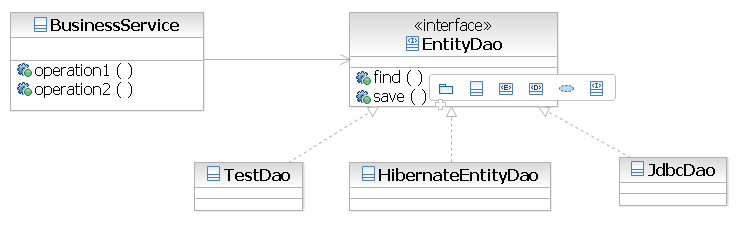
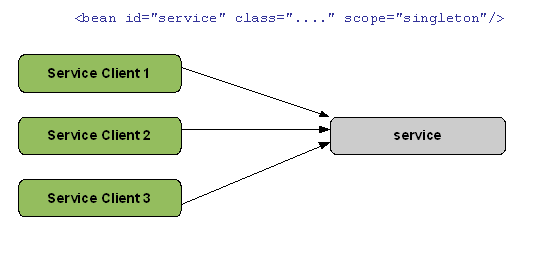
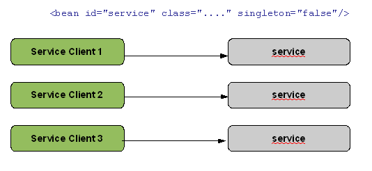

См. исходники и дополнения (RUS): https://www.finecosoft.ru/SpringDI

---
### Dependency Injection и Spring

Dependency Injection (DI), называемый также часто Inversion of Control (IoC) (в русскоязычном мире также используется
термин - "внедрение зависимости"), является одним из основополагающих принципов современных контейнеров программного
обеспечения. Подробно этот подход описан в одной из статей признанного гуру и вдохновителя многих современных тенденций
программного обеспечения в настоящее время [Мартина Фаулера (Martin Fowler)](https://martinfowler.com/articles/injection.html.).

В настоящее время существует и продолжает возникать большое количество программных продуктов, в основе которых лежит
возможность конфигурирования зависимостей между компонентами прикладной программной системы не на этапе разработки, а
либо во время ее запуска, либо вообще уже в процессе функционирования. В результате такого подхода обеспечение
взаимосвязи различных составных частей системы не зависит от конкретной технологии (например, это имеет место в EJB2) и,
к примеру, на этапе тестирования не составляет труда заменить заглушками некоторые объекты, зависящие от нижестоящего
слоя.

Первоначально реализацией этого подхода занимались создатели открытого программного обеспечения (open source software),
возникли такие контейнеры, как Pico Container, Spring, несколько позже Guice в мире Java, Castle Unity, Autofac для
платформы .NET, Copland для Python, The IOC Module для Perl и многие другие. Этот принцип наложил также свой отпечаток
и на создание новых технологий, например, эксперты Java Community Process не могли не использовать паттерн уменьшения
зависимостей между компонентами системы при создании нового стандарта [JSR 220: Enterprise JavaBeansTM 3.0](https://jcp.org/en/jsr/detail?id=220),
а впоследствии [JSR 330: Dependency Injection for Java](https://jcp.org/en/jsr/detail?id=330), который должен входить 
в состав новой версии J2SE 7.0. При этом у большинства разработчиков программного обеспечения, особенно из мира java, 
упоминание о dependency injection все таки в первую очередь ассоциируется со Spring Framework, поскольку использование 
Spring стало фактически негласным стандартом при разработке J2EE приложений (цифры варьируются у различных исследований, 
как правило не менее чем в примерно 75% всех вновь создаваемых систем).

---
### Принцип внедрения зависимости (dependency Injection)

В этом разделе будет кратко представлена основная концепция конфигурирования зависимостей, за более обстоятельным ее
описанием можно обратиться к уже упомянутой статье Мартина Фаулера. Лежащий в основе подход можно выразить известным
голливудским принципом: «Не звоните мне, я сам позвоню». 

Если в традиционных системах компонент получает прямую ссылку на местонахождение необходимых для работы объектов или 
сервисов, или [обращается к сервис-локатору](https://www.oracle.com/java/technologies/) и запрашивает ссылку на 
реализацию определенного типа сервиса, то в случае DI контейнера окружение на основе конфигурационных данных, которые 
могут быть предоставлены системы в виде xml-файла или аннотаций, само знает о необходимых взаимосвязях между компонентами, 
и предоставляет нужные объекты во время инициализации или исполнения. Использование внедрение зависимости вносит 
дополнительную гибкость в систему, поскольку облегчается создание альтернативных реализаций сервиса, и позволяет 
указывать в конфигурации, какая именно реализация должна быть использована.

На рисунке см. 

приведен пример диаграммы классов, отражающую зависимость, которую можно встретить практически в любой реальной системе. 
Как следует из нее, сервис BusinessService использует для работы с базой данных интерфейс EntityDao и существует несколько 
реализаций этого интерфейса: TestDao, HibernateDao и JdbcDao.

TestDao используется во время тестирования сервиса, а выбор между HibernateDao и JdbcDao желательно должен осуществляет
администратор системы основываясь на своих предпочтениях или объективных показателях производительности. В случае, когда
BusinessService сам создает экземпляр класса реализующего интерфейс EntityDao, разработка, а главное развитие и
сопровождение такой системы значительно усложняется, поскольку тогда для тестирования необходимо создать экземпляр
TestDao, потом после успешного тестирования изменить код сервиса BusinessService, и затем перекомпилировать его, что
само по себе может привнести новую ошибку.

Использование JNDI внутри BusinessService (такой подход также называется Dependency Lookup) решает вопрос с
перекомпиляцией после тестирования системы. Такой способ был основным во времена EJB2 контейнеров, которые не
поддерживают принцип конфигурирования зависимостей. Компоненту необходимо самому спрашивать у контейнера, где
находятся необходимые для работы объекты. Однако при этом увеличивается объем служебного кода в системе (glue code),
то есть кода, который не был разработан для решения бизнес требований системы, а для связывания воедино различных
частей системы, обработки исключительных ситуаций и т.д. Кроме этого, тестирование BusinessService при таком подходе
возможно только внутри EJB2 контейнера, что делает организацию unit tests совсем нетривиальной задачей.

Используемый часто в таких контейнерах паттерн ServiceLocator, который инкапсулирует внутри все JNDI-вызовы, также
позволяет не раздувать размеры вспомогательного кода, однако соответствующий метод ServiceLocator все равно должен
быть вызван явно внутри BusinessService.

Наиболее красивым и эффективным решением является использование принципа конфигурирования зависимостей (dependency
injection) и контейнера, поддерживающего этот принцип. В этом случае экземпляр класса, реализующий интерфейс EntityDao,
инициализируется внутри контейнера на основании указанной администратором конфигурации. После этого контейнером ссылка
на созданную реализацию EntityDao автоматически «впрыскивается» в соответствующее поле класса BusinessService.

Основные преимущества использования контейнера, реализующего принцип внедрения зависимостей:
- Централизованное и внешнее управление зависимостями, в случае использования текстовых конфигурационных файлов, которые
  не подлежат компиляции, и может быть адаптировано индивидуально к различным стадиям разработки и функционирования
  системы, не требуя при этом перекомпиляции.

  При традиционном подходе необходимые компоненты инициализируются либо по мере их необходимости – внутри использующих
  их классов, или же используются фабрики классов (class factory), что тоже не является идеальным способом, поскольку
  тогда использующий класс получает также зависимость от этих фабрик.

- Отсутствие вспомогательного связующего кода. При использовании контейнера, поддерживающего принцип DI, значительно
  уменьшается размер кода, поскольку все необходимые зависимости разрешается и компоненты «склеиваются» автоматически.

- Улучшение тестируемости отдельных компонент системы. Использование dependency injection позволяет легко заменять
  зависимые компоненты, что является особенно полезным для организации unit test системы.

  Рассмотрим приведенный выше пример, показанный на рисунке см. DOC/DI_in_Spring/SpringDependencyInjection.png. Для того
  чтобы протестировать реализацию BusinessService, надо проверить правильность работы с различными данными, которые этот
  сервис получает используя интерфейс EntityDao. Для этого можно использовать экземпляр объекта TestDao, имитирующего
  работу с базой данной и предоставляющего сервису необходимые тестовые данные. Проверку же правильности реализации
  JdbcDao или HibernateEntityDao можно провести в другом тесте.

- Использование лучших методик разработки программного обеспечения. Создание приложений с использованием DI контейнера
  подталкивает разработчика к интенсивному использованию интерфейсов. Обычно все основные компоненты определяются с
  помощью интерфейсов, потом создается конкретные реализации этих интерфейсов, которые связываются с помощью DI.

  Собственно такого рода приложения в платформе Java были возможны до появления dependency injection и DI контейнеров.
  Но, использование Spring или аналогичного ему контейнера позволяет использовать проверенную реализацию паттерна DI,
  позволяя разработчикам концентрироваться на создании бизнес логики.

---
### Реализация Dependency Injection в Spring.

В мире Spring Framework активно используется понятие бин (bean), обозначающее управляемый контейнером компонент (managed
component), то есть бин создается и инициализируется контейнером и существует внутри него. Обычно бином является java
класс, при разработке которого придерживались правил определенных спецификацией JavaBean, но это не является обязательным
условием (например, будет продемонстрировано позднее, что не является обязательным наличие не имеющего аргументов
конструктора).

Основным интерфейсом, отвечающим за управление компонентами и их зависимостями в Spring Framework, является BeanFactory
(«фабрика бинов»). В определенный момент времени приложение должно инициализировать класс, реализующий этот интерфейс,
и предоставить информацию о конфигурации системы. Во время конфигурации каждый инициализированный бин (bean) получает,
как минимум одно имя, хотя их может быть задано произвольное количество. Это имя может быть использовано в приложении
для получения доступа к этому компоненту.

---
### Конфигурирование зависимостей в Spring Framework

Взаимосвязи между компонентами могут быть заданы программным образом, но наиболее часто используется конфигурационный
файл или аннотации.

---
#### Использование property-файла

Информация о компонентах и взаимосвязях между ними содержится в виде обычного, знакомого большинству разработчиков java
property файла. Для нашего примера этот файл мог выглядеть следующим образом:

    serviceClient.(class)=com.company.common.ServiceClient
    stringProcessingService.(class)=com.company.common.RevertStringService
    serviceClient.stringProcessingService(ref)=stringProcessingService

Этот property file может быть использован на примере класса PropertyFileBeanFactoryDemo, исходный код которого показан
ниже:

- Строка (1) - Сначала инициализируется экземпляр класса DefaultListableBeanFactory, который реализует интерфейс,
               объявленный в BeanFactory. В этот момент beanFactory не содержит внутри себя никакой информации о
               компонентах.

- Строка (2) - Создается экземпляр класса BeanDefinitionReader, который преобразует данные из текстового property
               файла во внутреннее представление компонента в Spring - BeanDefinition.

- Строка (3) - Считывается конфигурационный файл, происходит загрузка контекст-контейнера.

    public class PropertyFileBeanFactoryDemo {
      public static void main(String[] args) {
    
        DefaultListableBeanFactory beanFactory = new DefaultListableBeanFactory();   (1)
        BeanDefinitionReader propertyReader = new PropertiesBeanDefinitionReader(beanFactory);   (2)
        propertyReader.loadBeanDefinitions(new ClassPathResource("propertyFile-context.properties"));   (3)
        ServiceClient client = (ServiceClient) beanFactory.getBean("serviceClient");   (4)
    
        String str = "this is test string";
        System.out.println("Original string: " + str);
        System.out.println("Processed by service string: " +
            client.callService("this is test string"));
    
      }
    }

- Строка (4) - После инициализации BeanFactory, компонент может быть получен из окружения, например, на основании его
               имени, заданному в конфигурационном файле. Для properties файла именем компонента является строка,
               стоящая перед знаком равенства.

Если скомпилировать и запустить пример, приведенный в этом разделе, то программа выведет на системной консоли следующий
результат:

    Original string: this is test string
    Processed by service string: gnirts tset si siht

То есть без какого-либо участия со стороны разработчика, Spring Framework сам инициализировал экземпляры классов
ServiceClient и RevertStringService и инициализировал (как бы «впрыскнул» - отсюда и название dependency injection)
локальную переменную stringProcessService экземпляром RevertStringService.

Если в конфигурационном файле заменить строку:

    stringProcessingService.(class)=com.company.common.RevertStringService

на строку:

    stringProcessingService.(class)=com.company.common.ToUpperStringService

И снова запустить программу, не перекомпилировав ее, то получим другой результат, поскольку переменная
stringProcessService в данном случае уже будет инициализирована экземпляром класса ToUpperService:

    Original string: this is test string
    Processed by service string: THIS IS TEST STRING

Таким образом было изменено поведения системы без ее перекомпиляции только за счет ее конфигурации, что может
значительно облегчить сопровождение и адаптацию системы к конкретным бизнес требованиям заказчика.

---
#### Использование xml для конфигурации системы

Property файлы становятся трудны для использования при увеличении количества управляемых компонентов. Значительно проще
использование XML для конфигурирования системы. В этом случае для инициализации компонент используется другой класс,
реализующий интерфейс BeanFactory – XmlBeanFactory.

Пример использования этого класса приведен ниже:

    package com.company.xmlfactorydemo;
    
    import org.springframework.beans.factory.xml.XmlBeanFactory;
    import org.springframework.core.io.ClassPathResource;
    
    import com.company.common.ServiceClient;
    
    public class XmlFactoryDemo {
         public static void main(String[] args) {
               XmlBeanFactory beanFactory =
                     new XmlBeanFactory(new ClassPathResource("xmlFactoryDemo-context.xml"));
    
                ServiceClient client =
                      (ServiceClient) beanFactory.getBean("serviceClient");
    
                String str = "this is test string";
                System.out.println("Original string: " + str);
                System.out.println("Processed by service string: " +
                            client.callService("this is test string"));
    }

Ниже продемонстрирован конфигурационный XML файл, который по сути аналогичен приведенному выше property-файлу и содержит
объявление таких же управляемых компонент.

    <?xml version="1.0" encoding="UTF-8"?>
    <beans     xmlns="http://www.springframework.org/schema/beans"
               xmlns:xsi="http://www.w3.org/2001/XMLSchema-instance"
               xmlns:util"http://www.springframework.org/schema/util"
               xsi:schemaLocation="
                     http://www.springframework.org/schema/beans
                      http://www.springframework.org/schema/beans/spring-beans.xsd
                      http://www.springframework.org/schema/util
                      http://www.springframework.org/schema/util/spring-util.xsd">
    
       <bean id="stringProcessingService"
             class="com.company.common.RevertStringService"/>
    
       <bean id="serviceClient"
             class="com.company.common.ServiceClient">
             <property name="stringProcessingService" ref="stringProcessingService"/>
    </beans>

Управляемый контейнером компонент (бин) определяется тегом <bean>, который, как правило, содержит атрибуты id и class.
Атрибут id используется для того, чтобы присвоить этому компоненту имя, используемое по умолчанию. Атрибут class
определяет класс компонента, который необходимо инициализировать.

---
### Режимы инициализации (scopes) управляемых компонент

---
#### Singleton

По умолчанию все создаваемые управляемые компоненты создаются в единственном экземпляре, то есть являются синглтонами
(Singleton – известный паттерн описанный в книге [Design Patterns: Elements of Reusable Object Oriented Software](https://en.wikipedia.org/wiki/Design_Patterns),
авторами которой являются Эрих Гамма, Ральф Джонсон, Ричард Гельм и Джон Влиссидес) и все зависимые компоненты от него 
компоненты используют этот экземпляр, как это показано на рисунке см.

В этом примере создается один единственный экземпляр компонента с идентификатором service и использующие его компоненты
Service Client 1, Service Client 2 и Service Client 3 используют этот единственный экземпляр.

Этот режим (Singleton) можно также задать в конфигурационном файле в явном виде, для этого существует два способа:

- либо, определяющий бин xml элемент содержит атрибут singleton значение которого равно - true ;

- либо, атрибут scope, значение которого задано как singleton ;

То есть определение управляемого компонента:

    <bean scope="singleton" class="com.company.scopedemo.BeanClass" id="singletonBean">

Эквивалентно определению:

    <bean id="singletonBean" class="com.company.scopedemo.BeanClass" singleton ="true"/>

Хотя как уже сказано, атрибуты scope (singleton) в этом случае являются избыточными, поскольку этот режим инициализации
используется по умолчанию. Начиная с версии Spring 3 не существует возможность объявлять режим инициализации с помощью
xml атрибута singleton.

---
#### Prototype

Если у управляемого компонента (bean) указан режим - prototype, то для всех зависимых от него компонент создается новый
экземпляр этого управляемого компонента, как это продемонстрировано на рисунке см. 

Этот режим (Prototype) задается в конфигурационном файле:

- либо, определением атрибута «singleton» в определении компонента со значением - false ;

- либо, определением атрибута «scope» со значением «prototype» ;

    <bean id="prototypeBean" class="com.company.scopedemo.BeanClass" scope="prototype"/>

Или

    <bean id="prototypeBean" class="com.company.scopedemo.BeanClass" singleton="false"/>

Начиная с версии Spring 3 не существует возможность объявлять режим инициализации с помощью xml атрибута prototype.

---
#### Режимы session, request и global session

Эти режимы используются в Spring Framework в web приложениях и определяют, что управляемый компонент создается в
единственном экземпляре во время:

- либо запроса (режим request) ;

- либо пользовательской HTTP сессии (режим session) ;

- либо глобальной HTTP сессии (режим global session), которая определена для портлетов (portlet) ;

В отличие от режимов prototype и singleton, для конфигурации которых можно использовать два различных аттрибута, эти
режимы определяются в конфигурационном файле только атрибутом scope, например:

    <bean id="prototypeBean" class="com.company.scopedemo.BeanClass" scope="globalSession"/>

или

    <bean id="prototypeBean" class="com.company.scopedemo.BeanClass" scope="request"/>

---
**!!! ВНИМАНИЕ !!!** 

Spring Framework создает управляемые компоненты с этими режимами только внутри web контекста,
например - XmlWebApplicationContext. Попытка создать бин с одним из этих режимов внутри обычного
контейнера (например XmlBeanFactory) приведет к генерации исключения IllegalStateException.

---
### Режим, определенный пользователем

Начиная с версии 2.0, Spring Framework предоставляет возможность самостоятельно создавать режимы создания управляемых
компонент или переопределять существующие (это не относится к режимам prototype и singleton). Для этого надо создать
класс, реализующий интерфейс Scope, в котором определены методы для манипуляции с объектами, определенных для этого
режима (получение объектов, удаление из списка и другие).

---
### Инициализация свойств управляемых компонент

В приведенном примере использования XML для конфигурирования системы было продемонстрировано, что во время создания
управляемого компонента контейнер, реализующий принцип внедрения зависимостей (dependency injection), инициализирует
сконфигурированные параметры.

В Spring Framework реализовано огромное количество различных вариантов осуществления этой возможности. Для демонстрации
этих способов будет использован класс Person, исходный код которого выглядит следующим образом:

    class Person {
         private String firstName;
         private String lastName;
         private int age;
    
         private Person mother;
         private Person father;
    
         public Person() {}
    
         public Person(String lastName) {
               this.lastName = lastName;
          }
    
         public Person(String firstName, String lastName, int age) {
               this.firstName = firstName;
               this.lastName = lastName;
               this.age = age;
         }
    
        /* ... getters and setters ... */
    
    }

Необходимо особо отметить, что у задаваемых параметров должны быть определена возможность задать его значение «извне»,
например с помощью set методов определенных по правилам Java Beans, или инициализация параметра возможна с помощью
значения указанного в конструкторе объекта. Например, в классе Person у свойства firstName есть соответствующий метод
setFirstName.

---
### Инициализация примитивов (простых значений)

Свойства класса, которые должны быть инициализированы примитивными значениями, такие как строка или число, задаются в
конфигурационном файле с помощью атрибута или дочернего элемента value. Чтобы инициализировать экземпляр класса Person,
необходимые значения могут быть заданы в конфигурационном файле следующим образом:

     <bean id"person" class="com.company.initializationdemo.Person">
           <property name="firstName" value="Ivan"/>
           <property name="lastName">
                 <value>Segeev</value>
           </property>
           <property name="age">
                 <value>30</value>
           </property>
     </bean>

В приведенном примере свойства lastName и age специфицированы с помощью дочернего элемента value, а свойство firstName
с помощью атрибута элемента xml.

В результате исполнения программы, исходный код который приведен ниже:

    public class PropertiesInitDemo {
         public static void main(String[] args) {
                XmlBeanFactory beanFactory =
                     new XmlBeanFactory(
                                new ClassPathResource("com/company/initializationdemo/initDemo-context.xml"));
    
                Person person = (Person) beanFactory.getBean("person");
    
                System.out.println("Initialized person:");
                System.out.println("First name: " + person.getFirstName());
                System.out.println("Last name: " + person.getLastName());
                System.out.println("Age: " + person.getAge());
         }
    }

На системной консоли мы получим следующий результат:

    Initialized person:
    First name: Ivan
    Last name: Segeev
    Age: 30

---
### Инициализация членов класса в конструкторах классов

В прошлом разделе было продемонстрировано, как можно инициализировать с помощью сеттеров (методов set <property name="">)
классов. Это не является единственной возможностью, аналогичного результата можно достигнуть с помощью конструкторов
класса, использующие аргументы, например экземпляр класса Person создается контейнером Spring с помощью такого
объявления:

     <bean id="person2" class="com.company.initializationdemo.Person">
           <constructor-arg value="Ivanov"/>
     </bean>

Контейнер находит конструктор, наиболее «подходящий» для использования с данными параметрами, в приведенном примере ему
не составляет большого труда определить, что поскольку при определении управляемого компонента указан единственный
параметр, то для создания экземпляра этого компонента надо использовать конструктор, у которого есть один аргумент
Person(String lastName).

Ситуация становится сложнее в случае, если у конструктора определено несколько аргументов. Одной из проблем является
необходимость указать контейнеру при конфигурации какой конфигурационный параметр соответствует какому аргументу
конструктора.

В Spring Framework существует несколько способов сделать это, в частности можно просто при определении указать
порядковый номер аргумента конструктора, которому этот параметр соответствует. Например, в случае создания экземпляра
класса Person с использованием конструктора с тремя аргументами, конфигурация могла бы выглядеть следующим образом:

     <bean id="person3" class="com.company.initializationDemo.Person">
           <constructor-arg index="1" value="Petrov"/>
           <constructor-arg index="0" value="Sergey"/>
           <constructor-arg index="2" value="30"/>
     </bean>

Соответствие формального параметра конструктора и его сконфигурированного значения определяется атрибутом index,
нумерация параметров начинается с 0. Как видно, совершенно не обязательно определять параметры в том порядке, в
котором они указаны в конструкторе, Spring контейнер берет на себя задачу корректного вызова конструктора.

Например, при использовании данной конфигурации, следующий код:

           person = (Person) beanFactory.getBean("person3");

           System.out.println("Initialized person 3:");
           System.out.println("First name: " + person.getFirstName());
           System.out.println("Last name: " + person.getLastName());
           System.out.println("Age: " + person.getAge());

Приведет к следующему выводу на системную консоль:

    Initialized person 3:
    First name: Sergey
    Last name: Petrov
    Age: 30

Если же контейнер не сможет подобрать конструктор управляющего компонента (bean-a), соответствующего указанным в
конфигурации параметрам, то он генерирует исключение UnsatisfiedDependencyException.

---
### Использование фабричных методов (factory methods) для инициализации управляемых компонент

Достаточно часто, особенно при использовании разработанных некоторое время назад библиотек (legacy code), для создания
необходимых компонент используются статические методы некоторого класса вместо оператора new. Существует возможность
использования этих методов в приложениях, использующих контейнер Spring.

Для этого в конфигурации управляемого компонента помимо атрибута class (который в данном случае содержит определение не
создаваемого класса, а класса, содержащего статический метод) надо использовать атрибут factory-method, значение
которого является имя статической функции, как показано на следующем примере:

     <bean id="personFactory" class="com.company.factoryMethodDemo.MethodFactory">
     <bean id="person2" factory-bean="personFactory" factory-method="getPerson">

В приведенном примере personFactory является компонентом, содержащий метод getPerson, который используется для создания
необходимого экземпляра класса Person.

---
### P-namespace

В версии 2.0 в окружении Spring появилась синтаксически новая возможность задавать свойства компонента в
конфигурационном файле, используя так называемое пространство имен p (p-namespace). Вместо того, чтобы определять
свойства управляемого компонента как xml элементы, как это до сих пор было сделано в большинстве приведенных до сих
пор примеров, использование p-namespace позволяет непосредственно указывать эти свойства как атрибуты xml элемента
bean, определяющего этот управляемый компонент.

Так например конфигурация экземпляра класса Person с использованием такого подхода выглядит следующим образом:

    <beans     xmlns="http://www.springframework.org/schema/beans"
               xmlns:context="http://www.springframework.org/schema/context"
               xmlns:p="http://www.springframework.org/schema/p"                      (*)
               xmlns:xsi="http://www.w3.org/2001/XMLSchema-instance"
               xsi:schemaLocation="
                     http://www.springframework.org/schema/beans
                     http://www.springframework.org/schema/beans/spring-beans-2.5.xsd
                      http://www.springframework.org/schema/context
                      http://www.springframework.org/schema/context/spring-context-2.5.xsd">
    
          <bean id="mother" class="com.company.common.Person"
                p:firstName="Maria"                                                    (**)
                p:lastName="Ivanova"                                                   (**)
                p:age="45">                                                            (**)
          </bean>
    </beans>

- (*)  определение p namespace
- (**)  конфигурация свойств управляемого компонента

При помощи 'p namespace' возможно сконфигурировать свойства управляемого компонента не только простыми значения, но
также задавать ссылки на другие управляемые компоненты. Для этого к имени свойства в xml атрибуте добавляется суффикс
«-ref»:

      <bean id="son" class="com.company.common.Person"
            p:firstName="Petr"
            p:lastName="Ivanov"
            p:age="20"
            p:mother-ref="mother">
      </bean>

Использование "p namespace" позволяет существенным образом уменьшить размер и объем «набиваемого» руками
конфигурационного файла, а также повысить их зрительное восприятие.

---
### Автоматическое связывание зависимостей (autowire)

Во всех приведенных до сих пор примерах было в явном виде в конфигурационном файле указано, как управляемые компоненты
связаны друг с другом, то есть какой управляемый компонент используется для инициализации атрибута другого компонента.

Spring Framework позволяет связывать компоненты и другим способом – переложить задачу нахождения необходимых
зависимостей на окружение. По умолчанию эта возможность отключена, активируется эта особенность для каждого управляемого
компонента отдельно путем указания xml атрибута autowire в конфигурационном файле, как это показано на следующем примере:

    <beans      xmlns="http://www.springframework.org/schema/beans"
                xmlns:context="http://www.springframework.org/schema/context"
                xmlns:xsi="http://www.w3.org/2001/XMLSchema-instance"
                xsi:schemaLocation="
                      http://www.springframework.org/schema/beans
                      http://www.springframework.org/schema/beans/spring-beans-2.5.xsd
                      http://www.springframework.org/schema/context
                      http://www.springframework.org/schema/context/spring-context-2.5.xsd">
    
          <bean id="mother" class="com.company.common.Person">
                <property name="firstName" value="Maria"/>
                <property name="lastName" value="Ivanova"/>
                <property name="age" value="45"/>
          </bean>
    
          <bean id="father" class="com.company.common.Person">
                <property name="firstName" value="Ivan"/>
                <property name="lastName" value="Ivanov"/>
                <property name="age" value="47"/>
          </bean>
    
          <bean id="son" class="com.company.common.Person" autowire="byName">
                <property name="firstName" value="Petr"/>
                <property name="lastName" value="Ivanov"/>
                <property name="age" value="20"/>
          </bean>
    </beans>

В данном случае для управляемого компонента "son" в конфигурационном файле отсутствуют значения для параметров "father"
и "mother", но добавлен атрибут autowire, имеющий значение "byName". В этом случае во время инициализации окружение
Spring само пытается найти управляемые компоненты с такими имена и, если таковые будут найдены, то инициализировать
соответствующие свойства компонента "son".

В Spring Framework предусмотрены 4 различных режима автоматического разрешения зависимостей (4 значения xml атрибута
autowire):

- byName - Spring пытается для каждой переменной управляемого компонента найти в окружении бин с аналогичным именем ;

- byType - Spring пытается для каждой переменной управляемого компонента найти в окружении бин аналогичного типа.
           Например, если управляемый компонент имеет поле типа Person, то Spring Framework проверяет, существует ли
           сконфигурированный компонент этого типа и если существует, то связывает его со этим полем. Если существует
           несколько управляемых компонент искомого типа, то окружение Spring не может сделать выбор самостоятельно и
           генерирует исключительную ситуацию ;

- constructor - этот режим автоматического разрешения зависимостей работает аналогично режиму byName. Разница
                заключается в том, что вместо использования методов присваивания (setter method), в данном случае
                используются соответствующие конструкторы управляемых компонент ;

- autodect - в этом случае окружение Spring самостоятельно выбирает режим автоматического связывания. Если у
             управляемого компонента существует не использующий параметров конструктор (default constructor),
             то будет выбран режим byName, если же такой конструктор существует, то будет использован режим
             constructor.

---
### Методы жизненного цикла управляемого компонента (lifecycle callback methods)

Важной особенностью контейнера Spring является возможность «сообщать» управляемым компонентам об определенных событиях
их жизненного цикла (lifecycle events), что позволяет компонентам производить дополнительные действия в соответствующий
момент своего существования.

Например, после инициализации проверить все ли переменные были сконфигурированы необходимые образом или установить
соединение с базой данных. Наиболее интересными являются моменты, когда Spring заканчивает инициализацию и
конфигурирование управляемого компонента (postinitialization) и момент подготовки к уничтожению компонента
(predestruction).

Однако, такая возможность существует только для бинов, созданных в режиме singleton. Компоненты, созданные в других
режимах, не имеют доступ к методам жизненного цикла.

В контейнере Spring предусмотрены два различных способа реализации быть уведомленным об этапе жизненном цикла. Для этого
либо компонент должен реализовать соответствующий так называемый callback интерфейс, различный для различных жизненных
циклов:

- InitializingBean - окончание инициализации ;

- DisposableBean – перед уничтожением компонента ;

В этом случае никаких других действий по конфигурации бина совершать не надо, контейнер автоматически распознает, что
класс компонента реализует данный интерфейс и вызывает соответствующие методы в нужный момент. Либо при конфигурировании
компонента с помощью xml атрибутов (опять таки различных для различных жизненных циклов: init-method, destroy-method и
т.д.) указать метод компонента, который должен быть выполнен на данном этапе.

Какой метод выбрать зависит от многих факторов и личного вкуса. Необходимо только отметить, что реализация callback
интерфейсов делают компоненты зависимыми от окружения Spring и они не могут быть использованы вне него.

Для того, чтобы продемонстрировать обратный вызов от контейнера к управляемому компоненту после его инициализации,
необходимо немного расширить используемый во многих предыдущих примерах класс Person – надо реализовать предусмотренный
интерфейсом InitializingBean метод afterPropertiesSet. Кроме того для демонстрации возможности указания callback метода
при конфигурации, будет реализован метод init:

    public class ExtendedPerson extends Person implements InitializingBean {
    
          public void init() {
                System.out.println("Init callback method");
          }
    
          public void afterPropertiesSet() throws Exception {
                System.out.println("Method of the InitializingBean interface");
          }
    }

Указанные два способа реализации методов обратных вызовов жизненного цикла (callback lifecycle) не являются
взаимоисключающими, компонент может одновременно как реализовывать один из интерфейсов, так и содержать метод,
который будет указан при конфигурации компонента, как например в следующем примере:

      <bean id="person" class="com.company.lifecycle.ExtendedPerson" init-method="init">
            <property name="firstName" value="Ivan"/>
            <property name="lastName" value="Petrov"/>
            <property name="age" value="30"/>
      </bean>

В этом случае при создании компонента сначала будет вызван метод afterPropertiesSet callback интерфейса, а затем метод,
указанный в xml атрибуте init-method, и создание компонента person приведёт к выводу на системную консоль следующего
текста:

    Method of the InitializingBean interface
    Init callback method
    Initialized person:
    First name: Ivan
    Last name: Petrov
    Age: 30

---
### Обращение из управляемых компонентов к методам окружения Spring

Одним из основных достоинств создания приложений с использованием Spring фреймворка заключается в том, что создаваемые
управляемые компоненты не зависят от этой технологии и могут быть использованы вне окружения Spring. Однако существуют
ситуации, когда крайне желательно иметь возможность обратиться к окружению из управляемого компонента.

Например, для вывода отладочной информации может быть полезной информация об имени компонента, с которым этот компонент
зарегистрирован в окружении, что может быть очень полезно, когда в системе зарегистрировано много управляемых компонент
одного типа в различной конфигурации. Или когда в зависимости от состояния системы надо динамически указать о совершении
дополнительных действий во время остановки системы (shutdown hook).

Если класс реализует интерфейс BeanNameAware, то в этом случае окружение вызывает предусмотренный этим интерфейсом метод
setBeanName(String name) после того, как окружением закончена конфигурация управляемого компонента, но перед методами
жизненного цикла (lifecycle methods).

В качестве параметра единственного параметра метода фреймворк использует имя компонента, указанного в конфигурации:

    public class OwnNameAwareBean implements BeanNameAware {
    
          private String beanName;
    
          @Override
          public void setBeanName(String beanName) {
                this.beanName = beanName;
          }
    
          public String getBeanName() {
                return beanName;
          }
    }

Для того, чтобы управляемый компонент имел доступ к окружению Spring достаточно, чтобы класс этого компонента
реализовывал интерфейс BeanFactoryAware. Этот интерфейс предусматривает реализацию единственного метода
setBeanFactory(BeanFactory beanFactory), при вызове которого окружение передает себя в качестве параметра этого метода:

    public class SpringAwareBean implements BeanFactoryAware {
    
          BeanFactory beanFactory;
    
          public void setBeanFactory(BeanFactory beanFactory) throws BeansException {
                this.beanFactory = beanFactory;
          }
    
          public BeanFactory getBeanFactory() {
                return beanFactory;
          }
    
          public Object getBean(String beanName) {
                return beanFactory.getBean(beanName);
          }
    }

Конфигурация компонентов, реализующих интерфейсы BeanFactoryAware и BeanNameAware ничем не отличается от конфигурации
обычных управляемых компонент, окружение Spring во время инициализации сам определяет, что для окончательной
конфигурации необходимо также вызвать предусмотренные этими интерфейсами методы:

    <beans      xmlns="http://www.springframework.org/schema/beans"
                xmlns:context="http://www.springframework.org/schema/context"
                xmlns:xsi="http://www.w3.org/2001/XMLSchema-instance"
                xsi:schemaLocation="
                      http://www.springframework.org/schema/beans
                      http://www.springframework.org/schema/beans/spring-beans-2.5.xsd
                      http://www.springframework.org/schema/context
                      http://www.springframework.org/schema/context/spring-context-2.5.xsd">
    
          <bean id="springAwareBean" class="com.company.springaware.SpringAwareBean"/>
    
          <bean id="nameAwareBean" class="com.company.springaware.OwnNameAwareBean"/>
    </beans>

Демонстрацией использования может служить достаточно простой пример. Сначала инициализируется компонент типа
SpringAwareBean, реализующий интерфейс BeanFactoryAware и затем этот компонент используется для получения
компонента класса OwnNameAware.

      public static void main(String[] args) {
            XmlBeanFactory beanFactory =
                  new XmlBeanFactory(
                             new ClassPathResource("com/company/springaware/springAwareDemo-context.xml"));

            SpringAwareBean springAwareBean =
                             (SpringAwareBean) beanFactory.getBean("springAwareBean");

            if (springAwareBean.getBeanFactory() != null)
                  System.out.println("SpringAwareBean is initiated");
            else
                  System.out.println("SpringAwareBean is not initiated");

            OwnNameAwareBean nameAwareBean =
                             (OwnNameAwareBean) springAwareBean.getBean("nameAwareBean");

            System.out.println("From the instance of SpringAwareBean is gotten a bean of the" +
                               "type OwnNameAwareBean with the name: "
                                                + nameAwareBean.getBeanName());
      }

В результате исполнения на системной консоли будет получен следующий вывод:

    SpringAwareBean is initiated
    From the instance of SpringAwareBean is gotten a bean of the type OwnNameAwareBean with the name: nameAwareBean

Надо отметить конечно, что реализация интерфейса BeanFactoryAware, как в приведенном примере только для того, чтобы
потом программным способом находить необходимые для дальнейшей работы компоненты является не самой лучшей практикой
использования окружения Spring и должна избегаться в реальных проектах, поскольку эта задача должна быть переложена
на базовое свойство этого контейнера – принципа внедрения зависимостей (dependency injection)

---
### Использование аннотаций Java для инициализации управляемых компонент

С выходом в свет версии Spring 2.5 у разработчиков появилась новая возможность конфигурировать управляемые компоненты
(beans) используя аннотации. В результате этого нововведения стало необходимым условием использования в проектах Java
не ниже 5 версии.

Это ограничение не должно сильно влиять на применимость данного способа конфигурирования приложения, поскольку
большинство существующих продуктов либо уже перенесены на эту версию, либо находятся в процессе переноса, а практически
все новые проекты используют эту версию изначально.

Среди разработчиков, использующих платформу Spring, постоянно происходят споры. Одни считают, что для конфигурирования
Java Beans лучше использовать XML, аргументирующих свое предпочтение тем, что исходный Java код должен быть свободен от
различных технических деталей.

Другие ратуют за более широкое использование аннотаций. Разумеется нет однозначного ответа, когда и какой метод лучше
использовать, однако наличие альтернативы всегда и лучше ее отсутствия и в каждом конкретном проекте решение может и
должно быть принято индивидуально.

Однако совсем избавиться от конфигурационного XML файла все равно пока нет возможности, поскольку в случае использования
аннотация для конфигурирования управляемых компонент, необходимо указать, чтобы Spring при загрузке определения класса
проверял наличие аннотаций и сохранял в случае необходимости экземпляры бинов в контексте приложения.

Для этого используется xml элемент component-scan, как это показано на следующем примере:

    <?xml version="1.0" encoding="UTF-8"?>
    <beans      xmlns="http://www.springframework.org/schema/beans"
                xmlns:context="http://www.springframework.org/schema/context"
                xmlns:xsi="http://www.w3.org/2001/XMLSchema-instance"
                xsi:schemaLocation="
                      http://www.springframework.org/schema/beans
                      http://www.springframework.org/schema/beans/spring-beans-2.5.xsd
                      http://www.springframework.org/schema/context
                      http://www.springframework.org/schema/context/spring-context-2.5.xsd">
          <context:annotation-config/>
    </beans>

---
### Автоматическое связывание зависимостей (autowire) с помощью аннотаций

Для автоматического связывания зависимостей существует аннотация Autowired, которая может быть применена на уровне
метода присваивания (setter method), поля класса или конструктора. То есть функционально следующие 3 объявления класса
Person являются одинаковыми:

- Вариант 1:

    publicclass Person {
    
          @Autowired
          private Person mother;
    
          public Person() {}
    
          publicvoid setMother(Person mother) {
                this.mother = mother;
          }
    }

- Вариант 2:

    publicclass Person {
          private Person mother;
    
          public Person() {}
    
          @Autowired
          publicvoid setMother(Person mother) {
                this.mother = mother;
          }
    }

- Вариант 3:

    publicclass Person {
          private Person mother;
    
          @Autowired
          public Person(Person mother) {
                this.mother = mother;
          }
    }

По умолчанию окружение Spring пытается найти один единственный компонент искомого типа, то есть соответствует типу
связывания «byType». Если таковой не существует вообще или определено более одного компонента желаемого типа, то
окружение сгенерирует исключение NoSuchBeanDefinitionException.

Существует несколько вариантов, для того, чтобы связывание соответстволо бы типу «byName»:

- изменение типа связывания для всего контекста окружения, это можно сделать в конфигурационном файле, используя xml
  атрибут default-autowire=“byName“ корневого элемента beans:

    <beans xmlns="http://www.springframework.org/schema/beans"
        xmlns:xsi="http://www.w3.org/2001/XMLSchema-instance"
        xmlns:context="http://www.springframework.org/schema/context"
        xsi:schemaLocation="http://www.springframework.org/schema/beans
            http://www.springframework.org/schema/beans/spring-beans-2.5.xsd
            http://www.springframework.org/schema/context
            http://www.springframework.org/schema/context/spring-context-2.5.xsd"
        default-autowire="byName">
        ...
    </beans>

- использование вместе с аннотацией @Autowired аннотации @Qualifier, в качестве параметра аннотации надо указать имя
  компонента:

    public class Child {
    
          @Autowired
          @Qualifier("mariaIvanova")
          private Person mother;
          //...
    }

- использование аннотации @Resource, определенной в JSR-250, для этой аннотации обязателен параметр - name. Окружение
  Spring интерпретирует значение этого параметра как имя управляемого компонента для связывания:

    public class Child {
    
          @Resource(name="ivanIvanov")
          private Person father;
          //...
    }

- начиная с версии Spring 3, существует поддержка определенной в JSR-330 аннотации @Inject, использование которой
  аналогично использованию аннотации @Autowired:

    public class Child {
    
          @Inject(name="ivanIvanov")
          private Person father;
          //...
    }

Для демонстрации возможности автоматического связывания зависимостей помощью аннотаций создан класс Child, основные
фрагменты которого касающиеся аннотаций приведены выше. Конфигурационный файл может выглядеть следующим образом:

    <beans      xmlns="http://www.springframework.org/schema/beans"
                xmlns:context="http://www.springframework.org/schema/context"
                xmlns:xsi="http://www.w3.org/2001/XMLSchema-instance"
                xsi:schemaLocation="
                      http://www.springframework.org/schema/beans
                      http://www.springframework.org/schema/beans/spring-beans-2.5.xsd
                      http://www.springframework.org/schema/context
                      http://www.springframework.org/schema/context/spring-context-2.5.xsd">
    
        <context:annotation-config/>
    
          <bean id="mariaIvanova" class="com.company.common.Person">
                <property name="firstName" value="Maria"/>
                <property name="lastName" value="Ivanova"/>
                <property name="age" value="35"/>
          </bean>
    
          <bean id="ivanIvanov" class="com.company.common.Person">
                <property name="firstName" value="Ivan"/>
                <property name="lastName" value="Ivanov"/>
                <property name="age" value="37"/>
          </bean>
    
          <bean id="child" class="com.company.annotationdemo.common.Child">
                <property name="firstName" value="Petr"/>
                <property name="lastName" value="Ivanov"/>
                <property name="age" value="10"/>
          </bean>
    </beans>

На данном примере показано, что в конфигурационном файле не связаны поля mother и father компонента child и во время
создания компонента они будут автоматически инициированы компонентами mariaIvanova и ivanIvanov.

---
### Регистрация методов жизненного цикла управляемого компонента с помощью аннотаций

В версии Spring 2.5 добавлена поддержка определенных в JSR-250 аннотаций @PostConstruct и @PreDestroy, которые
предоставляют еще одну возможность (в дополнение к уже существующим с помощью реализации интерфейсов InitializingBean,
DisposableBean или спецификаций xml атрибутов init-method, destroy-method в конфигурационном файле) определять методы
жизненного цикла (lifecycle methods).

Как можно догадаться по названию, аннотация @PostConstruct «помечает» метод, исполняемый после окончания инициализации
и конфигурирования управляемого компонента окружением (postinitialization), а аннотированный @PreDestroy метод будет
вызван во время подготовки к уничтожению компонента (predestruction).

    public class ExtendedPerson extends Person {
    
          @PostConstruct
          public void init() {
                System.out.println("@PostConstruct method");
          }
    
          @PreDestroy
          public void destroy() {
                System.out.println("@PreDestroy method");
          }
    }

---
### Автоматическая регистрация управляемых компонент с помощью аннотаций

Приведенные в этом до сих пор примеры демонстрировали возможность использования некоторые из имеющихся в Spring
аннотаций. Но, в любом случае существовала необходимость объявить сам управляемый компонент в конфигурационном файле.

Начиная с версии Spring 2.5 появилась возможность обойтись без явного указания каждого компонента в отдельности,
возложив задачу по их обнаружению на окружение Spring. Опять же совсем без конфигурационного файла не обойтись, в нем
необходимо зарегистрировать соответствующий механизм поиска и указать базовый java пакет:

    <context:component-scan base-package="com.company.annotationdemo.common"/>

В этом случае окружение Spring во время инициализации просмотрит все имеющиеся объявления классов, находящиеся в
указанном пакете и его подпакетах и создаст экземпляры управляемых компонент для тех их них, которые помечены
аннотациями, перечисленными ниже.

Таких инструкций в одном конфигурационном файле может быть несколько, если аннотированных классы находятся в различных
базовых пакетах.

В настоящее время в Spring Framework существуют 4 аннотации для объявления класса управляемым компонентом, называемые
создателями фреймворка "Stereotyping Annotation":

- @Component - является базовой аннотацией для объявления класса управляемым компонентом. При загрузке механизм поиска
               Spring Framework проверяет наличие у класса этой аннотации и сохраняет в контексте приложения ;

- @Service - данная аннотация является специализацией @Component, которая в настоящее время не добавляет новой
             функциональности и используется для того, чтобы различать управляемые компоненты, определенные на
             уровне бизнес сервисов (busness layer) для демонстрации смысла данного компонента ;

- @Repository - данная аннотация является специализацией @Component, которая используется для регистрации в контексте
                приложения управляемых компонент типа Data Access Object. Аннотация также обозначает, что все
                непроверяемые исключения (unchecked exception), которые генерируются внутри этого класса, должны быть
                транслированы в (также непроверяемое) исключение DataAccessException ;

- @Controller - объявляет класс контроллером Spring MVC controller, используемым в веб приложениях. Аннотация также
                является специализацией @Component ;

В качестве параметра можно указать имя, с которым управляемый компонент будет зарегистрирован в окружении. Если параметр
отсутствует, то Spring Фреймворк самостоятельно сгенерирует имя по умолчанию, которое соответствует имени класса, с той
только разницей, что первая буква имени, которая по стандарту кодирования Java является заглавной, меняется на прописную:

    @Component("stringProcessingService")
    public class RevertStringService implements StringProcessingService {
    
          public String processString(String str) {
                StringBuilder builder = new StringBuilder();
                if (str != null) {
                      for (int i=str.length() - 1; i >= 0; i --)
                            builder.append(str.charAt(i));
                }
                return builder.toString();
          }
    }

---
### Определение режимы инициализации (scopes) управляемых компонент с помощью аннотации @Scope

Использование аннотация Scope дает возможность избавиться от указания режима инициализации в конфигурационном файле.
В качестве параметра у аннотации служит режим инициализации представленный в виде строки например «singleton» или
«prototype».

Однако для того, что избежать возможных «опечаток» при наборе исходного кода, которые выявляются только в ходе тестов
или даже эксплуатации системы, возможные режимы инициализации определены как константы, в интерфейсе BeanDefinition:
- SCOPE_PROTOTYPE ;
- SCOPE_SINGLETON ;

И константы в интерфейсе WebApplicationContext:
- SCOPE_GLOBAL_SESSION ;
- SCOPE_REQUEST ;
- SCOPE_SESSION ;

    @Component
    @Scope(BeanDefinition.SCOPE_PROTOTYPE)
    public class PrototypePerson extends Person {
    }
    
    @Component
    @Scope(BeanDefinition.SCOPE_SINGLETON)
    public class SingletonPerson extends Person {
    }

---
Материалы для изучения (ENG):

- [Class DefaultListableBeanFactory](https://docs.spring.io/spring-framework/docs/2.5.6/javadoc-api/org/springframework/beans/factory/support/DefaultListableBeanFactory.html) ;

- [Interface BeanFactory](https://docs.spring.io/spring-framework/docs/2.5.6/javadoc-api/org/springframework/beans/factory/BeanFactory.html) ;

- [Interface BeanDefinitionReader](https://docs.spring.io/spring-framework/docs/2.5.6/javadoc-api/org/springframework/beans/factory/support/BeanDefinitionReader.html) ;

- [Interface BeanDefinition](https://docs.spring.io/spring-framework/docs/2.5.6/javadoc-api/org/springframework/beans/factory/config/BeanDefinition.html) ;

- [Class XmlBeanFactory](https://docs.spring.io/spring-framework/docs/2.5.6/javadoc-api/org/springframework/beans/factory/xml/XmlBeanFactory.html) ;

- [Class XmlWebApplicationContext](https://docs.spring.io/spring-framework/docs/2.5.6/javadoc-api/org/springframework/web/context/support/XmlWebApplicationContext.html) ;

- [Class IllegalStateException](https://docs.spring.io/spring-framework/docs/2.5.6/javadoc-api/org/springframework/jms/IllegalStateException.html) ;

- [Interface Scope](https://docs.spring.io/spring-framework/docs/2.5.6/javadoc-api/org/springframework/beans/factory/config/Scope.html) ;

- [Class UnsatisfiedDependencyException](https://docs.spring.io/spring-framework/docs/2.5.6/javadoc-api/org/springframework/beans/factory/UnsatisfiedDependencyException.html) ;

- [Interface BeanNameAware](https://docs.spring.io/spring-framework/docs/2.5.6/javadoc-api/org/springframework/beans/factory/BeanNameAware.html) ;

- [Interface BeanFactoryAware](https://docs.spring.io/spring-framework/docs/2.5.6/javadoc-api/org/springframework/beans/factory/BeanFactoryAware.html) ;

- [Annotation Type Autowired](https://docs.spring.io/spring-framework/docs/2.5.6/javadoc-api/org/springframework/beans/factory/annotation/Autowired.html) ;

- [Class NoSuchBeanDefinitionException](https://docs.spring.io/spring-framework/docs/2.5.6/javadoc-api/org/springframework/beans/factory/NoSuchBeanDefinitionException.html) ;

- [Annotation Type Qualifier](https://docs.spring.io/spring-framework/docs/2.5.6/javadoc-api/org/springframework/beans/factory/annotation/Qualifier.html) ;

- [Interface WebApplicationContext](https://docs.spring.io/spring-framework/docs/2.0.x/javadoc-api/org/springframework/web/context/WebApplicationContext.html) ;
