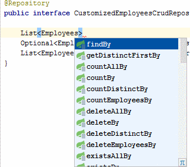

- [Исходник статьи](https://habr.com/ru/articles/435114/)
- [GitHub ссылка на материалы для статьи](https://github.com/avrylkov/DemoSpringData)

---
### Spring Data JPA

**Spring Data** - удобный механизм для взаимодействия с сущностями базы данных, организации их в репозитории, извлечение данных, изменение, в каких-то случаях для этого будет достаточно объявить интерфейс
и метод в нем, без имплементации см. [SpringData](./SpringData.md).

**Spring Data JPA** - поддержка репозитория Spring Data для JPA - часть более крупного семейства Spring Data, упрощает реализацию репозиториев на основе JPA. В этом модуле рассматривается расширенная см. [https://spring.io/projects/spring-data-jpa](https://spring.io/projects/spring-data-jpa) поддержка уровней доступа к данным на основе JPA. Это упрощает создание приложений на базе Spring, использующих технологии доступа к данным.

Реализация уровня доступа к данным приложения долгое время была обременительной. Для выполнения простых запросов,
а также разбиения на страницы и аудита необходимо написать слишком много шаблонного кода. Spring Data JPA
стремится значительно улучшить реализацию уровней доступа к данным, сокращая усилия до того количества, которое
действительно необходимо. Как разработчик, вы пишете интерфейсы своего репозитория, включая собственные методы
поиска, а Spring автоматически предоставит реализацию.

Функции:

- Сложная поддержка создания репозиториев на основе Spring и JPA.
- Поддержка предикатов Querydsl и, следовательно, типобезопасных запросов JPA.
- Прозрачный аудит доменного класса.
- Поддержка пагинации, динамическое выполнение запросов, возможность интеграции
  пользовательского кода доступа к данным.
- Проверка @Query аннотированных запросов во время начальной загрузки
- Поддержка сопоставления сущностей на основе XML
- Конфигурация репозитория на основе JavaConfig путем введения @EnableJpaRepositories.

Ниже будет рассмотрено:

1. **Spring Repository**;
2. **Методы запросов из имени метода**;
3. **Конфигурация и настройка**;
4. **Специальная обработка параметров**;
5. **Пользовательские реализации для репозитория**;
6. **Пользовательский Базовый Репозиторий**;
7. **Методы запросов — Query**;

---
### Spring Repository

Основное понятие в Spring Data — это репозиторий. Это несколько интерфейсов, которые используют JPA Entity для
взаимодействия с ней. Так например интерфейс:

```Java
 	public interface CrudRepository<T, ID extends Serializable> extends Repository<T, ID>
```

Который обеспечивает основные операции по поиску, сохранению, удалению данных (CRUD операции):

```Java
	T save(T entity);
	
	Optional findById(ID primaryKey);
	
	void delete(T entity);
```

И др. операции. Есть и другие абстракции, например PagingAndSortingRepository. Т.е. если того перечня, что
предоставляет интерфейс CrudRepository недостаточно для взаимодействия с сущностью, то можно прямо расширить
базовый интерфейс для своей сущности, дополнить его своими методами запросов и выполняемых операции.

Пример простого случая по шагам (не отвлекаясь пока на конфигурации, ORM, базу данных):

Шаг 1. Создаем сущность:

```Java
	@Entity
	@Table(name = "EMPLOYEES")
	public class Employees {
	    private Long employeeId;
	    private String firstName;
	    private String lastName;
	    private String email;
	    // . . .
```

Шаг 2. Наследуемся от одного из интерфейсов Spring Data, например от CrudRepository:

```Java
	@Repository
	public interface CustomizedEmployeesCrudRepository extends CrudRepository<Employees, Long>
```

Шаг 3. Используем в клиенте (сервисе) новый интерфейс для операций с данными:

```Java
	@Service
	public class EmployeesDataService {
	
	 @Autowired
	 private CustomizedEmployeesCrudRepository employeesCrudRepository;
	
	  @Transactional
	  public void testEmployeesCrudRepository() {
		Optional<Employees> employeesOptional = employeesCrudRepository.findById(127L);
		//....
	    }
```

Шаг 4. Теперь воспользуемся готовым (из коробки) методом findById, например. Т.е. легко и быстро, без имплементации,
       в распоряжение мы уже получим готовый перечень операций из CrudRepository:

```Java
	//...
    S save(S var1);
    Iterable<S> saveAll(Iterable<S> var1);
    Optional<T> findById(ID var1);
    boolean existsById(ID var1);
    Iterable<T> findAll();
    Iterable<T> findAllById(Iterable<ID> var1);
    long count();
    void deleteById(ID var1);
    void delete(T var1);
    void deleteAll(Iterable<? extends T> var1);
    void deleteAll();
	//...
```

Понятно что этого перечня, скорее всего не хватит для взаимодействия с сущностью, и тут можно расширить свой
интерфейс дополнительными методами запросов.

---
### Методы запросов из имени метода

Запросы к сущности можно строить прямо из имени метода. Для этого используется механизм префиксов find…By, read…By,
query…By, count…By, и get…By, далее от префикса метода начинает разбор остальной части. Вводное предложение может
содержать дополнительные выражения, например, Distinct. Далее первый 'By' действует как разделитель, чтобы указать
начало фактических критериев.

Можно определить условия для свойств сущностей и объединить их с помощью And и Or.

Примеры:

```Java
	@Repository
	public interface CustomizedEmployeesCrudRepository extends CrudRepository<Employees, Long> {
	
	    /* Искать по полям firstName And LastName */
	    Optional<Employees> findByFirstNameAndLastName(String firstName, String lastName);
	
	    /* Найти первые 5 по FirstName начинающихся с символов и сортировать по FirstName */
	    List<Employees> findFirst5ByFirstNameStartsWithOrderByFirstName(String firstNameStartsWith);
```

В документации определен весь перечень, и правила написания метода см. [https://docs.spring.io/spring-data/jpa/docs/current/reference/html/](https://docs.spring.io/spring-data/jpa/docs/current/reference/html/)

В качестве результата могут быть сущность: T, Optional, List, Stream. В среде разработки, например в IntelliJ IDEA, есть подсказка для написания методов запросов, см. пример:



Достаточно определить подобным образом метод, без имплементации и Spring подготовит запрос к сущности.
Что с виду просто, непривычно и обескураживающе.

Пример теста:

```Java
	@SpringBootTest
	public class DemoSpringDataApplicationTests {
	
	    @Autowired
	    private CustomizedEmployeesCrudRepository employeesCrudRepository;
	
	    @Test
	    @Transactional
	    public void testFindByFirstNameAndLastName() {
	            Optional<Employees> employeesOptional = employeesCrudRepository.findByFirstNameAndLastName("Alex", "Ivanov");
	    }
	}
```

---
### Конфигурация и настройка

Как это ни странно, но в Spring Data многое отдано на откуп авто-конфигурации, естественно мы имеем возможность
влиять на процесс весьма широко, но в большинстве стандартных случаем достаточно настроить: application.. . .,
spring.properties, т.е. файлы настроек.

---
### Специальная обработка параметров

В методах запросов, в их параметрах можно использовать специальные параметры Pageable, Sort, а также ограничения
Top и First.

Например, вот так можно взять вторую страницу (индекс с -0), размером в три элемента и сортировкой по firstName,
предварительно указав в методе репозитория параметр Pageable, также будут использованы критерии из имени метода
- findByFirstNameStartsWith.

```Java
	@Repository
	public interface CustomizedEmployeesCrudRepository extends CrudRepository<Employees, Long> {
	    List<Employees> findByFirstNameStartsWith(String firstNameStartsWith, Pageable page);
	//....
	}
	
	// пример вызова
	
	@Test
	@Transactional
	public void testFindByFirstNameStartsWithOrderByFirstNamePage() {
		List<Employees> list = employeesCrudRepository
		                         .findByFirstNameStartsWith("A", PageRequest.of(1,3, Sort.by("firstName")));
		list.forEach(e -> System.out.println(e.getFirstName() + " " +e.getLastName()));
	}
```

---
### Пользовательские реализации для репозитория

Предположим что в репозитории нужен метод, который не получается описать именем метода, тогда можно реализовать
с помощью своего интерфейса и класса его имплементирующего. В примере ниже добавим в репозиторий метод получения
сотрудников с максимальной оплатой труда.

Объявим интерфейс:

```Java
	public interface CustomizedEmployees<T> {
	
	    List<T> getEmployeesMaxSalary();
	
	}
```

Имплементируем интерфейс. С помощью HQL (SQL) получаем сотрудников с максимальной оплатой, возможны и другие
реализации.

```Java
	public class CustomizedEmployeesImpl implements CustomizedEmployees {
	
	    @PersistenceContext
	    private EntityManager entityManager;
	
	    @Override
	    public List getEmployeesMaxSalary() {
	        return entityManager.
	               createQuery("from Employees where salary = (select max(salary) from Employees )", Employees.class).
	               getResultList();
	    }
	}
```

Расширяем Crud Repository Employees еще и CustomizedEmployees:

```Java
	@Repository
	public interface CustomizedEmployeesCrudRepository extends CrudRepository<Employees, Long>,
	                                                           CustomizedEmployees<Employees>
```

---
**!!! Важная особенность !!!** 

Класс имплементирующий интерфейс, должен заканчиваться (postfix) на Impl, или в конфигурации надо поставить свой postfix:

            <repositories base-package="com.repository" repository-impl-postfix="MyPostfix" />

---
Проверяем работу этого метода через репозиторий:

```Java
	public class DemoSpringDataApplicationTests {
	
	    @Autowired
	    private CustomizedEmployeesCrudRepository employeesCrudRepository;
	
	    @Test
	    @Transactional
	    public void testMaxSalaryEmployees() {
	        List<Employees> employees = employeesCrudRepository.getEmployeesMaxSalary();
	
	        employees.stream().
	                forEach(e -> System.out.println(e.getFirstName() + " " + e.getLastName() + " " + e.getSalary()));
	}
```

Другой случай, когда надо изменить поведение уже существующего метода в интерфейсе Spring, например delete в
CrudRepository, нам надо что бы вместо удаления из БД, выставлялся признак удаления. Техника точно такая же.

Ниже пример:

```Java
	public interface CustomizedEmployees<T> {
	
	    void delete(T entity);
	    // ...
	}
	
	/* Имплементация CustomizedEmployees */
	public class CustomizedEmployeesImpl implements CustomizedEmployees {
	
	    @PersistenceContext
	    private EntityManager entityManager;
	
	    @Transactional
	    @Override
	    public void delete(Object entity) {
	        Employees employees = (Employees) entity;
	        employees.setDeleted(true);
	        entityManager.persist(employees);
	    }
	}
```

Теперь если в employeesCrudRepository вызвать delete, то объект будет только помечен как удаленный.

---
### Пользовательский Базовый Репозиторий

В предыдущем примере показано, как переопределить delete в CRUD репозитории сущности, но если это надо делать для
всех сущностей проекта, делать для каждой свой интерфейс затратно, тогда в Spring data можно настроить свой базовый
репозиторий.

Для этого, объявляется интерфейс и в нем метод для переопределения (или общий для всех сущностей проекта).
Введем для всех своих сущностей свой-же самописный интерфейс BaseEntity (это не обязательно), для удобства
вызова общих методов, его методы совпадают с методами сущности.

```Java
	/* Самописный интерфейс */
	public interface BaseEntity {
	
	    Boolean getDeleted();
	    void setDeleted(Boolean deleted);
	}
	
	/* Сущность Employees */
	@Entity
	@Table(name = "EMPLOYEES")
	public class Employees implements BaseEntity {
	  private Boolean deleted;
	
	    @Override
	    public Boolean getDeleted() {
	        return deleted;
	    }
	
	    @Override
	    public void setDeleted(Boolean deleted) {
	        this.deleted = deleted;
	    }
	}
	
	/* Базовый пользовательский интерфейс */
	@NoRepositoryBean
	public interface BaseRepository <T extends BaseEntity, ID extends Serializable> extends JpaRepository<T, ID> {
	    void delete(T entity);
	}
	
	/* Базовый пользовательский класс имплементирующий BaseRepository */
	public class BaseRepositoryImpl <T extends BaseEntity, ID extends Serializable>
	                                                                extends SimpleJpaRepository<T, ID>
	                                                                implements BaseRepository<T, ID> {
	
	    private final EntityManager entityManager;
	
	    public BaseRepositoryImpl(JpaEntityInformation<T, ?> entityInformation,
	                                               EntityManager entityManager) {
	        super(entityInformation, entityManager);
	        this.entityManager = entityManager;
	    }
	
	    @Transactional
	    @Override
	    public void delete(BaseEntity entity) {
	        entity.setDeleted(true);
	        entityManager.persist(entity);
	    }
	}
```

В конфигурации надо указать этот базовый репозиторий, он будет общий для всех репозиториев проекта (src/main/resources/context.xml):

```XML
    <jpa:repositories base-package="com.example.demoSpringData.repositories"
                      base-class="com.example.demoSpringData.BaseRepositoryImpl"/>
```

Теперь Employees Repository (и др.) надо расширять от BaseRepository и уже его использовать в клиенте.

```Java
	public interface EmployeesBaseRepository extends BaseRepository <Employees, Long> {
	  // ...
	}
```

Проверяю работу EmployeesBaseRepository:

```Java
	public class DemoSpringDataApplicationTests {
	    @Resource
	    private EmployeesBaseRepository employeesBaseRepository;
	
	    @Test
	    @Transactional
	    @Commit
	    public void testBaseRepository() {
	        Employees employees = new Employees();
	        employees.setLastName("Ivanov");
	            // Query by Example  (QBE)
	        Example<Employees> example = Example.of(employees);
	        Optional<Employees> employeesOptional = employeesBaseRepository.findOne(example);
	        employeesOptional.ifPresent(employeesBaseRepository::delete);
	    }
```

Теперь также, как и ранее, объект будет помечен как удаленный, и это будет выполняться для всех сущностей, которые
расширяют интерфейс BaseRepository. В примере был применен метод поиска - Query by Example (QBE) - из примера видно,
что он делает, просто и удобно.

---
### Методы запросов - Query

Выше описано, что если нужен специфичный метод или его реализация, которую нельзя описать через имя метода, то
это можно сделать через некоторый Customized интерфейс (CustomizedEmployees) и сделать реализацию вычисления. А
можно пойти другим путем, через указание запроса (HQL или SQL), как вычислить данную функцию.

Для примера c getEmployeesMaxSalary, приведенного выше, этот вариант реализации даже проще. Усложним его входным
параметром - salary. Т.е. достаточно объявить в интерфейсе метод и запрос вычисления.

```Java
	@Repository
	public interface CustomizedEmployeesCrudRepository extends CrudRepository<Employees, Long>,
	                                                           CustomizedEmployees<Employees> {
	
	    @Query("select e from Employees e where e.salary > :salary")
	    List<Employees> findEmployeesWithMoreThanSalary(@Param("salary") Long salary, Sort sort);
	    // ...
	}
```

Проверяем:

```Java
	@Test
	@Transactional
	public void testFindEmployeesWithMoreThanSalary() {
		List<Employees> employees = employeesCrudRepository.findEmployeesWithMoreThanSalary(10000L, Sort.by("lastName"));
	}
```

Так же запросы могут быть модифицирующие, для этого к ним добавляется еще аннотация @Modifying:

```Java
	@Modifying
	@Query("update Employees e set e.firstName = ?1 where e.employeeId = ?2")
	int setFirstnameFor(String firstName, String employeeId);
```

Еще одной из замечательных возможностей Query аннотаций - это подстановка типа домена сущности в запрос по шаблону
#{#entityName}, через SPEL выражения.

Так например, когда нам надо для всех сущностей иметь признак 'удален', мы сделаем базовый интерфейс с методом
получения списка объектов с признаком 'удален' или 'активный'

```Java
	@NoRepositoryBean
	public interface ParentEntityRepository<T> extends Repository<T, Long> {
	
	    @Query("select t from #{#entityName} t where t.deleted = ?1")
	    List<T> findMarked(Boolean deleted);
	}
```

Далее все репозитории для сущностей можно расширять от него. Интерфейсы, которые не являются репозиториями, но
находятся в «base-package» папке конфигурации, надо аннотировать @NoRepositoryBean.

Репозиторий Employees:

```Java
	@Repository
	public interface EmployeesEntityRepository extends ParentEntityRepository <Employees> {
	}
```

Теперь когда будет выполняться запрос, в тело запроса будет подставлено имя сущности 'T' для конкретного
репозитория который будет расширять ParentEntityRepository, в данном случае Employees.

Проверка:

```Java
	@SpringBootTest
	public class DemoSpringDataApplicationTests {
	
	    @Autowired
	    private EmployeesEntityRepository employeesEntityRepository;
	
	    @Test
	    @Transactional
	    public void testEntityName() {
	        List<Employees> employeesMarked = employeesEntityRepository.findMarked(true);
	            // ...
	    }
	}
```
