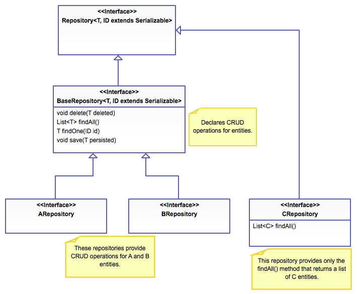

Исходник всего материала (ENG):
- [Petri Kainulainen Blog](https://www.petrikainulainen.net/programming/spring-framework/spring-data-jpa-tutorial-part-two-crud/)
- [GitHub code example](https://github.com/pkainulainen/spring-data-jpa-examples/tree/master)

---
- [См. настройка Spring проекта](https://start.spring.io/)
  
---
### Spring Data JPA Tutorial: CRUD

В [прошлом разделе](./3_SpringDataJPAConfiguration.md) мы настроили уровень персистентности
нашего приложения Spring. Теперь мы готовы создать наш первый репозиторий Spring Data JPA.

Мы можем создать репозиторий, который предоставляет CRUD операции, например для нашего ежедневника задач (наше приложение).

---
#### Создание репозитория

Прежде чем мы сможем создать наш первый JPA-репозиторий Spring Data, нам нужно создать класс сущности, который будет
содержать информацию об одной записи задачи. Соответствующая часть класса `Todo` выглядит следующим образом:

```java
import org.hibernate.annotations.Type;

import javax.persistence.Column;
import javax.persistence.Entity;
import javax.persistence.GeneratedValue;
import javax.persistence.GenerationType;
import javax.persistence.Id;
import javax.persistence.PrePersist;
import javax.persistence.Table;
import javax.persistence.Version;
import java.time.ZonedDateTime;

@Entity
@Table(name = "todos")
final class Todo {

    @Id
    @GeneratedValue(strategy = GenerationType.AUTO)
    private Long id;

    @Column(name = "creation_time", nullable = false)
    @Type(type = "org.jadira.usertype.dateandtime.threeten.PersistentZonedDateTime")
    private ZonedDateTime creationTime;

    @Column(name = "description", length = 500)
    private String description;

    @Column(name = "modification_time")
    @Type(type = "org.jadira.usertype.dateandtime.threeten.PersistentZonedDateTime")
    private ZonedDateTime modificationTime;

    @Column(name = "title", nullable = false, length = 100)
    private String title;

    @Version
    private long version;

    /* The constructor, builder, and other methods are omitted */
}
```

---
**Дополнительное чтение:**
- [Справочная документация Hibernate: 6.4 Пользовательские типы](https://docs.jboss.org/hibernate/orm/4.3/manual/en-US/html_single/#types-custom)

---
Теперь мы готовы создать наш первый репозиторий `Spring Data JPA`. Мы можем создать репозиторий, который предоставляет
операции CRUD для объектов `Todo`, используя один из следующих способов:
- Создать интерфейс, расширяющий интерфейс `CrudRepository`;
- Создать интерфейс, расширяющий интерфейс `Repository`, и добавить в созданный интерфейс необходимые методы;

**Давайте подробнее рассмотрим эти способы ниже.**

---
### Расширение интерфейса CrudRepository

Если мы создадим наш репозиторий, расширив интерфейс CrudRepository, нам нужно будет предоставить два параметра типа:
- Тип объекта, которым управляет наш репозиторий `<Entity>`.
- Тип поля идентификатора сущности `<ID>`.

Другими словами, когда мы создаем репозиторий, который предоставляет операции `CRUD` для объектов `Todo`, мы должны
предоставить следующие параметры типа (см. сущность выше):
- Тип сущности — `Todo`;
- Тип поля идентификатора сущности — `Long`;

Исходный код интерфейса `TodoRepository` выглядит следующим образом:

```Java
import org.springframework.data.repository.CrudRepository;

interface TodoRepository extends CrudRepository<Todo, Long> {

}
```

---
**Дополнительное чтение:**
- [Javadoc интерфейса CrudRepository](https://docs.spring.io/spring-data/data-commons/docs/current/api/org/springframework/data/repository/CrudRepository.html)
- [Справочное руководство Spring Data JPA: 3.3 Определение интерфейсов репозитория](https://docs.spring.io/spring-data/jpa/docs/1.8.x/reference/html/#repositories.definition)

---
Интерфейс `CrudRepository` **объявляет множество методов**, но пусть, методы, относящиеся к этой статье, описаны ниже:
- метод `void delete(T entity)` - удаляет объект, идентификатор которого указан в качестве параметра метода;
- метод `Iterable<T> findAll()` - возвращает все объекты, сохраненные в базе данных;
- метод `T findOne(Long id)` - возвращает объект, идентификатор которого указан в качестве параметра метода. Если объект не найден, этот метод возвращает значение null;
- метод `T save(T entity)` - сохраняет объект, указанный в качестве параметра метода, и возвращает сохраненный объект;

Сервисный класс `TodoCrudService`, который предоставляет операции CRUD для работы с задачами ежедневника, использует эти
методы для выполнения своих обязанностей (функций):

```Java
package net.petrikainulainen.springdata.jpa.todo;

import org.slf4j.Logger;
import org.slf4j.LoggerFactory;
import org.springframework.beans.factory.annotation.Autowired;
import org.springframework.stereotype.Service;
import org.springframework.transaction.annotation.Transactional;

import java.util.List;
import java.util.Optional;

@Service
final class RepositoryTodoService implements TodoCrudService {

    private static final Logger LOGGER = LoggerFactory.getLogger(RepositoryTodoService.class);

    private final TodoRepository repository;

    @Autowired
    RepositoryTodoService(TodoRepository repository) {
        this.repository = repository;
    }

    @Transactional
    @Override
    public TodoDTO create(TodoDTO newTodoEntry) {
        LOGGER.info("Creating a new todo entry by using information: {}", newTodoEntry);

        Todo created = Todo.getBuilder()
                .description(newTodoEntry.getDescription())
                .title(newTodoEntry.getTitle())
                .build();

        created = repository.save(created);
        LOGGER.info("Created a new todo entry: {}", created);

        return TodoMapper.mapEntityIntoDTO(created);
    }

    @Transactional
    @Override
    public TodoDTO delete(Long id) {
        LOGGER.info("Deleting a todo entry with id: {}", id);

        Todo deleted = findTodoEntryById(id);
        LOGGER.debug("Found todo entry: {}", deleted);

        repository.delete(deleted);
        LOGGER.info("Deleted todo entry: {}", deleted);

        return TodoMapper.mapEntityIntoDTO(deleted);
    }

    @Transactional(readOnly = true)
    @Override
    public List<TodoDTO> findAll() {
        LOGGER.info("Finding all todo entries.");

        List<Todo> todoEntries = repository.findAll();

        LOGGER.info("Found {} todo entries", todoEntries.size());

        return TodoMapper.mapEntitiesIntoDTOs(todoEntries);
    }

    @Transactional(readOnly = true)
    @Override
    public TodoDTO findById(Long id) {
        LOGGER.info("Finding todo entry by using id: {}", id);

        Todo todoEntry = findTodoEntryById(id);
        LOGGER.info("Found todo entry: {}", todoEntry);

        return TodoMapper.mapEntityIntoDTO(todoEntry);
    }

    @Transactional
    @Override
    public TodoDTO update(TodoDTO updatedTodoEntry) {
        LOGGER.info("Updating the information of a todo entry by using information: {}", updatedTodoEntry);

        Todo updated = findTodoEntryById(updatedTodoEntry.getId());
        updated.update(updatedTodoEntry.getTitle(), updatedTodoEntry.getDescription());

        /*
        Нам нужно сбросить изменения или иначе возвращаемый
        объект не содержит обновленной информации аудита.
        */
        repository.flush();

        LOGGER.info("Updated the information of the todo entry: {}", updated);

        return TodoMapper.mapEntityIntoDTO(updated);
    }

    private Todo findTodoEntryById(Long id) {
        Optional<Todo> todoResult = repository.findOne(id);
        return todoResult.orElseThrow(() -> new TodoNotFoundException(id));
    }
}
```

[См. код на GitHub}](https://github.com/pkainulainen/spring-data-jpa-examples/blob/master/query-methods/src/main/java/net/petrikainulainen/springdata/jpa/todo/RepositoryTodoService.java)

**Теперь давайте выясним, как мы можем создать интерфейс нашего репозитария, расширяющий интерфейс Repository.**

---
### Расширение интерфейса Repository

Если мы создадим наш репозиторий, расширив интерфейс `Repository`, нам необходимо выполнить следующие шаги:
- Шаг 1. Указать два параметра типа:
            - Тип управляемого объекта (`Todo`);
            - Тип поля идентификатора сущности (`Long`);
- Шаг 2. Добавить необходимые методы в интерфейс репозитория:
            - метод `void delete(Todo delete)` - удаляет объект `Todo`, указанный в качестве параметра метода;
            - метод `List <Todo> findAll()` - возвращает все объекты `Todo`, найденные в базе данных;
            - метод `Optional <Todo> findOne(Long id)` - находит запись задачи, идентификатор которой указан в качестве параметра метода. Если запись задачи не найдена, этот метод возвращает пустое значение `Optional`;
            - метод `Todo save(Todo persisted)` - сохраняет объект `Todo`, заданный в качестве параметра метода, и возвращает сохраненный объект;

Исходный код интерфейса `TodoRepository` выглядит следующим образом:

```Java
import org.springframework.data.repository.Repository;

import java.util.List;
import java.util.Optional;

interface TodoRepository extends Repository<Todo, Long> {

    void delete(Todo deleted);

    List<Todo> findAll();

    Optional<Todo> findOne(Long id);

    Todo save(Todo persisted);
}
```

В нашем случае мы имеем нечто похожее: [CompanyRepository.java](../src/main/java/spring/oldboy/database/repository/company_repository/CompanyRepository.java)

Если мы не хотим возвращать `Optional` объекты (Guava/Java 8), мы также можем использовать «традиционный» метод `Todo findOne(Long id)`.

---
**Дополнительное чтение:**
- [Javadoc Repository interface](https://docs.spring.io/spring-data/data-commons/docs/current/api/org/springframework/data/repository/Repository.html)
- [Справочное руководство Spring Data JPA: 3.3.1 Определение точной настройки репозитория](https://docs.spring.io/spring-data/jpa/docs/1.8.x/reference/html/#repositories.definition-tuning)
- [Что нового в Spring Data Dijkstra (поиск «поддержка типов-оболочек в качестве возвращаемых значений»)](https://spring.io/blog/2014/05/21/what-s-new-in-spring-data-dijkstra)

---
### Какой способ нам следует использовать?

**Ответа нет.** 

**Можно придерживаться двух правил**, которым мы можем следовать при создании репозиториев Spring Data JPA.
Вот эти правила:
- Если мы **хотим предоставить все методы репозитория**, объявленные интерфейсом `CrudRepository`, **И мы НЕ хотим возвращать
  `Optional`** объекты (Guava/Java 8), наши интерфейсы репозитория **должны расширять интерфейс `CrudRepository`**;
- Если мы **не хотим предоставлять все методы репозитория**, объявленные интерфейсом `CrudRepository`, **ИЛИ мы хотим возвращать
  `Optional`** объекты (Guava/Java 8), наши интерфейсы репозитория **должны расширять интерфейс `Repository`**;

**- Дело закрыто?** 
**- Не совсем.** 

**Существует мнение**, что мы всегда **должны использовать второй способ**. Это мнение основано на двух причинах:
- **Когда мы создаем интерфейс**, нам не следует добавлять к нему ненужные методы. **Мы должны делать интерфейс как можно
  меньшим**, потому что маленькие интерфейсы проще в использовании и помогают нам создавать компоненты, выполняющие
  только одну задачу;
- `Optional` **помогает нам создавать более качественные API**, поскольку показывает, что возвращаемого значения может не быть;

---
**Дополнительное чтение:**
- [Минимальный интерфейс](https://martinfowler.com/bliki/MinimalInterface.html)
- [Код, раскрывающий намерения, с новым типом Java 8 'Optional'](https://nipafx.dev/intention-revealing-code-java-8-optional/)
- [Устали от NullPointerExceptions? Рассмотрите возможность использования Java SE 8 'Optional'](https://www.oracle.com/technical-resources/articles/java/java8-optional.html)
- [Дизайн с использованием Optional](https://nipafx.dev/ (статья удалена, интересный блог))

---
Если мы **создаем наши репозитории, расширяя интерфейс Repository** и добавляем необходимые методы к созданным интерфейсам
репозитория, **нам нужно добавить «одни и те же» методы в каждый интерфейс**. 

**ВЕРНО? НЕВЕРНО!!!**

Мы можем избежать этого, выполнив следующие шаги:
- Шаг 1. - Создаем базовый интерфейс, расширяющий интерфейс `Repository`, и добавляем в этот интерфейс общие методы;
- Шаг 2. - Создаем фактический интерфейс репозитория, который расширяет наш базовый интерфейс;

**Давайте взглянем на эти шаги поближе:**
- ВО-ПЕРВЫХ, нам нужно создать базовый интерфейс, который объявляет методы, используемые нашими репозиториями.

Мы можем сделать это, выполнив следующие шаги:
- Шаг 1. - Создаем интерфейс `BaseRepository`, расширяющий интерфейс Repository.
           Этот интерфейс имеет два параметра типа:
                 - `T` - описывает тип управляемого объекта;
                 - `ID` - описывает тип поля идентификатора сущности (того самого объекта);
- Шаг 2. - Аннотируем созданный интерфейс аннотацией `@NoRepositoryBean`. Это гарантирует, что `Spring Data JPA` не попытается создать реализацию для нашего базового интерфейса репозитория.
- Шаг 3. - Добавляем общие методы в созданный интерфейс.

Исходный код интерфейса BaseRepository выглядит следующим образом:

```Java
import org.springframework.data.repository.NoRepositoryBean;
import org.springframework.data.repository.Repository;

import java.util.List;
import java.util.Optional;

@NoRepositoryBean
interface BaseRepository<T, ID extends Serializable> extends Repository<T, ID> {

    void delete(T deleted);

    List<T> findAll();

    Optional<T> findOne(ID id);

    T save(T persisted);
}
```

---
**Дополнительное чтение:**
- [Javadoc аннотации @NoRepositoryBean](https://docs.spring.io/spring-data/commons/docs/current/api/org/springframework/data/repository/NoRepositoryBean.html)

---
- ВО-ВТОРЫХ, нам нужно создать реальный интерфейс репозитория, который расширяет наш базовый интерфейс.

Мы можем сделать это, выполнив следующие шаги:
- Шаг 1. - Создать интерфейс `TodoRepository`.
- Шаг 2. - Расширить интерфейс `BaseRepository` и предоставьте два параметра типа:
            - Тип управляемой сущности — `Todo`.
            - Тип поля идентификатора (ID) сущности — `Long`.

Исходный код интерфейса `TodoRepository` выглядит следующим образом:

```Java
interface TodoRepository extends BaseRepository<Todo, Long> {

}
```

Теперь **мы создали иерархию репозитория**, которая позволяет нам:
- Создавать репозитории, которые **предоставляют операции CRUD для сущностей, не объявляя «одни и те же» методы в каждом интерфейсе репозитория**.
- Создавать репозитории, которые **не обеспечивают все операции CRUD**. Например, мы можем создать репозиторий, который предоставляет только метод findAll().

На рисунке показаны преимущества этого решения см. 



---
**В итоге:**
- Мы **можем создавать интерфейсы репозитория, расширяя интерфейс CrudRepository или Repository**.
- Нам **следует создавать наши репозитории, расширив интерфейс Repository и добавив необходимые методы** в созданный интерфейс репозитория.
- Если наше **приложение имеет более одного репозитория, нам следует создать интерфейс базового репозитория**, который объявляет методы, используемые нашими «конкретными» репозиториями.

[Теперь разберемся с методами запросов: →](./5_IntroductionQueryMethods.md) 
