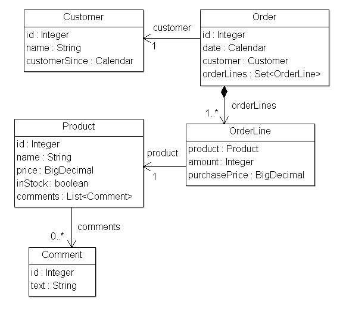
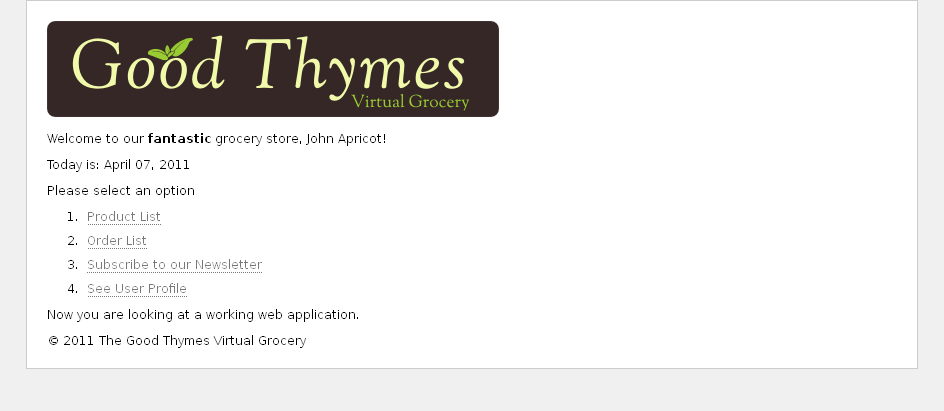

- [См. исходник (ENG)](https://www.thymeleaf.org/doc/tutorials/3.1/usingthymeleaf.html#the-good-thymes-virtual-grocery)

---
### Хорошая виртуальная бакалейная лавка Thymes

Исходный код примеров, показанных в этом и будущих главах руководства, можно найти в репозитории [Good Thymes Virtual Grocery GitHub](https://github.com/thymeleaf/thymeleafexamples-gtvg)

---
#### 2.1 Вебсайт для бакалейной лавки

Чтобы лучше объяснить концепции, связанные с обработкой шаблонов с помощью Thymeleaf, в этом учебнике будет
использоваться демонстрационное приложение, которое вы можете загрузить с веб-сайта проекта.

Это приложение является веб-сайтом воображаемого виртуального бакалейного магазина и предоставит нам множество
сценариев, чтобы продемонстрировать многие функции Thymeleaf.

Для начала нам нужен простой набор объектов-моделей для нашего приложения: *'Продукты'*, которые продаются *'Клиентам'*
через *'Заказы'*. Мы также будем управлять комментариями о продуктах см. 



Наше приложение также будет иметь очень простой сервис уровень, состоящий из объектов Service, содержащих такие методы, как:

```java
    public class ProductService {
        ...
        public List<Product> findAll() {
            return ProductRepository.getInstance().findAll();
        }
    
        public Product findById(Integer id) {
            return ProductRepository.getInstance().findById(id);
        }
    }
```

На веб-уровне наше приложение будет иметь фильтр, который делегирует выполнение команд с поддержкой Thymeleaf в
зависимости от URL-адреса запроса:

```java
    private boolean process(HttpServletRequest request, HttpServletResponse response)
            throws ServletException {
    
        try {
            /* Это предотвращает запуск выполнения механизма для URL-адресов ресурсов */
            if (request.getRequestURI().startsWith("/css") ||
                    request.getRequestURI().startsWith("/images") ||
                    request.getRequestURI().startsWith("/favicon")) {
                return false;
            }
    
            /*
            Запросим сопоставление контроллера и URL-адреса и получим контроллер,
            который будет обрабатывать запрос. Если контроллер недоступен, вернем
            false и позволим другим фильтрам/сервлетам обработать запрос.
            */
            IGTVGController controller = this.application.resolveControllerForRequest(request);
            if (controller == null) {
                return false;
            }
    
            /* Получим экземпляр TemplateEngine. */
            ITemplateEngine templateEngine = this.application.getTemplateEngine();
    
            /* Напишем (зададим) заголовки ответов */
            response.setContentType("text/html;charset=UTF-8");
            response.setHeader("Pragma", "no-cache");
            response.setHeader("Cache-Control", "no-cache");
            response.setDateHeader("Expires", 0);
    
            /*
            Выполним шаблон представления контроллера и процесса,
            записав результаты в средство записи ответов.
            */
            controller.process(
                    request, response, this.servletContext, templateEngine);
    
            return true;
    
        } catch (Exception e) {
            try {
                response.sendError(HttpServletResponse.SC_INTERNAL_SERVER_ERROR);
            } catch (final IOException ignored) {
                // Просто игнорируем это
            }
            throw new ServletException(e);
        }
    }
```

Интерфейс нашего контроллера IGTVGController:

```java
    public interface IGTVGController {
        public void process(
                HttpServletRequest request, HttpServletResponse response,
                ServletContext servletContext, ITemplateEngine templateEngine);
    
    }
```

Все, что осталось сделать — это реализовать интерфейс IGTVGController, запрашивающий данные из сервисов и обрабатывающий
шаблоны с помощью объекта ITemplateEngine.

В конце это будет выглядеть, как см. 



---
#### 2.2 Создание и конфигурирование Template Engine

Метод process(…) в нашем фильтре содержит эту строку:

```java
    ITemplateEngine templateEngine = this.application.getTemplateEngine();
```

Это означает, что класс GTVGApplication отвечает за создание и настройку одного из наиболее важных объектов в приложении
Thymeleaf: экземпляр [TemplateEngine](https://www.thymeleaf.org/apidocs/thymeleaf/3.0.0.BETA02/org/thymeleaf/TemplateEngine.html) (реализация интерфейса [ITemplateEngine](https://www.thymeleaf.org/apidocs/thymeleaf/3.0.0.BETA02/org/thymeleaf/ITemplateEngine.html)).

Наш объект [TemplateEngine](https://www.thymeleaf.org/apidocs/thymeleaf/3.0.0.BETA02/org/thymeleaf/TemplateEngine.html) инициализируется:

```java
    public class GTVGApplication {
        ...
        private final TemplateEngine templateEngine;
        ...
        public GTVGApplication(final ServletContext servletContext) {
    
            super();
    
            ServletContextTemplateResolver templateResolver =
                    new ServletContextTemplateResolver(servletContext);
    
            /* HTML — режим по умолчанию, но мы все равно устанавливаем его для лучшего понимания кода */
            templateResolver.setTemplateMode(TemplateMode.HTML);
    
            /* Зададим префикс и суффикс что позволит "home" превратить в "/WEB-INF/templates/home.html" */
            templateResolver.setPrefix("/WEB-INF/templates/");
            templateResolver.setSuffix(".html");
    
            /*
            Срок жизни кэша шаблонов будет 1 час. Если не установлено,
            записи будут кэшироваться до тех пор, пока не будут удалены LRU.
            */
            templateResolver.setCacheTTLMs(Long.valueOf(3600000L));
    
            /*
            По умолчанию для кэша установлено значение true. Установите значение
            false, если вы хотите, чтобы шаблоны автоматически обновлялись при
            изменении.
            */
            templateResolver.setCacheable(true);
    
            this.templateEngine = new TemplateEngine();
            this.templateEngine.setTemplateResolver(templateResolver);
            ...
        }
    }
```

Существует множество способов настройки объекта TemplateEngine, но на данный момент эти несколько строк кода будут
достаточно подробно информировать нас о необходимых шагах.

---
#### The Template Resolver

Давайте начнем с [Template Resolver](https://www.thymeleaf.org/apidocs/thymeleaf/3.0.0.BETA03/org/thymeleaf/templateresolver/ServletContextTemplateResolver.html):

```java
    ServletContextTemplateResolver templateResolver =
            new ServletContextTemplateResolver(servletContext);
```

[Template Resolvers](https://www.thymeleaf.org/apidocs/thymeleaf/3.0.0.BETA03/org/thymeleaf/templateresolver/ServletContextTemplateResolver.html) являются объектами, которые реализуют интерфейс из Thymeleaf API, называемый [org.thymeleaf.templateresolver.ITemplateResolver](https://www.thymeleaf.org/apidocs/thymeleaf/3.0.0.BETA02/org/thymeleaf/templateresolver/ITemplateResolver.html):

```java
    public interface ITemplateResolver {
        ...
        /*
        Шаблоны разрешаются по их имени (или содержимому), а также (необязательно)
        по шаблону владельца на случай, если мы пытаемся разрешить фрагмент для
        другого шаблона. Возвращает значение null, если шаблон не может быть
        обработан этим преобразователем шаблонов.
        */
        public TemplateResolution resolveTemplate(
                final IEngineConfiguration configuration,
                final String ownerTemplate, final String template,
                final Map<String, Object> templateResolutionAttributes);
    }
```

Эти объекты отвечают за определение того, как будут доступны шаблоны, и в этом приложении [GTVG - ServletContextTemplateResolver](https://www.thymeleaf.org/apidocs/thymeleaf/3.0.0.BETA03/org/thymeleaf/templateresolver/ServletContextTemplateResolver.html) 
означает, что мы собираемся извлекать файлы шаблонов в качестве ресурсов из контекста сервлета на уровне приложения 
[ServletContext](https://jakarta.ee/specifications/platform/9/apidocs/jakarta/servlet/servletcontext), который существует в 
каждом веб-приложении Java, и который разрешает ресурсы из корня веб-приложения.

Но это еще не все, что мы можем сказать о распознавателе шаблона. Мы можем установить на нем некоторые параметры
конфигурации. Например, режим шаблона:

```java
    templateResolver.setTemplateMode(TemplateMode.HTML);
```

HTML — это режим шаблонов по умолчанию для ServletContextTemplateResolver, но это хорошая практика, чтобы установить
его в любом случае, чтобы наши документы кода четко указывали, что происходит.

```java
    templateResolver.setPrefix("/WEB-INF/templates/");
    templateResolver.setSuffix(".html");
```

Префикс и суффикс изменяют имена шаблонов, которые мы передадим движку для получения имен реальных ресурсов, и которые
будут использоваться.

Используя эту конфигурацию, имя шаблона «product/list» будет соответствовать:

```java
    servletContext.getResourceAsStream("/WEB-INF/templates/product/list.html");
```

Необязательно, но количество времени, в течение которого анализируемый шаблон может проживать в кеше, настраивается в
Template Resolver с помощью свойства cacheTTLMs:

```java
    templateResolver.setCacheTTLMs(3600000L);
```

Шаблон все еще может исчезнуть из кеша до достижения TTL, если достигнут максимальный размер кеша, и это самая старая
запись.

Поведение и размеры кэша могут быть определены пользователем путем реализации интерфейса [ICacheManager](https://www.thymeleaf.org/apidocs/thymeleaf/3.0.0.BETA03/org/thymeleaf/cache/ICacheManager.html) или путем изменения объекта [StandardCacheManager](https://www.thymeleaf.org/apidocs/thymeleaf/3.0.0.BETA03/org/thymeleaf/cache/StandardCacheManager.html) для управления кешем по умолчанию.

Можно еще сказать много слов о template resolvers, но давайте вернемся к созданию нашего объекта Template Engine.

---
#### Template Engine

Объекты Template Engine — это реализация интерфейса [ITemplateEngine](https://www.thymeleaf.org/apidocs/thymeleaf/3.0.0.BETA03/org/thymeleaf/ITemplateEngine.html). Одна из этих реализаций предлагается
ядром Thymeleaf: [TemplateEngine](https://www.thymeleaf.org/apidocs/thymeleaf/3.0.0.BETA03/org/thymeleaf/TemplateEngine.html), и мы создаем его экземпляр:

```java
    templateEngine = new TemplateEngine();
    templateEngine.setTemplateResolver(templateResolver);
```

Просто, не так ли? Все, что нам нужно, это создать экземпляр и установить для него template resolvers.

Template resolvers является единственным обязательным параметром, требуемым TemplateEngine, хотя есть много других,
которые будут рассмотрены позже (message resolvers, размеры кеша и т. Д.). Пока что это все, что нам нужно.

Наш шаблонный модуль теперь готов, и мы можем начать создавать страницы с помощью [Thymeleaf](https://www.thymeleaf.org/).
