- [См. исходник (RUS)](https://habr.com/ru/articles/483374/)
- [См. оригинал (ENG)](https://www.springboottutorial.com/rest-api-best-practices-with-java-and-spring)

---
### Рекомендации по REST API — примеры проектирования веб-сервисов на Java и Spring

При разработке хорошего REST API важно иметь хорошие микросервисы.
- Как вы разрабатываете свой REST API?
- Каковы лучшие практики?

---
### Используйте Consumer First подход

Кто будет пользоваться вашим сервисом? Потребитель услуг!

Вы смотрите на сервис с точки зрения потребителя:
- Если вы разрабатываете API, сможет ли ваш потребитель понять ваш API?
- Если вы опубликуете свои ресурсы, сможет ли потребитель найти и получить к ним доступ?
- Сможет ли потребитель понять ваши URI?
- Какой тип услуги вы предоставляете?
- Это мобильное приложение или веб-приложение?
- Каких потребителей вы ожидаете, и могут ли эти типы потребителей измениться в будущем?
- Если вы реализуете что-то вроде HATEOAS, подумайте, как ваши потребители будут использовать это, прежде чем внедрять.

**!!! ВАЖНО !!!**
---
1. Самое главное — иметь отличную документацию.
2. Сделайте вещи проще для ваших потребителей - сэкономьте их и ваше время.
3. Чем больше потребители могут сделать самостоятельно, тем меньше работы для вас.
---

Всякий раз, когда у вас проходит обсуждение или ревью сервиса, ставьте требования потребителя на первое место.

---
### Используйте Contract First подход

Что такое контракт? Создатель веб-сервиса считается поставщиком сервиса. Приложение, которое использует веб-сервис,
является потребителем сервиса. Контракт — это соглашение между поставщиком и потребителем об услуге, см.

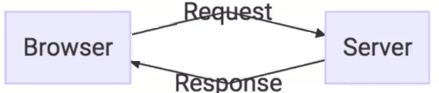

Чтобы правильно использовать услугу, потребитель сервиса должен полностью понимать договор. **Контракт включает в себя**
детали многих аспектов обслуживания, таких как:
- **Как вызвать веб-сервис?**
- **Какой транспорт используется?**
- **Каковы структуры запроса и ответа?**

**Это также называется определением сервиса (service definition)**. При contract first подходе вы сначала определяете
контракт на обслуживание, а затем только внедряете сервис.

---
### Contract First с WSDL

Например, когда вы определяете веб-службы SOAP, вы используете WSDL для определения договора см.

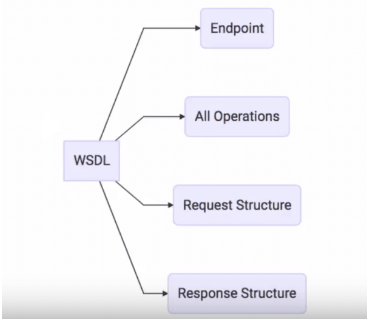

Фактически **WSDL определяет, каковы конечные точки**:
- службы;
- операции, которые вы публикуете;
- структуры запроса и ответа;

---
### Contract First с Swagger / Open API

Когда вы используете RESTful веб-сервисы, Swagger - это популярный инструмент для документирования ваших веб-сервисов, см. 

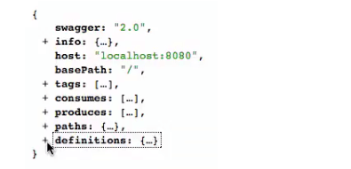

Swagger позволяет вам определить, какие ресурсы вы предоставляете в рамках своего API:
- Он включает в себя детали каждой операции, например, использует ли он XML, JSON или оба.
- Схема ответов также присутствует там, см. рис.
- Он также дает подробную информацию о кодах ответов, которые он поддерживает.

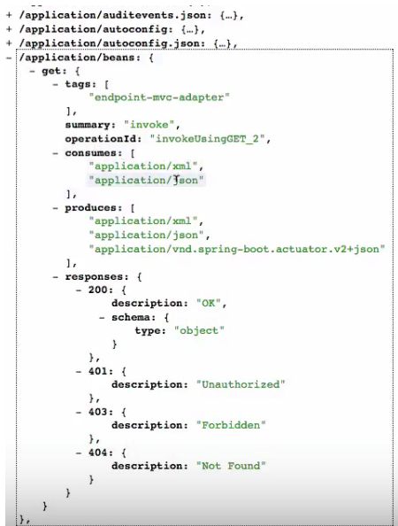

Например, вы можете увидеть, что этот конкретный ресурс - `/jpa/users`:
- см. поддерживает операцию GET:

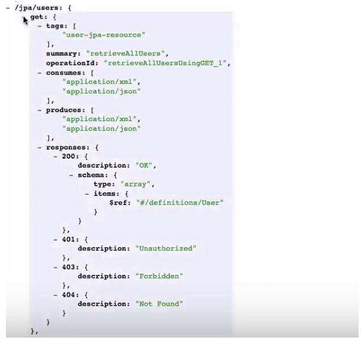

- см. поддерживает операцию POST:

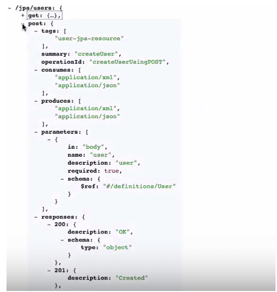

- см. схема ответа, если этот ресурс доступен:

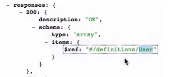

- см. определение объекта User присутствует в договоре Swagger:


Например, объект User согласно сгенерированной документации включает в себя атрибуты: birthDate, id, name и массив
сообщений posts. Некоторые поля также включают в себя поле описания внутри них.

При contract first подходе перед внедрением сервиса вы вручную или с помощью приложения создаете такое определение,
какое создал Swagger.

---
### Преимущества подхода Contract First

Используя contract first подход, вы думаете о своих потребителях и о том, как они могут использовать эту услугу. Вы
изначально не беспокоитесь о деталях реализации. Если на раннем этапе вы придаете большое значение внедрению,
технические подробности проникают в определение вашего сервиса. Вам нужно, чтобы определение вашего сервиса не зависело
от используемой платформы, будь то Java, .NET или какая-либо еще.

---
### Определите организационные стандарты для REST API

Важным [ориентиром для ваших организационных стандартов является YARAS](https://github.com/darrin/yaras)

**YARAS означает - 'Yet Another RESTful API Standard'** (еще один стандарт RESTful API). **YARAS** предоставляет стандарты,
руководства и соглашения, которые необходимо соблюдать при разработке RESTful веб-сервисов. Он **дает рекомендации для
следующих вещей**:
- Как вы должны назвать свои услуги;
- Как вы должны структурировать свой запрос и ответ;
- Как вы должны реализовать фильтрацию, сортировку, разбиение на страницы и другие действия;
- Как вы должны подходить к версионированию;
- Как вам нужно подходить к документации API;

---
### Единый подход к разработке сервисов

Вам нужно решить множество сложных проблем, прежде чем приступить к проектированию RESTful веб-сервисов. Все
перечисленное выше, необходимо выяснить. Руководство вашей организация не захочет, чтобы команды, которые занимаются
различными ресурсами, использовали разные подходы к этим вещам.

Например, нежелательно, чтобы Команда-A организовывала версионность на основе параметров запроса, а Команда-B
использовала версионность на основе URI. Поэтому важно, чтобы у вас были четко определенные организационные стандарты
для подхода к RESTful веб-сервисам.

---
### Кастомизация YARAS ПОД организационные нужды

Хорошая вещь в YARAS — это то, что он может быть настроен для удовлетворения потребностей, специфичных для организации.
Например, вы можете:
- Настройте, как должны выглядеть тела запросов и ответов;
- Выбрать конкретный вид системы управления версиями;

Поскольку YARAS имеет достаточно всеобъемлющий охват, вы можете быть уверены, что не пропустили ни одного важного решения.

---
### Выбор стандартного общеорганизационного REST API фреймвока

**Типичными фреймвоками**, которые используются **для создания веб-сервисов RESTful в мире Java** являются:
- **Spring MVC**;
- **Spring REST**;
- **JAX-RS**;

Если вы создадите специфичную для организации фреймвок/архетип/эталонное приложение, придерживающееся общих стандартов
организации, поверх предпочтительной REST API платформы, это позволит командам легко придерживаться общих стандартов.

Типичные особенности включают в себя:
- Структуры запросов и ответов;
- Обработка ошибок;
- Фильтрация;
- Поиск;
- Версионность;
- Поддержка ложных ответов;
- HATEOAS;

Стандартный фреймвок обеспечивает единый подход к проектированию и внедрению сервисов во всей организации.

---
### Децентрализованное управление REST API

Создайте группу экспертов из команд, создающих REST API, и сформируйте команду управления. Команда несет ответственность за:
- Улучшение стандартов REST API;
- Построение / Проектирование ваших REST API фреймвоков;

---
### Широкое использование HTTP

Всякий раз, когда вы думаете о веб-сервисах RESTful, думайте о HTTP.
HTTP имеет все функции, которые помогут вам создавать отличные веб-сервисы.

---
### Используйте правильные методы HTTP-запросов

Подумайте о методах HTTP-запросов, которые вам нужно использовать. Когда вы думаете о реализации какой-либо операции,
определите ресурс, на котором она должна быть выполнена, а затем найдите соответствующий метод HTTP-запроса. Вы
извлекаете детали, создаете что-то, обновляете что-то существующее или удаляете существующее и т.п.

Использование HTTP методов:
- GET для получения;
- POST для создания;
- PUT для обновления;
- DELETE для удаления;
- PATCH для частичных обновлений;

---
### Используйте соответствующий статус ответа HTTP

При выполнении операции убедитесь, что вы вернули правильный статус ответа.

Например, когда конкретный ресурс не найден, не выбрасывайте исключение сервера. Вместо этого отправьте соответствующий
код ответа в ответном сообщении, например 404.

Если на самом деле существует исключение сервера, отправьте обратно код 500.

В случае ошибки проверки отправьте код для неверного запроса.

---
### Фокус на представление

Каждый ресурс может иметь несколько представлений — в формате XML или JSON. Потребитель услуг может выбрать
представление по своему выбору.

Например, сервис возвращает 3 элемента users, когда мы отправляем запрос GET. В этом случае мы получаем
JSON-представление ресурса `/users`, см. 

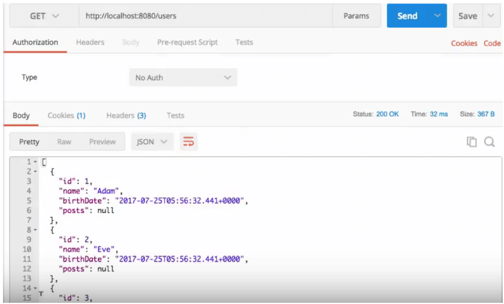

Т.е. когда потребитель явно не указывает предпочтительное представление, мы используем JSON.

Естественно, потребитель может отправить заголовок Accept, чтобы указать представление, см.

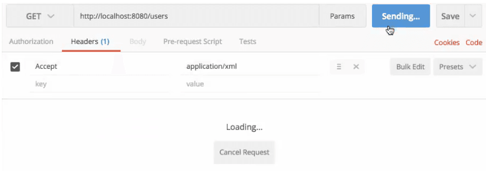 

и тогда тело ответа будет иметь содержимое в XML, см.

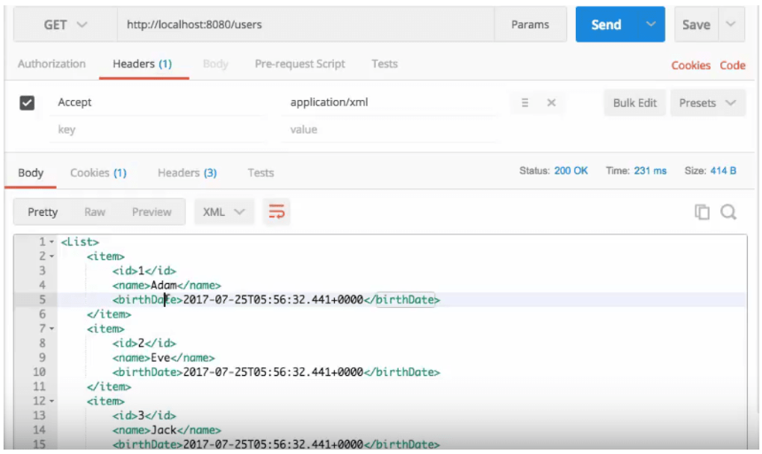

---
### Используйте множественное число

Всегда используйте множественное число, когда вы именуете ресурсы. Давайте посмотрим на простой пример. 
Предположим, у нас есть сервис, который размещает ресурс пользователя.

Ниже описано, как получить к ним доступ:
- Создать пользователя: POST /users ;
- Удалить пользователя: DELETE /users/1 ;
- Получить всех пользователей: GET /users ;
- Получить одного пользователя: GET /users/1 ;

Предпочтение множественного `users` единственному `user` делает URI более читабельным. Например, если мы 
используем `/user` вместо `/users` для получения, GET `/user` не передает правильное сообщение читателю.

---
### Создать хорошую документацию

Потребители должны понимать, как наилучшим образом использовать сервис, и лучший способ помочь им — создавать хорошую
документацию. Веб-сервисы SOAP могут использовать функциональность WSDL, в то время как RESTful веб-сервисы имеют опции
Swagger (теперь стандарт документации Open API).

Выбор формата — это только одна часть создания хорошей документации. Что также важно, так это предоставление нужного
количества информации, чтобы помочь потребителю.

Документация должна быть полной и включать следующие пункты:
- Что такое структура запроса и ответа?
- Как потребитель должен аутентифицировать себя?
- Каковы пределы использования?
- Укажите все типы ответных сообщений и соответствующие коды состояния, которые можно ожидать от службы.

---
### Создать общий портал документации REST API

Полезно было бы иметь общий портал документации REST API для всей организации. Взгляните на один такой портал, пример см. 

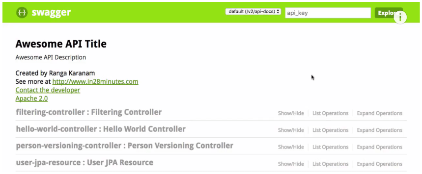

Такой портал объединяет все ресурсы, имеющиеся в организации. Наличие пользовательского интерфейса, такого как Swagger UI, 
будет иметь свои дополнительные преимущества.Используя Swagger UI, вы можете посмотреть документацию более подробно, например см.

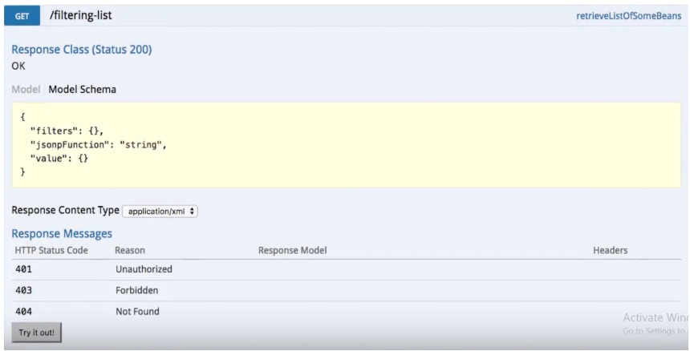

Это может быть использовано даже нетехническими пользователями. Информация, предоставляемая здесь, включает в себя:
- Ожидаемый формат ответа;
- Тип контента;
- Поддерживаемые коды ответов;

Интерес также может представлять формат документации в стиле «живой запрос/ответ».

---
### Поддержка версий (Версионность)

Управление версиями влечет за собой большую сложность для веб-службы. Поддерживать несколько разных версий одного и того
же веб-сервиса очень сложно. Старайтесь избегать этого, когда это возможно.

Однако в определенных сценариях управление версиями неизбежно. Рассмотрим пример службы:

**Ситуация 1** - Предположим, что мы изначально определили службу, имеющую класс PersonV1.

```java
public class PersonV1 {
		private String name;

		public PersonV1() {
			super();
		}

		public PersonV1(String name) {
			super();
			this.name = name;
		}

		public String getName() {
			return this.name;
		}

		public setName(String name) {
			this.name = name;
		}
	}
```

Данная версия класса не учитывает, что у имени может быть много подразделов, таких как имя и фамилия.

```java
public class Name {
			private String firstName;
			private String lastName;

			public Name() {
			}

			public Name(String firstName, String lastName) {
				this.firstName = firstName;
				thi.lastName = lastName;
			}

			public String getFirstName() {
				return this.firstName;
			}

			public String getLastName() {
				return this.lastName;
			}
		}
```

**Ситуация 2** - Вторая версия исходного класса была обновлена, чтобы исправить эту аномалию. Мы не можем сразу перенести
весь сервис для использования PersonV2. Т.к. там могут быть другие потребители, которые ожидают ответов в формате PersonV1.

```java
public class PersonV2 {
		private Name name;

		public PersonV1() {
			super();
		}

		public PersonV1(Name name) {
			super();
			this.name = name;
		}

		public String getName() {
			return this.name.getFirstName() + " " + this.name.getLastName();
		}

		public setName(Name name) {
			this.name = name;
		}
	}
```

Вот где требуется управление версиями. Давайте теперь посмотрим на варианты, которые мы имеем для управления версиями
этих двух ресурсов (их как минимум четыре):
- Использование разных URI;
- Использование параметра запроса;
- Использование Header (заголовка);
- Использование Accept Header;

---
### Использование разных URI

У нас есть первый вариант - использовать разные URI для этих разных ресурсов. В приведенном ниже коде мы используем разные
URI `v1/person` и `v2/person` для их различения.

```java
@RestController
	public class PersonVersioningController {

		@GetMapping("v1/person")
		public PersonV1 personV1() {
			return new PersonV1("Bob Charlie");
		}

		@GetMapping("v2/person")
		public PersonV2 personV2() {
			return new PersonV2(new Name("Bob", "Charlie"));
		}
	}
```

Если вы выполняете запрос GET для ресурса `v1/person` см.

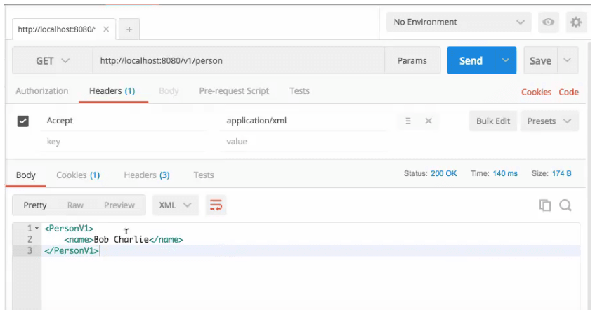

То вы получите информацию, соответствующую v1. Для другого ресурса см.

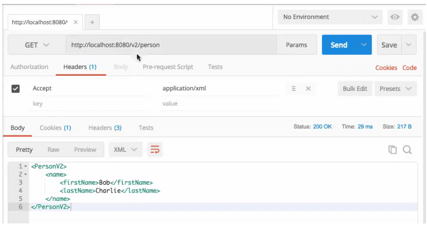

---
### Использование параметра запроса

У нас есть второй вариант - метод управления версиями использует параметр запроса.

```java
@RestController
	public class PersonVersioningController {

		@GetMapping(value="/person/param" params="version=1")
		public PersonV1 personV1() {
			return new PersonV1("Bob Charlie");
		}

		@GetMapping(value="/person/param" params="version=2")
		public PersonV2 personV2() {
			return new PersonV2(new Name("Bob", "Charlie"));
		}
	}
```

В URI `/person/param`, если мы отправляем параметр с version=1, мы возвращаем ресурс типа PersonV1 см.

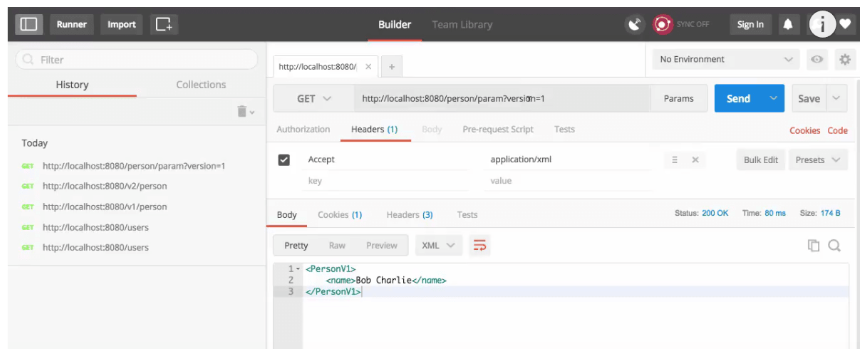

А для того же URI параметр с version=2 возвращает ресурс типа PersonV2 см. 

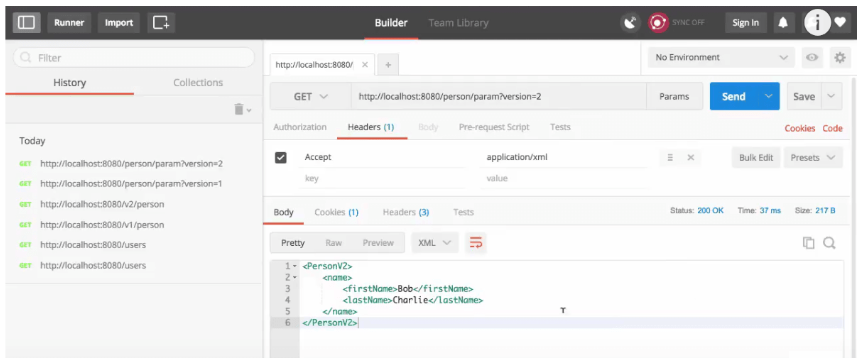

Этот метод называется управлением версиями с помощью параметров запроса.

---
### Использование Header (заголовка)

У нас есть третий вариант - вы можете управлять версиями, указав заголовок. Здесь мы используем заголовок с именем
X-API-VERSION и пометили URI как `/person/header`.

```java
@RestController
	public class PersonVersioningController {

		@GetMapping(value="/person/header" headers="X-API-VERSION=1")
		public PersonV1 personV1() {
			return new PersonV1("Bob Charlie");
		}

		@GetMapping(value="/person/header" headers="X-API-VERSION=1")
		public PersonV2 personV2() {
			return new PersonV2(new Name("Bob", "Charlie"));
		}
	}
```

Когда значение заголовка - 1, возвращается ресурс типа PersonV1 см. 

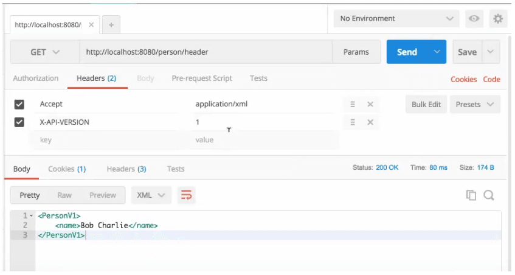

Когда его значение равно 2-ум, извлекается ресурс типа PersonV2 см. 

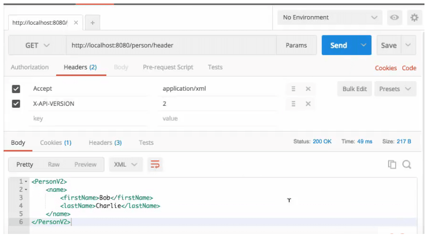

Тут мы явно используем атрибут в заголовке запроса, чтобы выполнить управление версиями.

---
### Использование Accept Header

У нас есть четвертый вариант - данный метод для создания версий использует Accept Header.

```java
@RestController
	public class PersonVersioningController {

		@GetMapping(value="/person/produces" produces="application/vnd.company.app-v1+json")
		public PersonV1 personV1() {
			return new PersonV1("Bob Charlie");
		}

		@GetMapping(value="/person/produces" produces="application/vnd.company.app-v2+json")
		public PersonV2 personV2() {
			return new PersonV2(new Name("Bob", "Charlie"));
		}
	}
```

Если потребитель включает информацию о первой версии в Accept Header запроса GET, возвращается следующий ресурс PersonV1 см. 

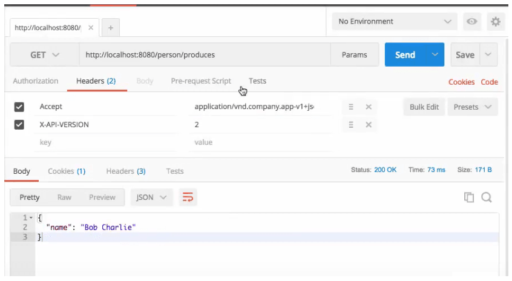

В противном случае возвращается ресурс типа PersonV2 см. 

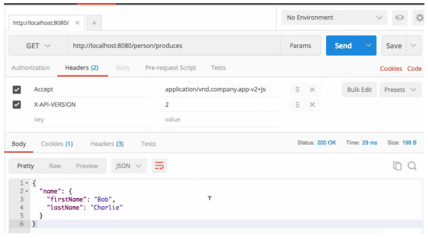

Этот **способ управления версией называется Accept Header Versioning или Media Type Versioning**, поскольку MIME-типы
обычно являются содержимым заголовка Accept.

---
### Сравнение методов управления версиями

До сих пор мы видели **четыре типа методов версиями**:
- Использование **разных URI**;
- Использование **параметра запроса**;
- Использование **заголовков**;
- Использование **Accept Header / Media Type**;

Какой из них самый лучший? 

Правда в том, что на этот вопрос нет однозначного ответа. В том-то и дело, что разные интернет-гиганты покровительствуют 
разным типам версий. 

Например:
- Использование разных URI — Twitter
- Использование параметра запроса — Amazon
- Использование заголовка — Microsoft
- Использование Accept Header / Media Type — GitHub

Вам необходимо оценить эти четыре варианта в соответствии с вашими конкретными потребностями. 

Есть **ряд важных факторов, которые следует учитывать**:
- **URI Pollution (Загрязнение URI)**: управляя версиями с использованием URI и параметров запроса мы в конечном итоге загрязняем
пространство URI. Это происходит потому, что мы добавляем префиксы и суффиксы к основным строкам URI. Управление версиями с
использованием заголовка позволяет избежать этого.

- **Misuse Of HTTP Headers (Неправильное использование заголовков HTTP)**: В случае управления версиями с использованием заголовков
и Media Type происходит неправильное использование заголовков HTTP, поскольку они изначально не предназначались для управления
версиями.

- **Caching (Кэширование)**: Ресурс определяется его URI. Однако, если вы не используете URI для определения его версии, а используете
механизм на основе заголовка, информация о версиях не может быть кэширована. Если для вас важно HTTP-кеширование, используйте управления
версиями на основе URI или параметра запроса.

- **Browser Request Executability (Выполняемость запроса браузера)**: Для управления версиями на основе заголовка и типа медиа требуется
использование таких инструментов, как Postman. Тем не менее, если потребители службы не разбираются в технических вопросах, то
предпочтительнее использовать управления версиями на основе URI или параметра запроса.

- **API Documentation (Документация API)**: Вам также нужно подумать о том, как вы хотите документировать свои API. Версионность на
основе URI и параметра запроса проще документировать, чем два других типа управления версиями.

**Поймите, что не существует единого идеального решения!**

---
### Подумайте об обработке ошибок

Когда потребитель отправляет запрос в службу, важно, чтобы он получил правильный ответ. Всякий раз, когда что-то идет
не так, важно отправить соответствующий ответ.

---
#### Когда потребитель запрашивает несуществующий ресурс

Если мы отправим запрос GET для поиска существующего пользователя, мы получим следующий ответ см. 

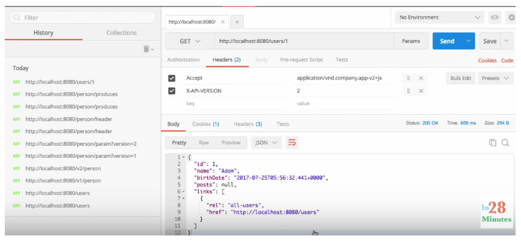

Если же вы ищете несуществующего пользователя см. 

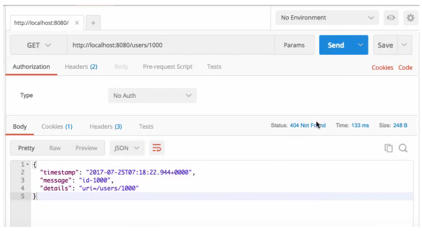

То, что вы получите, это статус 404 Not Found. Это хорошая обработка ошибок, поскольку она правильно определяет, что
ресурс не найден, и не возвращает ошибку сервера. Давайте теперь отправим запрос GET на несуществующий URI см. 

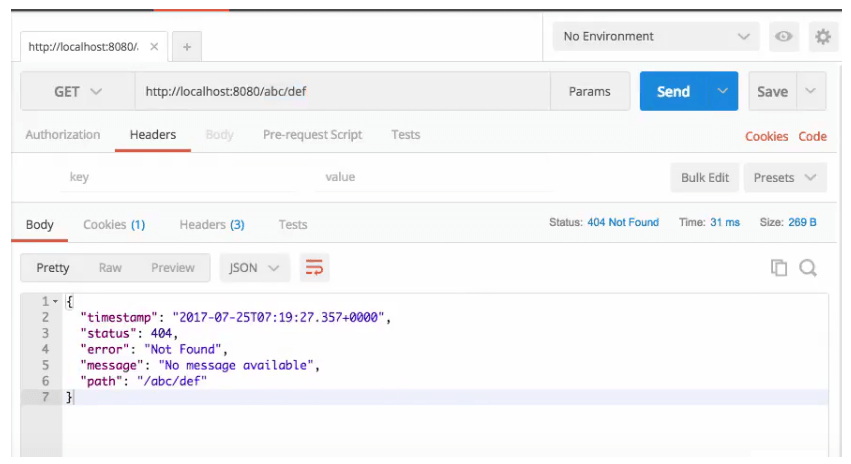

Как видите, вы получаете статусы ответа 404 Not Found. Неправильный URL указывает на несуществующий ресурс. 

Важные статусы ответа:
- 200 — успех;
- 404 — ресурс не найден;
- 400 — неверный запрос (например, ошибка проверки);
- 201 — создан;
- 401 — несанкционированный (при неудачной авторизации);
- 500 — ошибка сервера;

---
#### Сведения об ошибках в теле ответа

Это помогает, если у вас есть стандартная структура исключений при разработке вашего сервиса см. 

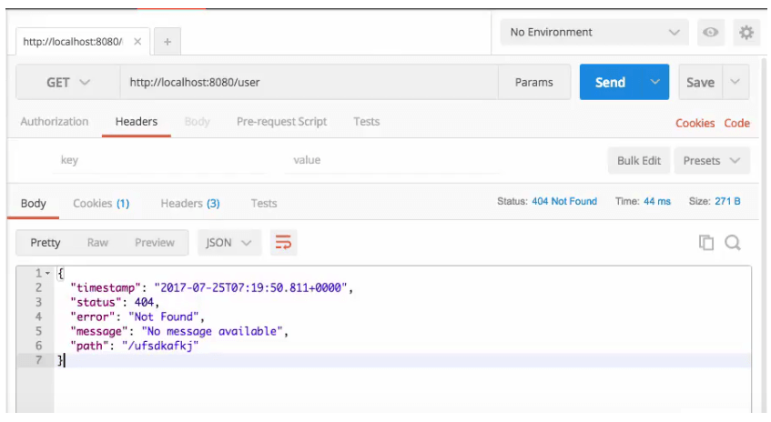

Для конкретных ошибок конкретные структуры ответа могут быть возвращены потребителю, и это может быть стандартом во
всей организации. Убедитесь, что ответ об ошибке также читается потребителям, без путаницы.

---
### Использование Swagger или Open API Documentation

Swagger обеспечивает один из самых популярных форматов документации для веб-сервисов RESTful. Сегодня он поддерживается
различными организациями и используется в большом количестве услуг. 

Здесь мы рассмотрим два основных аспекта Swagger:
- Формат документации Swagger;
- Swagger UI, который позволяет вам смотреть на документацию Swagger визуально удобным способом;

---
#### Swagger Документация

Посмотрите на следующий Swagger JSON см. 

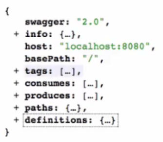

На верхнем уровне это выглядит очень похоже на определение WSDL. У него есть несколько важных атрибутов:
- host: где размещен сервис;
- basePath: путь, где размещен сервис;
- consumes: какие запросы принимаются см.

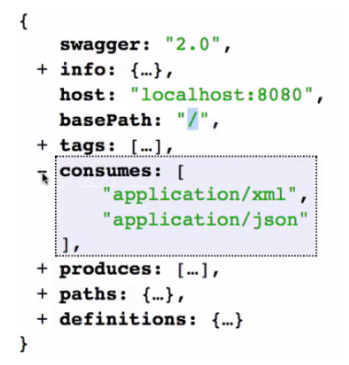

- produces: какие виды ответов генерируются см.

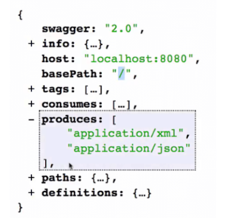

- paths: различные имеющиеся ресурсы и в этом случае у вас есть несколько типов ресурсов в списке см.

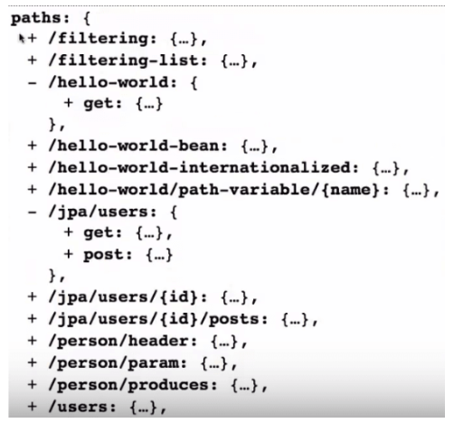

Когда вы посмотрите на документацию по Swagger, вы сможете быстро определить имеющиеся ресурсы, поддерживаемые операции
и операции, относящиеся к каждому ресурсу см. 

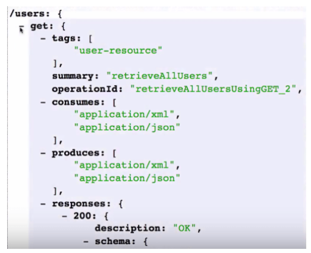

Например, ресурс `/users` поддерживает операции GET и POST. Для GET вы можете увидеть поддерживаемые типы запросов и ответов. 
Вы также видите различные типы ответов см. 

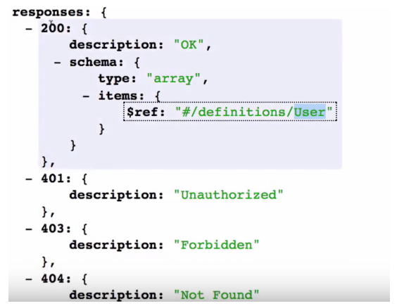

Обратите внимание, что для ответа 200 схема также упоминается как массив User. User является частью раздела definitions
(определения) в нижней части документа см. 

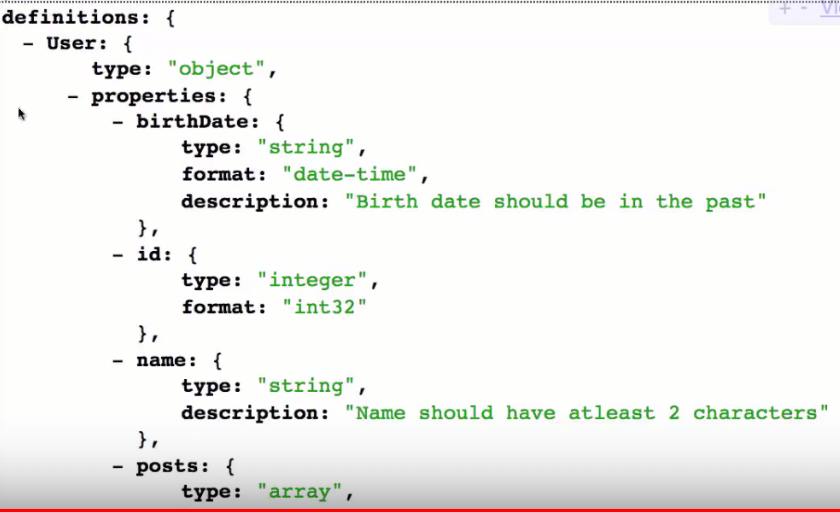

Swagger полностью независим от технологии, которую вы используете для реализации RESTful веб-сервиса. Все работает на
основе JSON.

---
#### Представляем Swagger UI

Swagger UI — отличный пользовательский интерфейс, который очень полезен для визуализации документации Swagger 
для веб-службы RESTful см. 

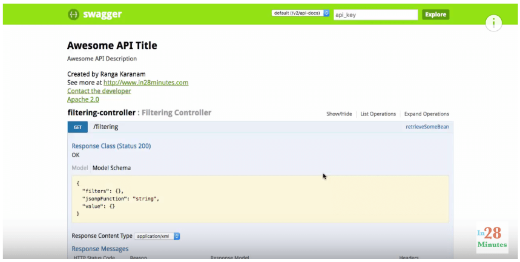

Обратите внимание, что мы выбрали конкретную версию веб-сервиса для просмотра его документации, более подробно см. 

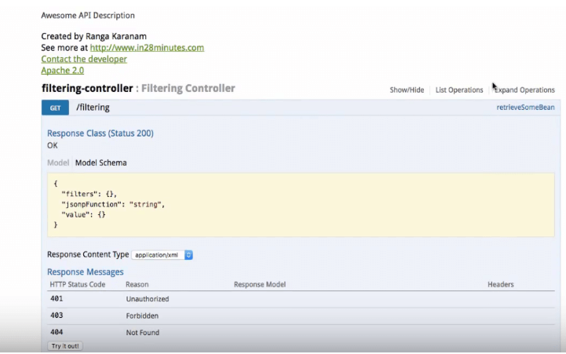

Теперь:
- Когда мы заходим на домашнюю страницу, она описывает перечисленные ресурсы, см.

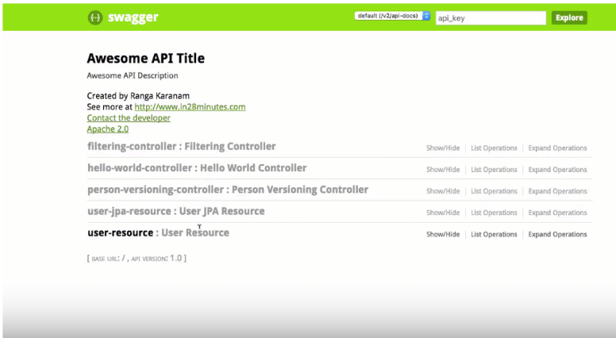

- Также можно увидеть набор операций, поддерживаемых для URL ресурсов, см.

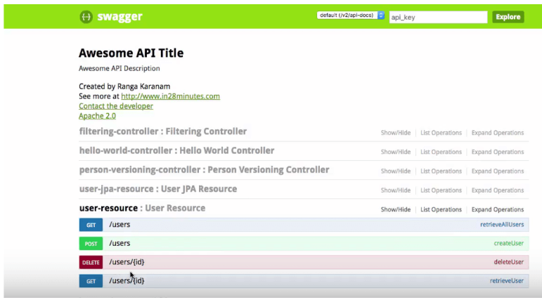

- Когда вы нажимаете на операцию GET определенного ресурса, вы получаете его детали, см.

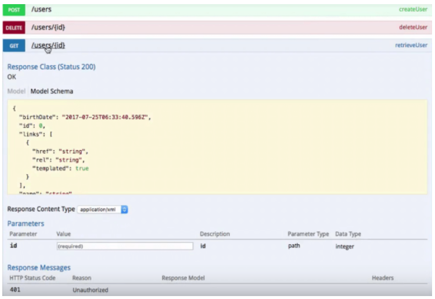

- Вы можете увидеть, что схема модели описана визуально. Атрибуты birthDate, id, links, name и posts также отображаются.
Вы также можете выполнить пример запроса и просмотреть ответ, см.

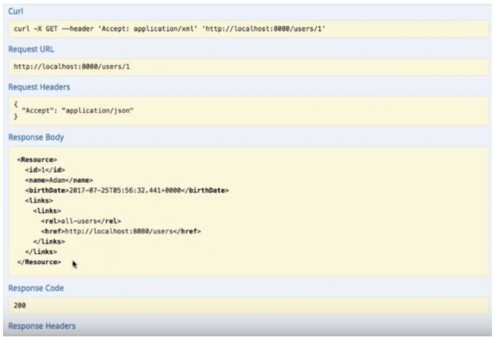

---
#### Использование инструментов Swagger (стандарт Open API) ***

Самое замечательное в Swagger — множество инструментов, доступных вокруг него. Взгляните на следующий сервис, который
мы использовали ранее, чтобы объяснить управление версиями. Вот посмотрите на автоматически сгенерированную документацию
для этого сервиса см. 

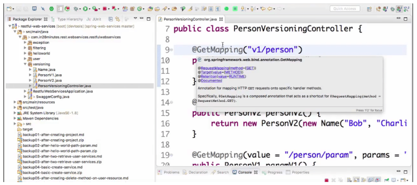.

В Swagger есть поддержка как подхода contract-first, так и подхода code-first.

---
**Доп. чтение:**

- [Be the BEST at Your REST API!](https://dzone.com/articles/be-the-best-api-you-can-be)
- [Developing REST APIs](https://dzone.com/articles/developing-rest-apis)

---
См. [комментарии к статье в русском исходнике](https://habr.com/ru/articles/483374/).
