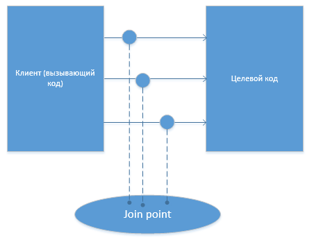
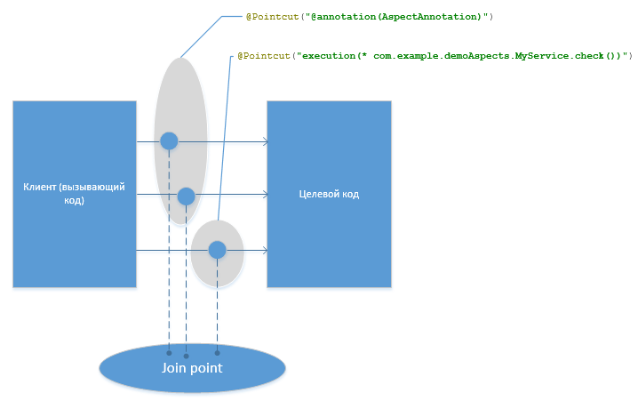
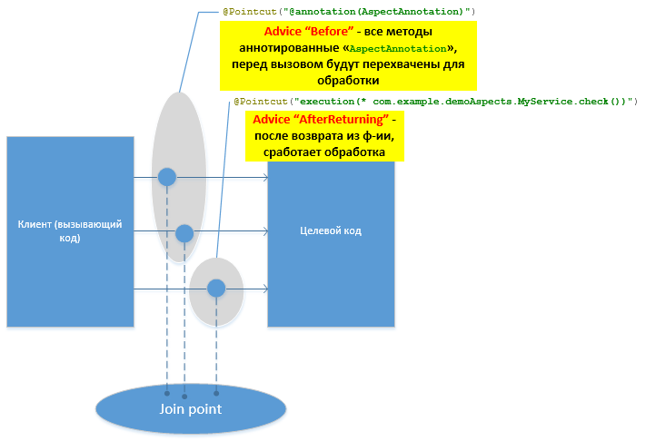
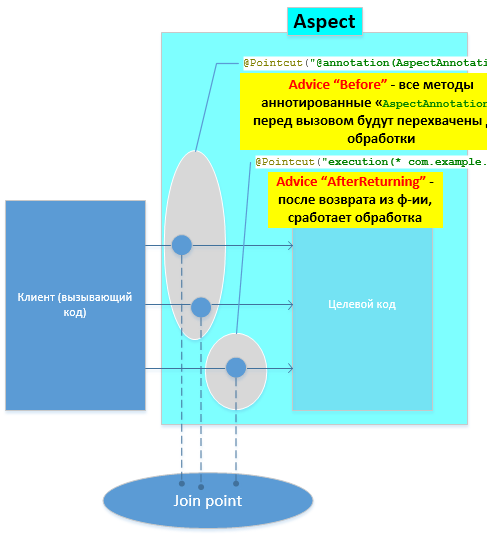
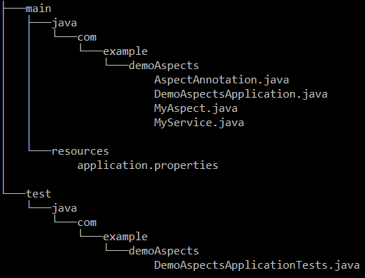

- [См. исходники и дополнения (RUS)](https://habr.com/ru/articles/428548/)

---
### Аспектно-ориентированное программирование в Spring

Аспектно-ориентированное программирование (АОП) — это парадигма программирования являющейся дальнейшим развитием
процедурного и объектно-ориентированного программирования (ООП). Идея АОП заключается в выделении так называемой
сквозной функциональности.

И так все по порядку, здесь я покажу как это сделать в Java — Spring @AspectJ annotation стиле (есть еще
schema-based xml стиль, функциональность аналогичная).

---
### Выделение сквозной функциональности

Код до выделения сквозной функциональности см.


Код после выделения общей сквозной функциональности см. 


Несложно заметить, что есть функциональность, которая затрагивает несколько модулей, но она не имеет прямого отношения
к бизнес-логике (бизнес-коду) приложения (сервиса), и ее необходимо вынести в отдельное место, это и показано на см.


---
### Основные понятия:

---
#### Join point:

**Join point — понятие в АОП, это точки наблюдения, присоединения к коду, где планируется введение функциональности** см.



---
#### Pointcut:

**Pointcut — срез, или запрос точек присоединения; это может быть одна и более точек.** Правила запросов точек очень
разнообразные, на рисунке см. 



Запрос по аннотации на методе и конкретный метод. Правила можно объединять знаками логики: 'AND' - &&, 'OR' - ||, 'NOT' - !

---
#### Advice:

**Advice — набор инструкций выполняемых на точках среза (Pointcut)**. Инструкции можно выполнять по событию разных типов:
- *Before — перед вызовом метода;*
- *After — после вызова метода;*
- *After returning — после возврата значения из функции;*
- *After throwing — в случае exception;*
- *After finally — в случае выполнения блока finally;*
- *Around — можно сделать пред., пост., обработку перед вызовом метода, а также вообще обойти вызов метода;*

На один Pointcut можно «повесить» несколько Advice разного типа см. 



---
#### Aspect:

**Aspect — модуль в котором собраны описания Pointcut и Advice**, см. 



Отличный пример - это логирование кода, который пронизывает многие модули, не имея отношения к бизнес-коду, но, тем не менее
без него нельзя.

---
### Логирование кода через AOP

Отделяем функционал логирования от бизнес-кода.

Целевой сервис:

```java
	@Service
	public class MyService {
	
	    public void method1(List<String> list) {
	        list.add("method1");
	        System.out.println("MyService method1 list.size=" + list.size());
	    }
	
	    @AspectAnnotation
	    public void method2() {
	        System.out.println("MyService method2");
	    }
	
	    public boolean check() {
	        System.out.println("MyService check");
	        return true;
	    }
	}
```

Aspect с описанием Pointcut и Advice:

```java
	@Aspect
	@Component
	public class MyAspect {
	
	    private Logger logger = LoggerFactory.getLogger(this.getClass());
	
	    @Pointcut("execution(public * com.example.demoAspects.MyService.*(..))")
	    public void callAtMyServicePublic() { }
	
	    @Before("callAtMyServicePublic()")
	    public void beforeCallAtMethod1(JoinPoint jp) {
	        String args = Arrays.stream(jp.getArgs())
	                .map(a -> a.toString())
	                .collect(Collectors.joining(","));
	        logger.info("before " + jp.toString() + ", args=[" + args + "]");
	    }
	
	    @After("callAtMyServicePublic()")
	    public void afterCallAt(JoinPoint jp) {
	        logger.info("after " + jp.toString());
	    }
	}
```

Вызывающий тестовый код:

```java
	@RunWith(SpringRunner.class)
	@SpringBootTest
	public class DemoAspectsApplicationTests {
	
	    @Autowired
	    private MyService service;
	
	    @Test
	    public void testLoggable() {
	        List<String> list = new ArrayList();
	        list.add("test");
	
	        service.method1(list);
	        service.method2();
	        Assert.assertTrue(service.check());
	    }
	}
```

Пояснения. В целевом сервисе нет никакого упоминания про запись в лог, в вызывающем коде тем более. Все логирование
сосредоточено в отдельном модуле

```java
	@Aspect
	class MyAspect ...
```

В Pointcut:

```java
    @Pointcut("execution(public * com.example.demoAspects.MyService.*(..))")
    public void callAtMyServicePublic() { }
```

Были запрошены все public методы `MyService` с любым типом возврата `*` и любым количеством аргументов - `(..)`.

В Advice Before и After которые ссылаются на Pointcut (callAtMyServicePublic), написаны инструкции для записи в лог.
JoinPoint это не обязательный параметр, который, предоставляет дополнительную информацию, но если он используется, то
он должен быть первым.

Все разнесено в разные модули! Вызывающий код, целевой, логирование.

Результат работы отображается в консоли см. 

![DOC/AOP_Articles/images/AOPLogResult.png]

Естественно правила Pointcut-ов могут быть различные:

---
### Несколько примеров Pointcut и Advice

- **Пример 1. Pointcut запрос по аннотации на методе:**

```java
    @Pointcut("@annotation(AspectAnnotation)")
    public void callAtMyServiceAnnotation() { }
```

Advice для него:

```java
    @Before("callAtMyServiceAnnotation()")
    public void beforeCallAt() { }
```

- **Пример 2. Pointcut запрос на конкретный метод с указанием параметров целевого метода:**

```java
    @Pointcut("execution(* com.example.demoAspects.MyService.method1(..)) && args(list,..))")
    public void callAtMyServiceMethod1(List<String> list) { }
```

Advice для него:

```java
    @Before("callAtMyServiceMethod1(list)")
    public void beforeCallAtMethod1(List<String> list) { }
```

- **Пример 3. Pointcut запрос для результата возврата:**

```java
    @Pointcut("execution(* com.example.demoAspects.MyService.check())")
    public void callAtMyServiceAfterReturning() { }
```

Advice для него:

```java
    @AfterReturning(pointcut="callAtMyServiceAfterReturning()", returning="retVal")
    public void afterReturningCallAt(boolean retVal) { }
```

- **Пример 4. - Проверка прав на Advice типа Around, через аннотацию:**

```java
  @Retention(RUNTIME)
  @Target(METHOD)
   public @interface SecurityAnnotation {
   }

   /* Наш аспект */
   @Aspect
   @Component
   public class MyAspect {

    @Pointcut("@annotation(SecurityAnnotation) && args(user,..)")
    public void callAtMyServiceSecurityAnnotation(User user) { }

    @Around("callAtMyServiceSecurityAnnotation(user)")
    public Object aroundCallAt(ProceedingJoinPoint pjp, User user) {
        Object retVal = null;
        if (securityService.checkRight(user)) {
         retVal = pjp.proceed();
         }
        return retVal;
    }
```

Методы которые необходимо проверять перед вызовом, на право, можно аннотировать «SecurityAnnotation», далее в Aspect-е
получим их срез, и все они будут перехвачены перед вызовом и сделана проверка прав.

Целевой код:

```java
	@Service
	public class MyService {
	
	   @SecurityAnnotation
	   public Balance getAccountBalance(User user) {
	       /* ... some business ... */
	   }
	
	   @SecurityAnnotation
	   public List<Transaction> getAccountTransactions(User user, Date date) {
	       /* ... some business ... */
	   }
	}
```

Вызывающий код:

```java
	balance = myService.getAccountBalance(user);
	if (balance == null) {
	   accessDenied(user);
	} else {
	   displayBalance(balance);
	}
```

Т.е. в вызывающем коде и целевом, проверка прав отсутствует, только непосредственно бизнес-логика.

- **Пример 5. - Профилирование того же сервиса с использованием Advice типа Around:**

```java
	@Aspect
	@Component
	public class MyAspect {
	
	    @Pointcut("execution(public * com.example.demoAspects.MyService.*(..))")
	    public void callAtMyServicePublic() {
	    }
	
	    @Around("callAtMyServicePublic()")
	    public Object aroundCallAt(ProceedingJoinPoint call) throws Throwable {
	        StopWatch clock = new StopWatch(call.toString());
	        try {
	            clock.start(call.toShortString());
	            return call.proceed();
	        } finally {
	            clock.stop();
	            System.out.println(clock.prettyPrint());
	        }
	    }
	}
```

Если запустить вызывающий код с вызовами методов MyService, то получим время вызова каждого метода. Таким образом не
меняя вызывающий код и целевой были добавлены новые функциональности: логирование, профайлер и безопасность.

- **Пример 6. - Использование в UI формах:**

Есть код, который при определенной настройке скрывает/показывает поля на форме:

```java
	public class EditForm extends Form {
	
	@Override
	public void init(Form form) {
	   formHelper.updateVisibility(form, settingsService.isVisible(COMP_NAME));
	   formHelper.updateVisibility(form, settingsService.isVisible(COMP_LAST_NAME));
	   formHelper.updateVisibility(form, settingsService.isVisible(COMP_BIRTH_DATE));
	   // ...
	}
```

Так же можно updateVisibility убрать в Advice типа Around:

```java
	@Aspect
	public class MyAspect {
	
	@Pointcut("execution(* com.example.demoAspects.EditForm.init() && args(form,..))")
	    public void callAtInit(Form form) { }
	
	    // ...
	    @Around("callAtInit(form)")
	    public Object aroundCallAt(ProceedingJoinPoint pjp, Form form) {
	       formHelper.updateVisibility(form, settingsService.isVisible(COMP_NAME));
	       formHelper.updateVisibility(form, settingsService.isVisible(COMP_LAST_NAME));
	       formHelper.updateVisibility(form, settingsService.isVisible(COMP_BIRTH_DATE));
	       Object retVal = pjp.proceed();
	       return retVal;
	    }
```

и т.д., см. структуру проекта 



Pom файл:

```xml
<?xml version="1.0" encoding="UTF-8"?>
<project xmlns="http://maven.apache.org/POM/4.0.0" xmlns:xsi="http://www.w3.org/2001/XMLSchema-instance"
	xsi:schemaLocation="http://maven.apache.org/POM/4.0.0 http://maven.apache.org/xsd/maven-4.0.0.xsd">
	<modelVersion>4.0.0</modelVersion>

	<groupId>com.example</groupId>
	<artifactId>demoAspects</artifactId>
	<version>0.0.1-SNAPSHOT</version>
	<packaging>jar</packaging>

	<name>demoAspects</name>
	<description>Demo project for Spring Boot Aspects</description>

	<parent>
		<groupId>org.springframework.boot</groupId>
		<artifactId>spring-boot-starter-parent</artifactId>
		<version>2.0.6.RELEASE</version>
		<relativePath/> <!-- lookup parent from repository -->
	</parent>

	<properties>
		<project.build.sourceEncoding>UTF-8</project.build.sourceEncoding>
		<project.reporting.outputEncoding>UTF-8</project.reporting.outputEncoding>
		<java.version>1.8</java.version>
	</properties>

	<dependencies>
		<dependency>
			<groupId>org.springframework.boot</groupId>
			<artifactId>spring-boot-starter-aop</artifactId>
		</dependency>

		<dependency>
			<groupId>org.springframework.boot</groupId>
			<artifactId>spring-boot-starter-test</artifactId>
			<scope>test</scope>
		</dependency>
	</dependencies>

	<build>
		<plugins>
			<plugin>
				<groupId>org.springframework.boot</groupId>
				<artifactId>spring-boot-maven-plugin</artifactId>
			</plugin>
		</plugins>
	</build>

</project>
```

---
**См. так же:"
- [Aspect Oriented Programming with Spring](https://docs.spring.io/spring-framework/reference/core/aop.html)
- [Introduction to Spring AOP](https://www.baeldung.com/spring-aop)
- [Aspect Oriented Programming (AOP) in Spring Framework](https://www.geeksforgeeks.org/advance-java/aspect-oriented-programming-aop-in-spring-framework/)
- [Mastering Spring AOP: Real-World Use Case and Practical Code Samples](https://dev.to/haraf/mastering-spring-aop-real-world-use-case-and-practical-code-samples-5859)
- [Mastering Spring AOP: The Ultimate Guide for 2025](https://medium.com/@sharmapraveen91/mastering-spring-aop-the-ultimate-guide-for-2025-55a146c8204c)
- [Aspect Oriented Programming with Spring](https://docs.spring.io/spring-framework/docs/4.0.x/spring-framework-reference/html/aop.html)
- [Magic of Aspects: How AOP Works in Spring](https://dzone.com/articles/magic-of-aspects-how-aop-works-in-spring)
- [Spring AOP Explained: How to Implement Aspect-Oriented Programming in Your Spring Application](https://medium.com/@alxkm/spring-aop-explained-how-to-implement-aspect-oriented-programming-in-your-spring-application-17cee1da12e8)
