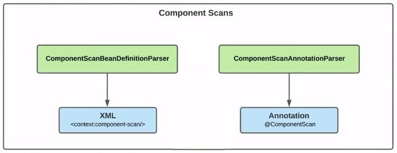
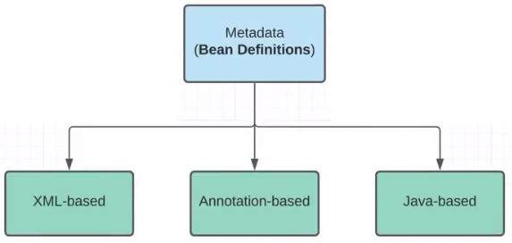
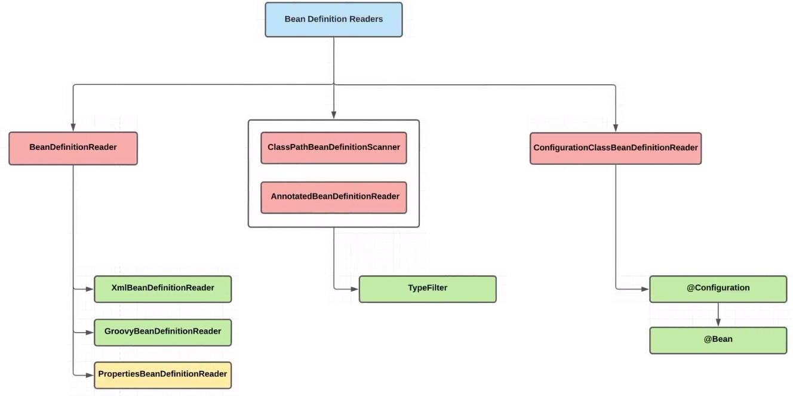
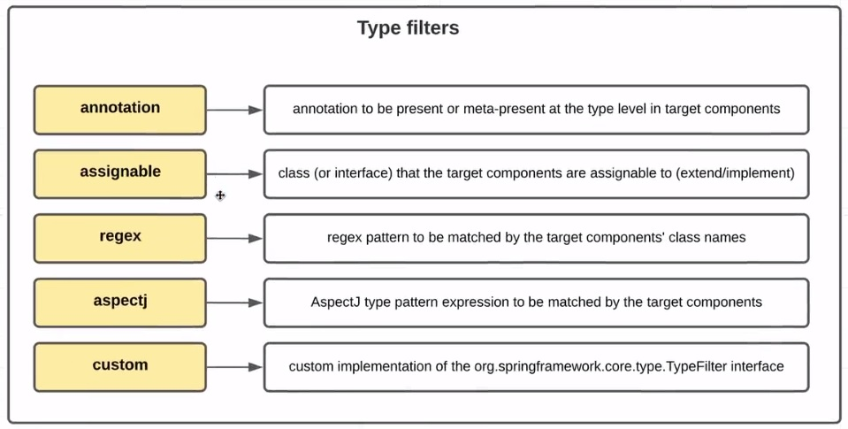
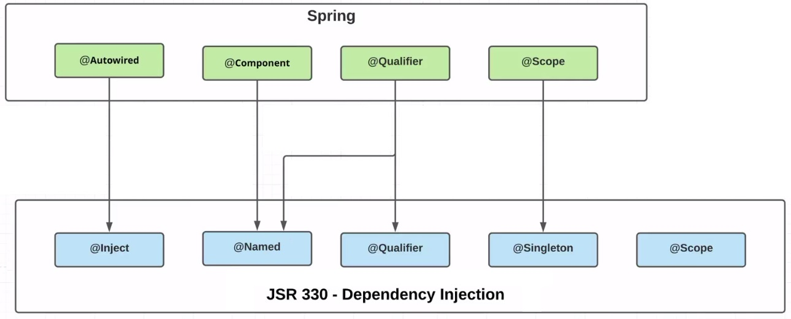

### Spring (Core) lessons part 3 - Annotation-based Configuration (continuation).

[Предыдущий раздел по конфигурированию Spring](https://github.com/JcoderPaul/Spring_Framework_Lessons/tree/master/Spring_part_2) приложения при помощи аннотаций.

В [папке DOC](https://github.com/JcoderPaul/Spring_Framework_Lessons/tree/master/Spring_part_3/DOC) sql-скрипты и др. полезные файлы.

Док. для изучения:
- [Spring Framework 3.2.x Reference Documentation](https://docs.spring.io/spring-framework/docs/3.2.x/spring-framework-reference/html/index.html) ;
- [Spring Framework 6.1.5 Documentation](https://spring.io/projects/spring-framework)

---
Для начала проведем предварительную подготовку:

Шаг 1. - в файле [build.gradle](https://github.com/JcoderPaul/Spring_Framework_Lessons/blob/master/Spring_part_3/build.gradle) добавим необходимые нам зависимости: 

    /* Подключим Spring-core и Spring-context. */
    implementation 'org.springframework:spring-core:5.3.22'
    implementation 'org.springframework:spring-context:5.3.22'

Шаг 2. - подключаем Jakarta Annotation API:

    implementation 'jakarta.annotation:jakarta.annotation-api:1.3.5'

Шаг 3. - для того, чтобы обрабатывать аннотации, мы добавляем в [application.xml](https://github.com/JcoderPaul/Spring_Framework_Lessons/blob/master/Spring_part_3/src/main/resources/application.xml) нужные строки 
и удаляем все лишнее (указываем Sprig-у какую папку сканировать на наличие аннотаций @Component, 
@Controller, @Repository, @Service:  

    <context:component-scan base-package="spring.oldboy"/> 

---
Основным методом интеграции (внедрении) зависимостей все же принято считать внедрение через конструктор.
Для использования данной техники нам нужно уйти от полного создания наших bean-ов через *.XML, поскольку
при создании bean-a при помощи *.XML мы сразу должны указывать конструктор, который мы используем. И даже
если мы не указываем конструктор - должен быть конструктор без параметров. Но обычно мы хотим создать
неизменяемый объект и значит все поля будут final, а значит должен существовать желательно единственный 
конструктор для их инициализации.

---
#### Lesson 14 - [Classpath Scanning](https://docs.spring.io/spring-framework/reference/core/beans/classpath-scanning.html) и аннотация @Component (@Controller, @Repository, @Service)

Аннотация [@Component](https://docs.spring.io/spring-framework/docs/current/javadoc-api/org/springframework/stereotype/Component.html) имеет логическое разделение согласно [MVC архитектурному приему](https://github.com/JcoderPaul/HTTP_Servlets_Java_EE/tree/master/MVCPractice/DOC) на: 
[@Controller](https://docs.spring.io/spring-framework/docs/current/javadoc-api/org/springframework/stereotype/Controller.html), [@Repository](https://docs.spring.io/spring-framework/docs/current/javadoc-api/org/springframework/stereotype/Repository.html), [@Service](https://docs.spring.io/spring-framework/docs/current/javadoc-api/org/springframework/stereotype/Service.html) (каждая для своего слоя). Прописываем эти аннотации над
нашими классами (...Repository, ...Service), чтобы сканер компонентов смог подхватить bean definition и работать с ним.

Т.е. все, что мы аннотируем @Component, мы удаляем из [application.xml](https://github.com/JcoderPaul/Spring_Framework_Lessons/blob/master/Spring_part_3/src/main/resources/application.xml) (или комментируем).
Это, для примера, наши: AuditingBeanPostProcessor, InjectBeanPostProcessor и MyOwnTransactionBeanPostProcessor, см. их
отличие в [предыдущем разделе Spring_part_2](https://github.com/JcoderPaul/Spring_Framework_Lessons/tree/master/Spring_part_2/src/main/java/spring/oldboy/bean_post_processor).
Либо другие классы, ранее прописанные в application.xml, как bean-ы, а теперь удаленные оттуда и помеченные как @Component:

    @Component
    public class LogBeanFactoryPostProcessor implements BeanFactoryPostProcessor, PriorityOrdered {
    ... some code ...
    }

Так же стоит обратить внимание на отличия [StarterConnectionPool.java](https://github.com/JcoderPaul/Spring_Framework_Lessons/blob/master/Spring_part_3/src/main/java/spring/oldboy/pool/StarterConnectionPool.java) от его старого аналога [InitCallBackPool.java](https://github.com/JcoderPaul/Spring_Framework_Lessons/blob/master/Spring_part_2/src/main/java/spring/oldboy/pool/InitCallBackPool.java). Из него
удалили все лишнее и поставили необходимые аннотации см. комментарии внутри класса.

) 

---
#### Lesson 15 - Bean Definition Readers (теория)

Чтобы предоставить Bean Definition Metamodel см. 

) 

они считываются с помощью вспомогательных классов Bean Definition Reader-ов см. 

) 

и это мы можем сделать 3-мя способами (первые два мы уже видели).

**Док. для изучения:**
- [Interface BeanDefinitionParser](https://docs.spring.io/spring-framework/docs/current/javadoc-api/org/springframework/beans/factory/xml/BeanDefinitionParser.html) ;
- [Class ComponentScanBeanDefinitionParser](https://docs.spring.io/spring-framework/docs/current/javadoc-api/org/springframework/context/annotation/ComponentScanBeanDefinitionParser.html) ;
- [Class AnnotationConfigBeanDefinitionParser](https://docs.spring.io/spring-framework/docs/current/javadoc-api/org/springframework/context/annotation/AnnotationConfigBeanDefinitionParser.html) ;
- [Class ClassPathBeanDefinitionScanner](https://docs.spring.io/spring-framework/docs/current/javadoc-api/org/springframework/context/annotation/ClassPathBeanDefinitionScanner.html) ;
- [Class AnnotatedBeanDefinitionReader](https://docs.spring.io/spring-framework/docs/current/javadoc-api/org/springframework/context/annotation/AnnotatedBeanDefinitionReader.html) ;

---
#### Lesson 16 - Type Filters

См. [application.xml](https://github.com/JcoderPaul/Spring_Framework_Lessons/blob/master/Spring_part_3/src/main/resources/application.xml):

    <context:component-scan base-package="spring.oldboy"
        
        /* Позволяет отключить/включить <context:annotation-config></context:annotation-config> */
        annotation-config="true"
        
        /* Позволяет настроит генератор имен bean-ов или подставить свой */
        name-generator=""
        
        /* Паттерн по которому мы ищем наши bean-ы, в данном случае мы ищем *.class, т.е. классы */
        resource-pattern="**/*.class"
        
        /* 
        Создавать ли прокси на основании наших классов, по умолчанию NO, мы можем использовать
        создание на основании interface или на основании наследования targetClass. В Spring 
        используется библиотека cglib (Code Generation Library)
        */
        scoped-proxy="no"
        
        /* 
        По-умолчаеию данный параметр установлен в true, т.е. при сканировании нашей папки где
        находятся bean-ы используются некие фильтры, т.е. ищуться классы помеченные @Companent,
        а не что-то другое. И таких фильтров несколько см. DOC/TypeFilters.jpg. Все фильтры 
        реализуют единственный интерфейс TypeFilter, хотя мы сами можем написать свой фильтр,
        переопределив метод *.match(), который вернет true / false.

        Т.е. выбери мы параметр false - не один фильтр не будет подключен.
        */
        use-default-filters="false"
        
        /* 
        Даже если мы установили false, но использовали context:include-filter, мы можем 
        указать, что ищем все классы помеченные как @Component, т.е. восстановили, то
        что сломали применив 'false', т.е. снова используется дефолтное состояние фильтров.
        */
        <context:include-filter type="annotation" expression="org.springframework.stereotype.Component"/>
        
        /* 
        Прописываем насильное создание bean-ов из всех наследников CrudRepository, даже если
        они не помечены аннотацией @Repository (@Companent)
        */
        <context:include-filter type="assignable" expression="spring.oldboy.repository.CrudRepository"/>
        
        /* 
        Вариант использования регулярного выражения для создания bean-a, если класс находится в 
        папке 'com' и заканчивался на постфикс 'Repository' из него будет сделан bean, независимо от
        того аннотирован он или нет @Companent (@Repository) 
        */
        <context:include-filter type="regex" expression="spring.oldboy\..+Repository"/>
    </context:component-scan>

- [FirmRepositoryDemo.java](https://github.com/JcoderPaul/Spring_Framework_Lessons/blob/master/Spring_part_3/src/main/java/spring/oldboy/lesson_16/FirmRepositoryDemo.java) - пример работы настроек 

 

Так же см. [application.xml](https://github.com/JcoderPaul/Spring_Framework_Lessons/blob/master/Spring_part_3/src/main/resources/application.xml))

**Док. для изучения:**
- [Interface TypeFilter](https://docs.spring.io/spring-framework/docs/current/javadoc-api/org/springframework/core/type/filter/TypeFilter.html) ;

---
#### Lesson 17 - [@Scope](https://docs.spring.io/spring-framework/docs/current/javadoc-api/org/springframework/beans/factory/config/Scope.html)

Применение аннотации @Scope и ее особенности см. комментарии в классе [FirmRepository.java](https://github.com/JcoderPaul/Spring_Framework_Lessons/blob/master/Spring_part_3/src/main/java/spring/oldboy/repository/FirmRepository.java).

- [ScopeDemo.java](https://github.com/JcoderPaul/Spring_Framework_Lessons/blob/master/Spring_part_3/src/main/java/spring/oldboy/lesson_17/ScopeDemo.java) - пример работы [@Scope](https://docs.spring.io/spring-framework/docs/current/javadoc-api/org/springframework/beans/factory/config/Scope.html)([BeanDefinition.SCOPE_PROTOTYPE](https://docs.spring.io/spring-framework/docs/current/javadoc-api/org/springframework/beans/factory/config/BeanDefinition.html)) в [FirmRepository.java](https://github.com/JcoderPaul/Spring_Framework_Lessons/blob/master/Spring_part_3/src/main/java/spring/oldboy/repository/FirmRepository.java)

Док. для изучения:
- [Interface ScopeMetadataResolver](https://docs.spring.io/spring-framework/docs/current/javadoc-api/org/springframework/context/annotation/ScopeMetadataResolver.html) ;
- [Class AnnotationScopeMetadataResolver](https://docs.spring.io/spring-framework/docs/current/javadoc-api/org/springframework/context/annotation/AnnotationScopeMetadataResolver.html) ;
- [Class Jsr330ScopeMetadataResolver](https://docs.spring.io/spring-framework/docs/current/javadoc-api/org/springframework/context/annotation/Jsr330ScopeMetadataResolver.html) ;

---
#### Lesson 18 - [JSR330](https://docs.spring.io/spring-framework/reference/core/beans/standard-annotations.html)

Для подключения зависимости внедрим в [build.gradle](https://github.com/JcoderPaul/Spring_Framework_Lessons/blob/master/Spring_part_3/build.gradle) ([javax.inject](https://docs.oracle.com/javaee%2F6%2Fapi%2F%2F/javax/inject/package-summary.html)):

    implementation 'javax.inject:javax.inject:1'

См. краткую статью - [DOC/JSR330.txt](https://github.com/JcoderPaul/Spring_Framework_Lessons/blob/master/Spring_part_3/DOC/JSR330.txt) и граф. соответствия:

- [StockRepository.java](https://github.com/JcoderPaul/Spring_Framework_Lessons/blob/master/Spring_part_3/src/main/java/spring/oldboy/repository/StockRepository.java) - демо класс аннотированный по [JSR330](https://docs.spring.io/spring-framework/reference/core/beans/standard-annotations.html);
- [JSR330Demo.java](https://github.com/JcoderPaul/Spring_Framework_Lessons/blob/master/Spring_part_3/src/main/java/spring/oldboy/lesson_18/JSR330Demo.java) - микро-приложение показывающее работоспособность JSR330;
