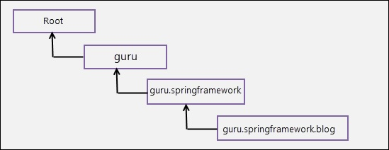
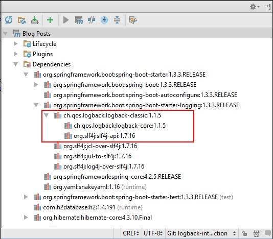
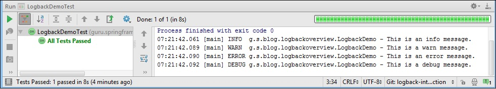

* - переводная статья

---
### Введение в логирование (журналирование)

Мониторинг, диагностика и устранение неполадок — ключевые действия в жизненном цикле любого корпоративного
приложения, а ведение журналов — основная часть этих действий. Благодаря ведению журнала вы можете увидеть,
что на самом деле делает код приложения во время этих действий во время выполнения. Использование System.out
для вывода сообщений на консоль просто недостаточно для корпоративных приложений. Корпоративные приложения
предъявляют требования к ведению журналов различной степени сложности. Вам потребуется создавать журналы с
разными уровнями важности, например: ОШИБКА, ПРЕДУПРЕЖДАТЬ, ИНФОРМАЦИЯ, и ОТЛАДКА (ERROR, WARN, INFO, and
DEBUG). Вам также потребуется отправлять журналы в разные места назначения, такие как консоль, файл, база
данных, SMTP-сервер или место назначения очереди JMS (см. DOC/Logging_Metrics.jpg). Эти требования невозможны
с помощью простых операторов System.out. Платформы ведения журналов, такие как Logback, предназначены для
удовлетворения потребностей ведения журналов на предприятии.

---
### Logback-архитектура

Разработчики Log4J, создали logback. Имея многолетний опыт работы с платформами ведения журналов, они
создали Logback, чтобы он был достаточно быстрым и универсальным для работы в различных средах. Logback состоит
из трех модулей:

- logback-core : формирует основу logback-classic и logback-access. Для ведения журнала вам понадобится более
                 специализированный logback-classic или logback-access.
- logback-classic : использует logback-core для служб журналирования.
- logback-access : предоставляет функции журнала HTTP-доступа к контейнерам сервлетов, таким как Tomcat и Jetty.

Тут мы рассмотрим log-back-классик, который в дальнейшем будем называть logback. Logback изначально реализует
API Simple Logging Facade для Java (SLF4J). SLF4J — это фасад (API см. DOC/Logging_System.jpg) для различных
платформ ведения журналов. Как разработчик, вы будете писать код ведения журнала для API SLF4J. Во время
развертывания у вас есть возможность подключить нужную платформу ведения журналов, что стало возможным благодаря
промежуточному мостовому уровню SLF4J. Поскольку logback изначально реализует SLF4J, дополнительный уровень
API SLF4J не влияет на производительность, что является небольшим преимуществом Logback перед другими платформами.

На этом рисунке показано взаимодействие приложения с Logback и т.п. см. 


Ключевыми компонентами Logback являются регистраторы, приложения и кодировщики/макеты. Компоненты работают вместе,
чтобы предоставить разработчику полный контроль над тем, как сообщения регистрируются, форматируются и куда они
передаются.

---
### Регистратор

Регистраторы — это компоненты, выполняющие тяжелую работу по ведению журналов. Они собирают данные журнала и
передают их в пункт назначения с помощью приложений. Регистраторы, используемые в приложении, обычно организованы
в иерархию, а корневой регистратор находится на вершине иерархии. Именно LoggerContext отвечает за создание
регистраторов и их расположение в иерархии.

Loggers поддерживает иерархическое правило именования. Например, регистратор с именем 'guru' является родителем
регистратора с именем 'guru.springframework' и предок логера по имени 'guru.springframework.blog' см.



Помимо наследования регистраторов, важной концепцией журналирования является наследование уровней, также
называемое эффективным уровнем. Вы можете назначать уровни регистраторам. Logback поддерживает уровни: СЛЕД,
ОТЛАЖИВАТЬ, ИНФОРМАЦИЯ, ПРЕДУПРЕЖДАТЬ и ОШИБКА (TRACE, DEBUG, INFO, WARN and ERROR), как показано на этом
рисунке DOC/Log_Level.jpg.

На рисунке выше показано, что СЛЕД (TRACE) - это самый низкий уровень, и условно уровень движется вверх или
влево: ОТЛАЖИВАТЬ, ИНФОРМАЦИЯ, ПРЕДУПРЕЖДАТЬ, и до, ОШИБКА - высший уровень (DEBUG, INFO, WARN and ERROR).
Это означает, что если вы установите уровень журнала на ПРЕДУПРЕЖДАТЬ (WARN), то только ПРЕДУПРЕЖДАТЬ и ОШИБКА
будут отображаться сообщения журнала уровня, а остальные будут игнорироваться.

Помимо вышеперечисленных уровней, есть два специальных уровня:

- ВСЕ : Включает все уровни.
- ВЫКЛ : Выключает все уровни.

Если регистратору не назначен уровень, то в игру вступает наследование уровней. Регистратор унаследует уровень
от своего ближайшего предка с назначенным уровнем. Если ни одному из средств ведения журнала приложений в
иерархии не назначен уровень, будет унаследован уровень корневого средства ведения журнала. Уровень корневого
регистратора по умолчанию: ОТЛАЖИВАТЬ (DEBUG).

---
**!!! Примечание !!!** 

При разработке на локальном компьютере обычно уровень журнала устанавливается на ОТЛАЖИВАТЬ.
Это даст вам подробные сообщения журнала для использования в разработке. При развертывании в производственной
среде обычно уровень журнала устанавливается на ОШИБКА. Это сделано для того, чтобы избежать заполнения журналов
излишней отладочной информацией. Кроме того, хотя ведение журнала очень эффективно, оно все равно требует затрат
системных ресурсов.

---
### Аппендеры (Appenders)

После того как вы соберете информацию журнала с помощью средства ведения журнала, вам необходимо отправить ее в
место назначения вывода. Место назначения вывода называется приложением и прикрепляется к регистратору. Log4J 2
предоставляет приложения для консоли, файлов, удаленных серверов сокетов, SMTP-серверов, многих популярных баз
данных (таких как: MySQL, PostgreSQL и Oracle), JMS, удаленных демонов системного журнала UNIX и многого другого.

---
### Макеты/Кодировщики (Layouts/Encoders)

Приложение использует макет для форматирования события журнала. Макет, который является реализацией интерфейса
Layout log4j-core, преобразует событие журнала в строку. Макет не может контролировать момент записи событий
журнала и, следовательно, не может группировать события в пакеты. Чтобы устранить ограничения макетов, в версии
0.9.19 компания logback представила кодировщики.

Кодировщики, которые являются реализацией интерфейса Encoder, преобразуют входящее событие журнала в массив
байтов и записывают полученный массив в соответствующий выходной поток. Кодировщики имеют полный контроль над
форматом записываемых байтов. Кроме того, кодировщики могут контролировать, будут ли (и когда) записываться
эти байты.

---
### Использование журнала

Мы начнем с простого приложения, которое использует Logback для ведения журналов. Для начала нам нужны
зависимости журналирования в нашем проекте. Как ядро Spring Boot, так и веб-проекты изначально включают
классические зависимости logback. На этом рисунке показаны зависимости входа в систему, включенные в
Spring Boot см. 



Как показано на рисунке, последняя версия SpringBoot 1.3.3 REALESE на момент написания этого поста
(3.1.3 на момент перевода) использует Logback classic 1.1.5

Если вы хотите использовать разные версии Logback и SLF4J или не используете SpringBoot, определить их
зависимости можно в Maven POM (build.gradle), как показано ниже:

```XML
  . . .
  <dependency>
    <groupId>org.slf4j</groupId>
    <artifactId>slf4j-api</artifactId>
    <version>1.7.21</version>
  </dependency>
  <dependency>
    <groupId>ch.qos.logback</groupId>
    <artifactId>logback-classic</artifactId>
    <version>1.1.7</version>
  </dependency>
  . . .
```

В приложении вы можете получить регистратор, вызвав метод *.getLogger() - метод класса SLF4J LoggerFactory.
Есть два перегруженных *.getLogger() метода. Один возвращает экземпляр Logger, названный в соответствии со
строковым значением, переданным в качестве параметра. Другой возвращает Logger экземпляр с именем,
соответствующим классу, переданному в качестве параметра. Рекомендуемая стратегия — использовать последнюю.
Это связано с тем, что в большом приложении с тысячами операторов журнала вам будет легко определить источник
сообщения журнала, поскольку выходные данные журнала содержат имя создателя журнала. Как только вы получите
Logger, вы можете вызвать методы журнала, пример:

LogbackDemo.java

```Java
    package spring.oldboy;

    import org.slf4j.Logger;
    import org.slf4j.LoggerFactory;

    public class LogbackDemo {
8.        private final Logger logger = LoggerFactory.getLogger(this.getClass());
9.        public void performTask(){
10.            logger.info("This is an {} message.","info");
11.            logger.warn("This is a warn message.");
12.            logger.error("This is an error message.");
13.            logger.debug("This is a debug message.");
        }
    }
```

В строке 8 - LogbackDemo выше, мы получили Logger - объект с вызовом статического Loggerfactory.getLogger()
метода. В принципе передача LogbackDemo.class в параметры getLogger() вместо this.getClass() даст тот же результат.
Но, я предлагаю передать this.getClass() чтобы отделить оператор от определенного класса, тем самым сделав его
пригодным для повторного использования в других классах логирования. В строках 10–13 мы вызывали методы журнала
в полученном регистраторе. Обратите внимание на строку 10, в которой используется параметризованное сообщение в
методе info(). Такие параметризованные сообщения журнала можно использовать и в других методах ведения журнала.

Чтобы протестировать предыдущий регистратор, мы будем использовать JUnit. Тестовый класс таков:

```Java
    package spring.oldboy;

    import org.junit.Test;
    import static org.junit.Assert.*;

    public class LogbackDemoTest {
        @Test
        public void testPerformTask() throws Exception {
            LogbackDemo logBackDemo = new LogbackDemo();
            logBackDemo.performTask();
        }
    }

Когда вы запускаете тестовый класс, сообщения журнала LogbackDemo отправляются на консоль см.



---
### РЕЗЮМЕ:

В данной статье вы, возможно, заметили, что я не указал никакого приложения/кодировщика или макета для
регистратора. Скорее, я полагался на настройки по умолчанию, унаследованные от корневого регистратора журнала.
По умолчанию корневой регистратор связан с консольным приложением и имеет уровень ОТЛАЖИВАТЬ (DEBUG), и наш
регистратор унаследовал оба. Поэтому сообщения отладки и более высокого уровня отправлялись на консоль
IntelliJ IDE. Однако в корпоративных приложениях вам, скорее всего, придется работать с внешними файлами
конфигурации, чтобы использовать более расширенные функции Logback. Эти файлы конфигурации могут быть XML
или Groovy для указания параметров конфигурации Logback.

В следующих статьях я расскажу об использовании внешних файлов конфигурации XML и Groovy, чтобы помочь вам
понять, что представляет собой мощный инструмент ведения журналов Logback.
