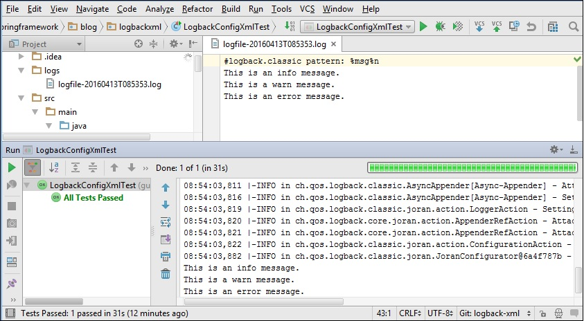
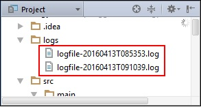
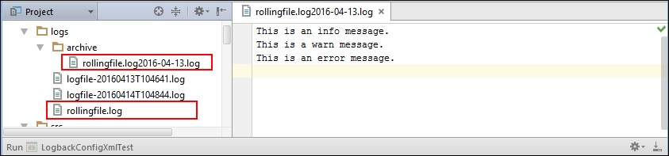
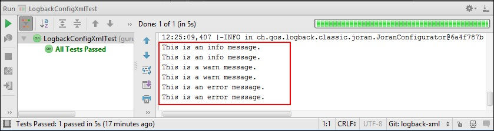

* переводная статья

---
### Конфигурация журнала: использование XML

Вся цель ведения журналов теряет смысл, когда базовая структура ведения журналов становится узким местом.
Платформы ведения журналов должны быть быстрыми, занимать небольшой объем памяти и легко настраиваться.
Logback — это платформа ведения журналов с такими качествами. Если вы новичок в Logback, я предлагаю прочитать
мой вводный пост по Logback см. [LoggingBegin](../ArticlesAboutLogging/LoggingBegin.md)

Logback поддерживает настройку через XML и Groovy. Тут я расскажу, как настроить Logback с помощью XML-файла.

---
### Создание регистратора

Мы начнем с создания средства регистрации приложений, а затем настроим его с помощью XML. Как упоминалось в
[LoggingBegin](../ArticlesAboutLogging/LoggingBegin.md), если мы используем Spring Boot, нам не требуется никакого
дополнительного объявления зависимостей для Logback в нашем Maven POM. Мы можем сразу приступить к написанию
кода логирования.

LogbackConfigXml.java

```Java
    package spring.oldboy;

    import org.slf4j.Logger;
    import org.slf4j.LoggerFactory;

    public class LogbackConfigXml {
        private final Logger logger = LoggerFactory.getLogger(this.getClass());
        public void performTask(){
            logger.debug("This is a debug message.");
            logger.info("This is an info message.");
            logger.warn("This is a warn message.");
            logger.error("This is an error message.");
        }
    }
```

Наш тестовый класс использует JUnit для модульного тестирования предыдущего кода.

LogbackConfigXmlTest.java

```Java
    package spring.oldboy;

    import org.junit.Test;
    import static org.junit.Assert.*;

    public class LogbackConfigXmlTest {
        @Test
        public void testPerformTask() throws Exception {
            LogbackConfigXml logbackConfigXml=new LogbackConfigXml();
            logbackConfigXml.performTask();
        }
    }
```

---
### Файл конфигурации

Для конфигурации Logback через XML Logback ожидает Logback.xml или Logback-test.xml файл в пути к классам.
В приложении Spring Boot вы можете поместить Logback.xml файл в папку resources. Если ваш Logback.xml файл
находится за пределами пути к классам, вам нужно указать его местоположение с помощью Logback.configurationFile
системное свойство, вот так:

        -DLogback.configurationFile=/path/to/Logback.xml

В Logback.xml, все параметры конфигурации заключены в файл <configuration> корневой элемент. В корневом элементе
вы можете установить атрибут debug=true для проверки внутреннего статуса Logback. Вы также можете настроить
автоматическое сканирование файла конфигурации, установив атрибут scan=true. При этом Logback сканирует изменения
в своем файле конфигурации. Если Logback обнаружит какие-либо изменения, Logback автоматически переконфигурирует
себя с учетом этих изменений. Если автоматическое сканирование включено, Logback сканирует изменения раз в минуту.
Вы можете указать другой период сканирования, установив атрибут scanPeriod со значением, указанным в миллисекундах,
секундах, минутах или часах, вот так:

        <configuration debug="true" scan="true" scanPeriod="30 seconds" >
          ...
        </configuration>

Корневой элемент <configuration> может содержать одно или несколько свойств в локальной области, каждое из которых
указывается с помощью элемента <property>. Такое свойство существует с момента его определения в файле конфигурации
до завершения интерпретации/выполнения файла. Параметры конфигурации в других частях файла могут получить доступ к
свойству с помощью синтаксиса ${property_name}. Объявите свойства в локальной области для значений, которые могут
измениться в разных средах. Например, путь к файлам журналов, подключения к базе данных, настройки SMTP-сервера
и т. д.

```XML
<configuration debug="true" scan="true" scanPeriod="30 seconds" >
  <property name="LOG_PATH" value="logs"/>
  <property name="LOG_ARCHIVE" value="${LOG_PATH}/archive"/>
 ...
</configuration>
```

Приведенный выше код конфигурации объявляет два свойства: LOG_PATH и LOG_ARCHIVE чьи значения представляют пути
для хранения файлов журналов и архивных файлов журналов соответственно.

На этом этапе стоит упомянуть один элемент Logback: <timestamp>. Этот элемент определяет свойство в соответствии
с текущей датой и временем, что особенно полезно при входе в файл. Используя это свойство, вы можете создать новый
файл журнала с уникальным именем по отметке времени при каждом новом запуске приложения. Вот код объявления
свойства отметки времени:

        <timestamp key="timestamp-by-second" datePattern="yyyyMMdd'T'HHmmss"/>

В приведенном выше коде атрибут datePattern обозначает шаблон даты, используемый для преобразования текущего
времени в соответствии с соглашениями, определенными в SimpleDateFormat
(см. https://docs.oracle.com/javase/8/docs/api/java/text/SimpleDateFormat.html).

Далее мы посмотрим, как использовать каждое из объявленных свойств из разных приложений.

---
### Console and File Appenders

Вы объявляете одно или несколько приложений с помощью <appender> элемента, содержащего обязательные атрибуты
name и class. Атрибут name указывает имя приложения, на которое могут ссылаться регистраторы, тогда как атрибут
class указывает полное имя класса приложения. Appender может содержать <layout> или <encoder> элементы,
определяющие, как регистрировать события и преобразования.

Вот код конфигурации для настройки appender-a для вывода данных в консоль и файл:

```XML
    . . .
    2.    <appender name="Console-Appender" class="ch.qos.logback.core.ConsoleAppender">
    3.        <layout>
    4.            <pattern>%msg%n</pattern>
    5.        </layout>
    6.    </appender>
    7.    <appender name="File-Appender" class="ch.qos.logback.core.FileAppender">
    8.        <file>${LOG_PATH}/logfile-${timestamp-by-second}.log</file>
    9.        <encoder>
    10.            <pattern>%msg%n</pattern>
    11.            <outputPatternAsHeader>true</outputPatternAsHeader>
    12.       </encoder>
    13.    </appender>
    . . .
```

В приведенном выше коде конфигурации Logback:

Строка 2 – Строка 6: Мы задали консольное приложение с именем Console-Appender использовать макет шаблона.
                     Обратите внимание, что мы не задали макет явно, а вместо этого полагались на значение
                     Logback по умолчанию, которое использует макет шаблона.

Строка 4: Мы определили шаблон преобразования с помощью элемента <pattern>. Шаблон преобразования состоит
          из буквенного текста и выражений управления форматом, называемых спецификаторами преобразования.
          В данном коде, '%msg' - спецификатор сообщения преобразования выводит предоставленное приложением
          сообщение, связанное с логируемым событием. Спецификатор преобразования '%n' - выводит
          символы-разделители строк, зависящие от платформы.

          Подробнее о макете шаблона и спецификаторах преобразования можно узнать на сайте разработчика:
          https://logback.qos.ch/manual/layouts.html#PatternLayout

Строка 7 – Строка 13: Мы задали appender для обращения к файлу с именем File-Appender. Этот appender записывает
                      в файл, определенный тегом <file> элемент. Обратите внимание, как мы использовали
                      определенные ранее свойства для создания нового файла журнала при каждом запуске
                      приложения.

Строка 10 – Строка 11: Мы определили кодировщик с шаблоном. Мы также использовали outputPatternAsHeader
                       чтобы вставить шаблон, используемый для вывода журнала, вверху файлов журнала.

!!! Примечание !!! Кодировщики были представлены в версии Logback 0.9.19. Из-за преимуществ, которые
предоставляют кодировщики, как описано здесь, рекомендуется использовать кодировщики вместо макетов.
Фактически, Logback удалил поддержку макетов в FileAppender и его подклассах, начиная с версии 0.9.19.
(см. https://logback.qos.ch/apidocs/ch/qos/logback/core/FileAppender.html)

Теперь мы настроим регистратор для конкретного приложения вместе с корневым регистратором для использования
консоли и приложений, как показано ниже:

```XML
    . . .
    <logger name="spring.oldboy" level="info">
       <appender-ref ref="File-Appender"/>
    </logger>
    <root>
        <appender-ref ref="Console-Appender"/>
    </root>
    . . .
```

В приведенном выше коде мы определили два регистратора. Первый регистратор, определенный как <logger> настраивает
все регистраторы в пакете spring.oldboy для использования файл appender-a (выводим лог в файл). Второй,
определенный как <root> корневой регистратор настроен на использование консольного appender-a (выводим лог в
консоль).

Если мы запустим LogbackConfigXmlTest.java, то Log4J 2 будет генерировать сообщения журнала и отправлять их,
как на консоль, так и в файл, как показано рисунке см. 



Запустите тестовый класс еще раз. Обратите внимание, как Logback использует свойство timestamp для создания
отдельного файла журнала на основе указанного шаблона дат см. пример:



---
### Добавление данных в лог файл

Средство добавления данных в файл поддерживает запись в добавление данных в соответствии с одной из
предварительно определенных вами политик. Наиболее популярной политикой является политика скользящего графика
на основе времени. Вы можете определить основанную на времени политику для выполнения смены дат, когда шаблон
даты и времени больше не применяется к активному файлу журнала.

Чтобы узнать больше о скользящем добавлении файлов и его политиках, обратитесь к руководству Logback:
https://logback.qos.ch/manual/appenders.html#RollingFileAppender

Код для настройки скользящего добавления файлов:

```XML
    . . .
    2.    <appender name="RollingFile-Appender" class="ch.qos.logback.core.rolling.RollingFileAppender">
    3.        <file>${LOG_PATH}/rollingfile.log</file>
    4.        <rollingPolicy class="ch.qos.logback.core.rolling.TimeBasedRollingPolicy">
    5.            <fileNamePattern>${LOG_ARCHIVE}/rollingfile.%d{yyyy-MM-dd}.log</fileNamePattern>
    6.            <maxHistory>30</maxHistory>
    7.            <totalSizeCap>1MB</totalSizeCap>
    8.        </rollingPolicy>
    9.        <encoder>
    10.            <pattern>%msg%n</pattern>
    11.        </encoder>
    12.    </appender>
    . . .
```

В приведенном выше коде:

Строка 3: Элемент <file> определяет имя файла журнала для записи.
Строка 4: Элемент <rollingPolicy> определяет политику, основанную на времени.
Строка 5: Элемент <fileNamePattern> определяет шаблон имени файла для архивных файлов журнала.
          Период ролловера выводится из значения <fileNamePattern>, который в примере кода
          настроен на ежедневную смену.
Строка 6: Элемент <maxHistory> устанавливает максимальное количество сохраняемых архивных файлов
          перед асинхронным удалением старых файлов.
Строка 7: Элемент <TotalSizeCap> устанавливает общий размер всех файлов архива. Самые старые архивы
          удаляются асинхронно при превышении общего ограничения размера.

Чтобы использовать средство прокручивания файлов, добавьте ссылку на приложение в объявление средства
ведения журнала, как показано ниже:

```XML
    . . .
    <logger name="spring.oldboy" level="info">
        <appender-ref ref="File-Appender"/>
        <appender-ref ref="RollingFile-Appender"/>
    </logger>
    . . .
```

На этом этапе при запуске тестового класса создается прокручиваемый файл журнала с rollingfile.log под файлами
логов. Чтобы смоделировать ролловер, установите системные часы на день вперед и снова запустите тестовый класс.
Новый rollingfile.log будет создан в журналах, а предыдущий файл архивируется в папке logs/archive см.



В дополнение к политике чередования по времени вы можете определить политику запуска по размеру. Важно понимать
разницу между скользящей и инициирующей политикой. Политика пролонгации определяет, ЧТО происходит при
пролонгации, тогда как политика запуска определяет, КОГДА должна произойти пролонгация. Следующий код
устанавливает политику запуска для запуска смены, когда размер файла журнала превышает 1 МБ:

```XML
    . . .
    <triggeringPolicy class="ch.qos.logback.core.rolling.SizeBasedTriggeringPolicy">
        <maxFileSize>1MB</maxFileSize>
    </triggeringPolicy>
    . . .
```

---
### Logback Async Appender

Для повышения производительности ведения журнала нам нужна меньшая задержка (latency) ведения журнала и более
высокая пропускная способность (throughput). Задержка (latency) — это время, необходимое для выполнения
какого-либо действия или получения определенного результата. С другой стороны, (throughput) пропускная
способность — это количество выполненных действий или результатов, полученных за единицу времени.

Чтобы постоянно достигать более низкой задержки и более высокой пропускной способности, Logback поддерживает
асинхронное ведение журнала через асинхронное приложение. Logback выполняет асинхронное добавление в отдельном
потоке, чтобы отделить накладные расходы на ведение журнала от потока, выполняющего ваш код.

Использовать асинхронное приложение невероятно просто. Обратитесь к приложению, которое должно быть асинхронно
вызвано, внутри тегов <appender>. Затем установите атрибут class  для полного имени AsyncAppender, так:

```XML
    . . .
        <appender name="Async-Appender" class="ch.qos.logback.classic.AsyncAppender">
            <appender-ref ref="RollingFile-Appender"/>
        </appender>
    . . .
```

Определив асинхронный appender, вы можете использовать его в журнале, как и любое другой appender (определитель),
например так:

```XML
    . . .
        <logger name="spring.oldboy" level="info" >
          <appender-ref ref="File-Appender" />
          <appender-ref ref="Async-Appender" />
        </logger>
    . . .
```

*** Logback Additivity ***

Чтобы понять, что такое аддитивность журнала, давайте добавим настроенное консольное приложение в журнал
приложений. Код конфигурации регистратора следующий:

```XML
    . . .
        <logger name="spring.oldboy" level="info">
           <appender-ref ref="Console-Appender"/>
           <appender-ref ref="File-Appender"/>
           <appender-ref ref="RollingFile-Appender"/>
        </logger>
        <root>
            <appender-ref ref="Console-Appender"/>
        </root>
    . . .
```

Вывод консоли при запуске тестового класса см. 



На рисунке LogbackAdditivity см. выше, обратите внимание на дублирующийся
вывод. Это связано с аддитивностью. Appender с именем Console-Appender подключен к двум логгерам: root и
spring.oldboy. Поскольку root является предком всех регистраторов, запрос на регистрацию, сделанный
spring.oldboy получает вывод дважды. Сначала запущенный appender-ом spring.oldboy и еще раз запущенный,
appender-ом root. Вы можете переопределить это поведение журнала по умолчанию, установив флаг параметра
аддитивности в false, так:

```XML
    . . .
        <logger name="spring.oldboy.springframework.blog.logbackxml" level="info" additivity="false">
           <appender-ref ref="Console-Appender"/>
           <appender-ref ref="File-Appender"/>
           <appender-ref ref="RollingFile-Appender"/>
        </logger>
        <root>
            <appender-ref ref="Console-Appender"/>
        </root>
    . . .
```

С флагом аддитивности, установленным в false, Logback не будет использовать root-ый Console-Appender для
регистрации сообщений.

Хотя аддитивность является удобной функцией и не предназначена для того, чтобы сбить с толку новых пользователей,
она все же сбивать с толку. Я предлагаю просмотреть руководство по Logback по этому вопросу:
https://logback.qos.ch/manual/configuration.html#cumulative

Полный код файла Logback.xml приведен ниже:

```XML
    <?xml version="1.0" encoding="UTF-8"?>
    <configuration debug="true" scan="true" scanPeriod="30 seconds">
        <property name="LOG_PATH" value="logs" />
        <property name="LOG_ARCHIVE" value="${LOG_PATH}/archive" />
        <timestamp key="timestamp-by-second" datePattern="yyyyMMdd'T'HHmmss"/>
        <appender name="Console-Appender" class="ch.qos.logback.core.ConsoleAppender">
            <layout>
                <pattern>%msg%n</pattern>
            </layout>
        </appender>
        <appender name="File-Appender" class="ch.qos.logback.core.FileAppender">
            <file>${LOG_PATH}/logfile-${timestamp-by-second}.log</file>
            <encoder>
                <pattern>%msg%n</pattern>
                <outputPatternAsHeader>true</outputPatternAsHeader>
            </encoder>
        </appender>
        <appender name="RollingFile-Appender" class="ch.qos.logback.core.rolling.RollingFileAppender">
            <file>${LOG_PATH}/rollingfile.log</file>
            <rollingPolicy class="ch.qos.logback.core.rolling.TimeBasedRollingPolicy">
                <fileNamePattern>${LOG_ARCHIVE}/rollingfile.log%d{yyyy-MM-dd}.log</fileNamePattern>
                <maxHistory>30</maxHistory>
                <totalSizeCap>1KB</totalSizeCap>
            </rollingPolicy>
            <encoder>
                <pattern>%msg%n</pattern>
            </encoder>
        </appender>
        <appender name="Async-Appender" class="ch.qos.logback.classic.AsyncAppender">
            <appender-ref ref="RollingFile-Appender" />
        </appender>
        <logger name="spring.oldboy.springframework.blog.logbackxml"  level="info" additivity="false">
            <appender-ref ref="Console-Appender" />
            <appender-ref ref="File-Appender" />
            <appender-ref ref="Async-Appender" />
        </logger>
        <root>
            <appender-ref ref="Console-Appender" />
        </root>
    </configuration>
```
