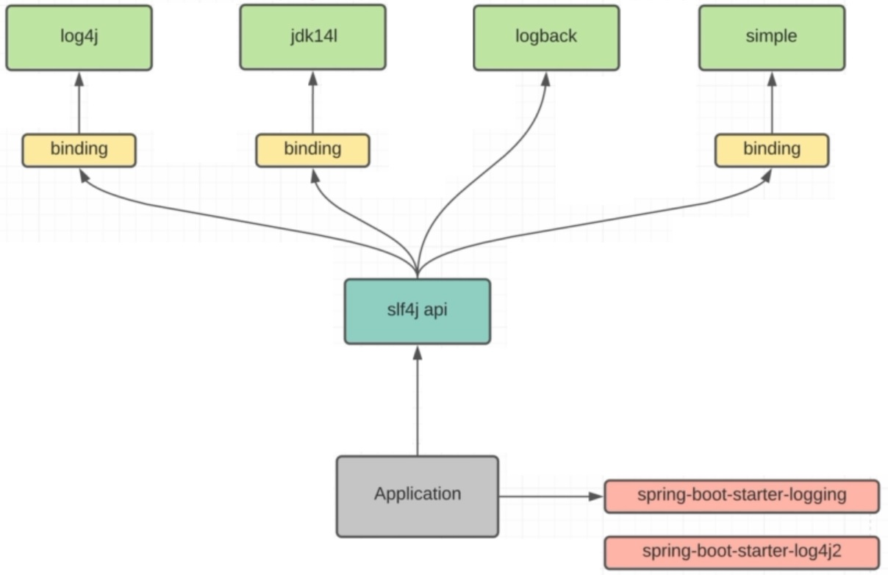
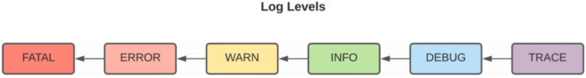
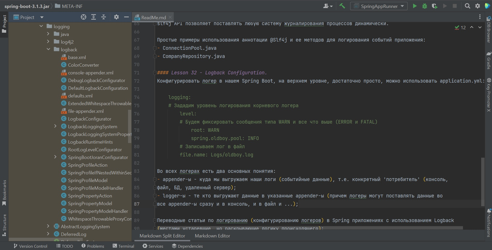

### Spring (Boot) lessons part 7 - [Логирование](https://docs.spring.io/spring-boot/docs/current/reference/htmlsingle/#features.logging)

В [папке DOC](https://github.com/JcoderPaul/Spring_Framework_Lessons/tree/master/Spring_part_7/DOC) sql-скрипты и др. полезные файлы.

Док. для изучения:
- [Simple Logging Facade for Java (SLF4J)](https://www.slf4j.org/) ;
- [SLF4J user manual](https://www.slf4j.org/manual.html) ;

---
- [Spring Boot Reference Documentation](https://docs.spring.io/spring-boot/docs/current/reference/htmlsingle/) ;
- [Spring Framework 6.1.5 Documentation](https://spring.io/projects/spring-framework) ;
- [Spring Framework 3.2.x Reference Documentation](https://docs.spring.io/spring-framework/docs/3.2.x/spring-framework-reference/html/index.html) ;
- [Getting Started Guides](https://spring.io/guides) ;
- [Developing with Spring Boot](https://docs.spring.io/spring-boot/docs/current/reference/html/using.html) ;

---
- [Архив Spring-Boot Docs](https://docs.spring.io/spring-boot/docs/) ;
- [Архив Spring-Framework Docs](https://docs.spring.io/spring-framework/docs/) ;

---
Для начала проведем предварительную подготовку:

Шаг 1. - в файле [build.gradle](https://github.com/JcoderPaul/Spring_Framework_Lessons/blob/master/Spring_part_7/build.gradle) добавим необходимые plugin-ы: 

    /* 
       Плагин Spring Boot он добавляет необходимые задачи в Gradle 
       и имеет обширную взаимосвязь с другими plugin-ами.
    */
    id 'org.springframework.boot' version '3.1.3'
    /* 
       Менеджер зависимостей позволяет решать проблемы несовместимости 
       различных версий и модулей Spring-а
    */
    id "io.spring.dependency-management" version '1.0.11.RELEASE'
    /* Подключим Lombok */
    id "io.freefair.lombok" version "8.3"

Шаг 2. - подключаем Spring Boot:

    /* 
       Подключим Spring Boot Starter он включает поддержку 
       авто-конфигурации, логирование и YAML
    */
    implementation 'org.springframework.boot:spring-boot-starter'

---
#### Lesson 31 - Logging Starter.

Java имеет массу фреймворков [для логирования](https://docs.spring.io/spring-boot/docs/current/reference/htmlsingle/#features.logging) см. 

:

- [Log4J](https://logging.apache.org/log4j/2.x/) ;
- [Jdk14l](https://docs.oracle.com/en/java/javase/17/docs/api/java.logging/java/util/logging/package-summary.html) ;
- [LogBack](https://logback.qos.ch/) ;

Обычно в Spring есть выбор, но по умолчанию используется Logback. Однако для взаимодействия с системами логирования
используется slf4j API ([набор интерфейсов и классов](https://www.slf4j.org/api/)). Так же, для большинства логеров, нужен binding - адаптер, 
описывающий, как нам передавать информацию из нашего приложения через API в конкретный логер.

И только для Logback адаптер не требуется, еще раз см. [DOC/Logging_System.jpg](https://github.com/JcoderPaul/Spring_Framework_Lessons/blob/master/Spring_part_7/DOC/Logging_System.jpg). В Spring есть стартер для системы
логирования logback - '[spring-boot-starter-logging](https://docs.spring.io/spring-boot/docs/current/reference/htmlsingle/#using.build-systems.starters)', он подхватывается автоматически (как транзитивная зависимость)
при добавлении Spring Boot стартера. Мы легко можем поменять (отключить) систему логирования на другую (исключив
одну и подключив другую):

    implementation ('org.springframework.boot:spring-boot-starter'){
        exclude group: 'org.springframework.boot', module: 'spring-boot-starter-logging'
    }
    implementation 'org.springframework.boot:spring-boot-starter-log4j2'

Уровни логирования имеют приоритет и отображение их идет от худшего к менее критичному, т.е. если мы настроили 
систему логирования на запись только FATAL ситуаций, то только они и будут фиксироваться, если же, например, на
ERROR см. 

), то теперь будут записываться уже и FATAL и ERROR. И так далее по иерархии вниз до TRACE (пишем абсолютно все уровни логирования).

Подключить систему логирования к классу просто, например, используя аннотацию [@Slf4j](https://projectlombok.org/api/lombok/extern/slf4j/Slf4j) над всем классом. А сервисные
сообщения можно передавать в логер (см. [JpaConfiguration.java](https://github.com/JcoderPaul/Spring_Framework_Lessons/blob/master/Spring_part_7/src/main/java/spring/oldboy/config/JpaConfiguration.java)):

    log.info("Jpa configuration is enabled");

Мы используем именно эту аннотацию, чтобы не привязываться к конкретной реализации логера, т.е. использование 
[slf4j API](https://www.slf4j.org/) позволяет поставлять любую систему журналирования процессов динамически. 

Простые примеры использования аннотации [@Slf4j](https://projectlombok.org/api/lombok/extern/slf4j/Slf4j) и ее методов 
для логирования событий приложения:
- [ConnectionPool.java](https://github.com/JcoderPaul/Spring_Framework_Lessons/blob/master/Spring_part_7/src/main/java/spring/oldboy/pool/ConnectionPool.java);
- [CompanyRepository.java](https://github.com/JcoderPaul/Spring_Framework_Lessons/blob/master/Spring_part_7/src/main/java/spring/oldboy/repository/CompanyRepository.java);

Док. для изучения:
- [Spring Boot features 2.1.13.RELEASE (Logging)](https://docs.spring.io/spring-boot/docs/2.1.13.RELEASE/reference/html/boot-features-logging.html) ;
- [Spring Boot features 3.3.* (Logging)](https://docs.spring.io/spring-boot/docs/current/reference/htmlsingle/#features.logging) ;

---
#### Lesson 32 - Logback Configuration.

Конфигурировать логер в нашем Spring Boot, на верхнем уровне, достаточно просто, можно использовать [application.yml](https://github.com/JcoderPaul/Spring_Framework_Lessons/blob/master/Spring_part_7/src/main/resources/application.yml) (выгрузка событий происходит и в консоль, и [в файл](https://github.com/JcoderPaul/Spring_Framework_Lessons/blob/master/Spring_part_7/Logs/oldboy.log)):
    
    logging:
    # Зададим уровень логирования корневого логера
        level:
        # Будем фиксировать сообщения типа WARN и все что выше (ERROR и FATAL)
            root: WARN
            spring.oldboy.pool: INFO
        # Записываем лог в файл
        file.name: Logs/oldboy.log

Основные default настройки Spring Boot находятся в *.XML файлах самого Spring пакета см. 

 

(или саму структуру jar файла), но мы можем создавать свои файлы конфигурации. 

Внутренняя структура [base.xml](https://github.com/spring-projects/spring-boot/blob/main/spring-boot-project/spring-boot/src/main/resources/org/springframework/boot/logging/logback/base.xml) для примера:
    
    <included>
        <include resource="org/springframework/boot/logging/logback/defaults.xml" />
        <property name="LOG_FILE" value="${LOG_FILE:-${LOG_PATH:-${LOG_TEMP:-${java.io.tmpdir:-/tmp}}}/spring.log}"/>
        <include resource="org/springframework/boot/logging/logback/console-appender.xml" />
        <include resource="org/springframework/boot/logging/logback/file-appender.xml" />
        <root level="INFO">
            <appender-ref ref="CONSOLE" />
            <appender-ref ref="FILE" />
        </root>
    </included>

Во всех системах логирования есть два основных понятия (см. код выше):
- appender-ы - куда мы выгружаем наши логи (событийные данные), т.е. конкретный 'потребитель' (консоль - [console-appender.xml](https://github.com/spring-projects/spring-boot/blob/main/spring-boot-project/spring-boot/src/main/resources/org/springframework/boot/logging/logback/console-appender.xml),
  файл - [file-appender.xml](https://github.com/spring-projects/spring-boot/blob/main/spring-boot-project/spring-boot/src/main/resources/org/springframework/boot/logging/logback/file-appender.xml), БД, удаленный сервер);
- logger-ы - те кто выгружают данные в указанные appender-ы (причем логеры могут поставлять данные во
  все appender-ы сразу и в консоль, и в файл и ...);

Более подробно об этом можно прочитать в переводных статьях по логированию (конфигурированию логеров) в 
Spring приложениях с использованием Logback (данные местами устаревшие, но раскрывающие логику 
происходящего):

- [YAML_SpringBoot_Config_Logback](./DOC/ArticlesAboutLogging/YAML_SpringBoot_Config_Logback.md) - описание настройки *.yaml файлов для 
конфигурирования Spring Boot Logging;
- [LoggingBegin](./DOC/ArticlesAboutLogging/LoggingBegin.md) - описание принципов работы логеров в Spring Boot;
- [LoggingWithXML](./DOC/ArticlesAboutLogging/LoggingWithXML.md) - конфигурирование Logback при помощи *.XML файлов;
- [LogbackWithSpringBoot](./DOC/ArticlesAboutLogging/LogbackWithSpringBoot.md) - применение Logback в Spring приложениях;

Как описано в статьях, если мы захотим полностью переписать (максимально кастомизировать) настройки
по логированию нашего приложения нам придется создать файлы свойств и настроек в одном из удобных для 
нас форматах XML, YML, Groovy. 

См. официальную документацию: 
- [Spring Boot Logging](https://docs.spring.io/spring-boot/docs/3.3.x/reference/htmlsingle/#features.logging) ;
- [Spring Boot Custom Log Configuration](https://docs.spring.io/spring-boot/docs/3.1.3/reference/htmlsingle/#features.logging.custom-log-configuration) ;

И конечно для работы с Logback и slf4j API: 
- [SLF4J USER MANUAL](https://www.slf4j.org/manual.html) ;
- [Logback Project](https://logback.qos.ch/index.html) ;
- [The logback manual](https://logback.qos.ch/manual/index.html) ;
- [Logback configuration](https://logback.qos.ch/manual/configuration.html) ;

Мы можем использовать для [Logback](https://docs.spring.io/spring-boot/docs/current/reference/htmlsingle/#howto.logging.logback), как и описано в документации зарезервированные названия XML файлов, например
logback-spring.xml (для просмотра переименовали в [logback_spring_demo.xml](https://github.com/JcoderPaul/Spring_Framework_Lessons/blob/master/Spring_part_7/src/main/resources/logback_spring_demo.xml)) и прописать там все наши 
демонстрационные настройки (взятые из документации по Logback, как пример).
 
И это работает для любой системы логирования см. 

.

---
См. официальные [Guides](https://spring.io/guides):
- [Getting Started Guides](https://spring.io/guides) - Эти руководства, рассчитанные на 15–30 минут, содержат быстрые 
практические инструкции по созданию «Hello World» для любой задачи разработки с помощью Spring. В большинстве случаев
единственными необходимыми требованиями являются JDK и текстовый редактор.
- [Topical Guides](https://spring.io/guides#topicals) - Тематические руководства предназначенные для прочтения и 
понимания за час или меньше, содержит более широкий или субъективный контент, чем руководство по началу работы.
- [Tutorials](https://spring.io/guides#tutorials) - Эти учебники, рассчитанные на 2–3 часа, обеспечивают более глубокое 
контекстное изучение тем разработки корпоративных приложений, что позволяет вам подготовиться к внедрению реальных 
решений.

---
- [Spring Projects на GitHub](https://github.com/spring-projects) ;
