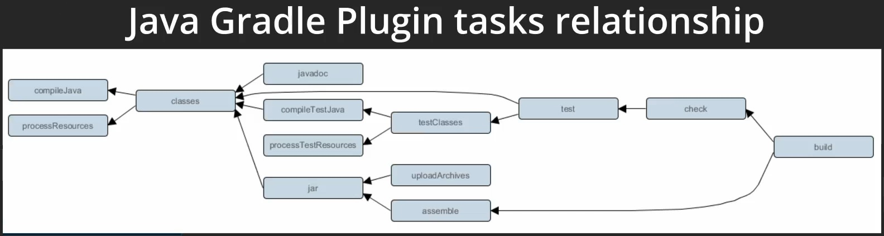
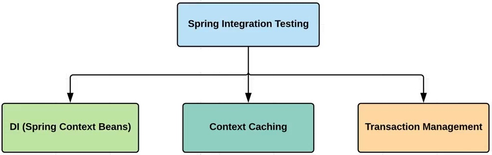
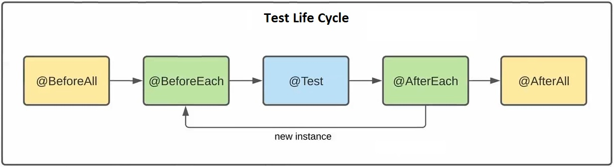
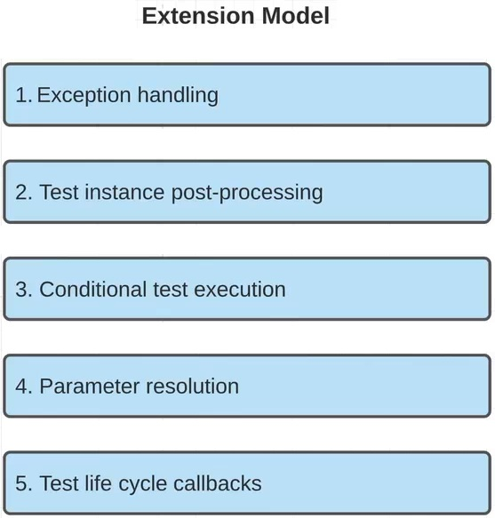
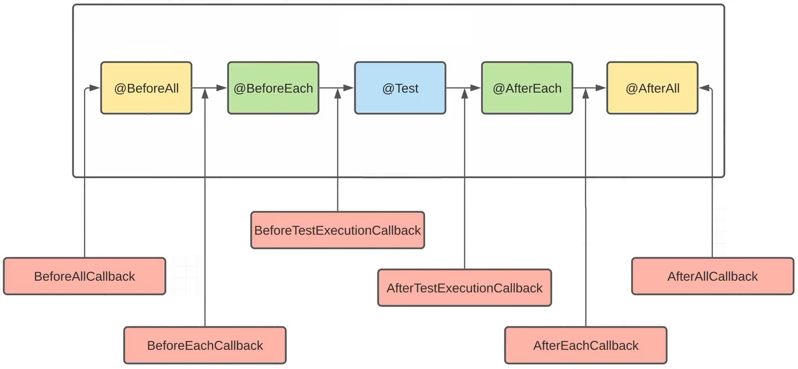

### Spring (Boot) lessons part 8 - [Test Starter](https://docs.spring.io/spring-boot/docs/current/reference/htmlsingle/#features.testing)

В папке DOC sql-скрипты и др. полезные файлы.

Док. (ссылки) для изучения:
- [JUnit 5](https://junit.org/junit5/) ;
- [Mockito](https://site.mockito.org/) ;

---
- [Spring Framework 6.1.6 Testing](https://docs.spring.io/spring-framework/reference/testing.html#testing) ;
- [Spring Boot Reference Documentation](https://docs.spring.io/spring-boot/docs/current/reference/htmlsingle/) ;
- [Spring Framework 6.1.5 Documentation](https://spring.io/projects/spring-framework) ;
- [Spring Framework 3.2.x Reference Documentation](https://docs.spring.io/spring-framework/docs/3.2.x/spring-framework-reference/html/index.html) ;
- [Getting Started Guides](https://spring.io/guides) ;
- [Developing with Spring Boot](https://docs.spring.io/spring-boot/docs/current/reference/html/using.html) ;

---
Для начала проведем предварительную подготовку:

Шаг 1. - в файле [build.gradle](https://github.com/JcoderPaul/Spring_Framework_Lessons/blob/master/Spring_part_8/build.gradle) добавим необходимые plugin-ы: 

    /* 
       Плагин Spring Boot он добавляет необходимые задачи в Gradle 
       и имеет обширную взаимосвязь с другими plugin-ами.
    */
    id 'org.springframework.boot' version '3.1.3'
    /* 
       Менеджер зависимостей позволяет решать проблемы несовместимости 
       различных версий и модулей Spring-а
    */
    id "io.spring.dependency-management" version '1.0.11.RELEASE'
    /* Подключим Lombok */
    id "io.freefair.lombok" version "8.3"

Шаг 2. - подключаем Spring Boot starter:

    /* 
       Подключим Spring Boot Starter он включает поддержку 
       авто-конфигурации, логирование и YAML
    */
    implementation 'org.springframework.boot:spring-boot-starter'

Шаг 3. - подключаем блок тестирования (Spring Boot Starter Test) 
(он будет активен на этапе тестирования):

    testImplementation 'org.springframework.boot:spring-boot-starter-test'

Шаг 4. - автоматически Gradle создал тестовую зависимость на Junit5
(хотя мы можем использовать Junit4 и TestNG):

    test {
        useJUnitPlatform()
    }

---
#### Lesson 33 - [Test-Starter](https://docs.spring.io/spring-boot/docs/current/reference/htmlsingle/#features.testing).

Проведя все шаги описанные выше, как минимум три первые, мы получаем полный комплект зависимостей для работы
с тестовыми классами в Spring Boot. В качестве примера см. [CompanyServiceTest.java](https://github.com/JcoderPaul/Spring_Framework_Lessons/blob/master/Spring_part_8/src/test/java/spring/oldboy/service/CompanyServiceTest.java), практически все 'поднимается
из коробки' см. так же статью: [UnitTestingSpringBoot](./DOC/UnitTestingSpringBoot.md)

Также в задачах (tasks) Gradle появились соответствующие разделы отвечающие за тестирование см.



- [CompanyServiceTest.java](https://github.com/JcoderPaul/Spring_Framework_Lessons/blob/master/Spring_part_8/src/test/java/spring/oldboy/service/CompanyServiceTest.java) - пример простого теста для метода *.findById() из класса [CompanyService.java](https://github.com/JcoderPaul/Spring_Framework_Lessons/blob/master/Spring_part_8/src/main/java/spring/oldboy/service/CompanyService.java)

---
#### [Lesson 34](https://github.com/JcoderPaul/Spring_Framework_Lessons/tree/master/Spring_part_8/src/test/java/spring/oldboy/integration/service/lesson_34) - [Integration-Testing](https://docs.spring.io/spring-framework/reference/testing/integration.html).

В интеграционных тестах Spring-a нам необходимо см. 

) :

- поднимать SpringContext во время запуска тестов и внедрять bean-ы в качестве зависимостей в тестовых классах;
- кеширование Context-a, поскольку запуск 'с нуля' нашего Context-a при прогоне каждого теста (а их может быть
очень много) штука ресурсоемкая и неоптимальная, т.е. наша цель при возможности переиспользовать уже существующий
(закешированный) SpringContext;
- управление транзакциями, т.к. при работе с интеграциоными тестами нам может понадобиться обращение к БД, причем так, 
чтобы наши тестовые манипуляции не влияли на уже существующую БД (т.е. откатывать тестовые транзакции).

Жизненный цикл тестов (и его аннотаций) остался неизменным см. 



Модель внешних взаимодействий с тестами из JUnit5 так же в нашем распоряжении см. 

,

т.е. мы легко можем внедриться в любую стадию жизненного цикла теста: обработать исключение, внести изменения в 
test-instance, использовать какие-либо дополнительные условия к конкретному тесту (условие его вызова, например),
дополнительно внедрять зависимости в тестируемые методы и конструкторы, использование CallBack-ов для внедрения в
жизненный цикл тестов см. 

.

Создадим наш первый интеграционный тест:
- выделим для него отдельную папку '[integration.service](https://github.com/JcoderPaul/Spring_Framework_Lessons/tree/master/Spring_part_8/src/test/java/spring/oldboy/integration/service/)' в тестовом разделе проекта;
- создадим там файл с зарезервированным постфиксом 'IT' (Integration Test) и названием тестируемого 
класса - [CompanyServiceIT.java](https://github.com/JcoderPaul/Spring_Framework_Lessons/blob/master/Spring_part_8/src/test/java/spring/oldboy/integration/service/lesson_34/CompanyServiceIT.java);
- настроим связь Junit5 и TestContextFramework через аннотации;

Для примера настройки связи  [JUnit 5 User Guide](https://junit.org/junit5/docs/current/user-guide/) ([JUnit 5.10.2 API](https://junit.org/junit5/docs/5.10.2/api/)) и [TestContextFramework](https://docs.spring.io/spring-framework/reference/testing/testcontext-framework.html) используем разные аннотации:
- [CompanyServiceIT.java](https://github.com/JcoderPaul/Spring_Framework_Lessons/blob/master/Spring_part_8/src/test/java/spring/oldboy/integration/service/lesson_34/CompanyServiceIT.java) - настраиваем при помощи [@ExtendWith](https://junit.org/junit5/docs/5.8.0/api/org.junit.jupiter.api/org/junit/jupiter/api/extension/ExtendWith.html) и [@ContextConfiguration](https://docs.spring.io/spring-framework/reference/testing/annotations/integration-spring/annotation-contextconfiguration.html);
- [CompanyServiceSecondTestIT.java](https://github.com/JcoderPaul/Spring_Framework_Lessons/blob/master/Spring_part_8/src/test/java/spring/oldboy/integration/service/lesson_34/CompanyServiceSecondTestIT.java) - настраиваем при помощи [@SpringBootTest](https://docs.spring.io/spring-boot/docs/current/api/org/springframework/boot/test/context/SpringBootTest.html);

Внутри [TestContextFramework](https://docs.spring.io/spring-framework/reference/testing/testcontext-framework.html) (см. [DOC/TestContextFramework/TestContextFramework.jpg](https://github.com/JcoderPaul/Spring_Framework_Lessons/blob/master/Spring_part_8/DOC/TestContextFramework/TestContextFramework.jpg)) на каждый наш тестовый класс
создается свой TestContextManager (см. [DOC/TestContextFramework/ContextManagement.txt](https://github.com/JcoderPaul/Spring_Framework_Lessons/blob/master/Spring_part_8/DOC/TestContextFramework/ContextManagement.txt)). Каждый [TestContextManager](https://github.com/spring-projects/spring-framework/blob/main/spring-test/src/main/java/org/springframework/test/context/TestContextManager.java)
имеет два поля: 
- [TestContext](https://docs.spring.io/spring-framework/docs/current/javadoc-api/org/springframework/test/context/TestContext.html) - содержит модель, он в курсе какой тест запущен, имеет доступ к ApplicationContext; 
- [TestExecutionListener](https://docs.spring.io/spring-framework/docs/current/javadoc-api/org/springframework/test/context/TestExecutionListener.html) - содержит логику по внедрению зависимостей в тесты 
(см. [DOC/TestContextFramework/TestExecutionListener.txt](https://github.com/JcoderPaul/Spring_Framework_Lessons/blob/master/Spring_part_8/DOC/TestContextFramework/TestExecutionListener.txt)), т.е. как только происходит подготовка тестового объекта 
сразу происходит внедрение зависимостей, через [DependencyInjectionTestExecutionListener](https://docs.spring.io/spring-framework/docs/current/javadoc-api/org/springframework/test/context/support/DependencyInjectionTestExecutionListener.html) и его метод 
[void injectDependencies()](https://github.com/spring-projects/spring-framework/blob/main/spring-test/src/main/java/org/springframework/test/context/support/DependencyInjectionTestExecutionListener.java) см. ниже (мы получаем тестовый объект, его класс, получаем ApplicationContext, и сразу 
у контекста вызываются методы 'autowireBeanProperties' и 'initializeBean' передавая в него тестовый класс); 

```Java
        protected void injectDependencies(TestContext testContext) throws Exception {
            Object bean = testContext.getTestInstance();
            Class<?> clazz = testContext.getTestClass();
            AutowireCapableBeanFactory beanFactory = testContext.getApplicationContext().getAutowireCapableBeanFactory();
            beanFactory.autowireBeanProperties(bean, AutowireCapableBeanFactory.AUTOWIRE_NO, false);
            beanFactory.initializeBean(bean, clazz.getName() + AutowireCapableBeanFactory.ORIGINAL_INSTANCE_SUFFIX);
            testContext.removeAttribute(REINJECT_DEPENDENCIES_ATTRIBUTE);
        }
```

---
#### [Lesson 35](https://github.com/JcoderPaul/Spring_Framework_Lessons/tree/master/Spring_part_8/src/test/java/spring/oldboy/integration/service/lesson_35) - [@ActiveProfiles](https://docs.spring.io/spring-framework/docs/current/javadoc-api/org/springframework/test/context/ActiveProfiles.html).

В процессе тестирования может возникнуть ситуация когда мы для целей тестирования хотим использовать другие
настройки нежели для целей разработки или конечного использования. Тогда и возникает потребность использовать
различные файлы свойств (очень похожие друг на друга, но с разными постфиксами, например [application-test.yml](https://github.com/JcoderPaul/Spring_Framework_Lessons/blob/master/Spring_part_8/src/test/resources/application-test.yml)).

И тут, нам могут пригодиться упомянутые ранее 'профили', см. официальную документацию:
- [Context Configuration with Environment Profiles](https://docs.spring.io/spring-framework/reference/testing/testcontext-framework/ctx-management/env-profiles.html) ;

Пример теста: 
- [CompanyServiceTestProfileIT.java](https://github.com/JcoderPaul/Spring_Framework_Lessons/blob/master/Spring_part_8/src/test/java/spring/oldboy/integration/service/lesson_35/CompanyServiceTestProfileIT.java) - демонстрация работы аннотации [@ActiveProfiles](https://github.com/JcoderPaul/Spring_Framework_Lessons/blob/master/Spring_part_8/DOC/IntegrationTesting/ActiveProfiles.txt) см. [DOC/IntegrationTesting](https://github.com/JcoderPaul/Spring_Framework_Lessons/tree/master/Spring_part_8/DOC/IntegrationTesting)

---
#### [Lesson 36](https://github.com/JcoderPaul/Spring_Framework_Lessons/tree/master/Spring_part_8/src/test/java/spring/oldboy/integration/service/lesson_36) - MetaAnnotation

Большинство аннотаций, связанных с тестированием, можно использовать в качестве мета-аннотаций для
создания собственных аннотаций и сокращения конфигурационного дублирования в тестовом комплекте.

Многие из аннотаций, предоставляемых Spring, могут быть использованы в качестве мета-аннотаций в
вашем собственном коде. Мета-аннотация – это аннотация, которая может быть применена к другой
аннотации. См. документацию и примеры:
- [(RUS) DOC/TestContextFramework/MetaAnnotationSupportForTesting.txt](https://github.com/JcoderPaul/Spring_Framework_Lessons/blob/master/Spring_part_8/DOC/TestContextFramework/MetaAnnotationSupportForTesting.txt)
- [(ENG) Using Meta-annotations and Composed Annotations](https://docs.spring.io/spring-framework/reference/core/beans/classpath-scanning.html#beans-meta-annotations) ;
- [(ENG) Meta-Annotation Support for Testing](https://docs.spring.io/spring-framework/reference/testing/annotations/integration-meta.html) ;

Пример аннотации и тестового класса:
- [IT.java](https://github.com/JcoderPaul/Spring_Framework_Lessons/blob/master/Spring_part_8/src/test/java/spring/oldboy/integration/annotation/IT.java) - наша аннотация, которая может применяться в нашем проекте в качестве основной для задач тестирования;
- [CompanyServiceMyITAnnotation.java](https://github.com/JcoderPaul/Spring_Framework_Lessons/blob/master/Spring_part_8/src/test/java/spring/oldboy/integration/service/lesson_36/CompanyServiceMyITAnnotation.java) - тест аннотированный самописной аннотацией, демонстрация либо через DEBUG, либо
стандартный запуск теста;

---
#### [Lesson 37](https://github.com/JcoderPaul/Spring_Framework_Lessons/tree/master/Spring_part_8/src/test/java/spring/oldboy/integration/service/lesson_37) - Внедрение зависимостей в тесты через конструктор.

Spring также можно сконфигурировать на автоматическое обнаружение и связывание всех аргументов конструктора
тестового класса, если конструктор считается автоматически связываемым. Конструктор считается автоматически
связываемым, если выполняется одно из следующих условий (в порядке старшинства):
- Конструктор аннотирован [@Autowired](https://docs.spring.io/spring-framework/docs/current/javadoc-api/org/springframework/beans/factory/annotation/Autowired.html);
- Аннотация [@TestConstructor](https://docs.spring.io/spring-framework/docs/current/javadoc-api/org/springframework/test/context/TestConstructor.html) присутствует или мета-присутствует для тестового класса с атрибутом autowireMode,
  установленным в ALL;
- Режим автоматического обнаружения и связывания тестового конструктора по умолчанию был изменен на ALL.
см. 
- (RUS):
  - [DOC/TestContextFramework/HelperClassesOfTestContext.txt](https://github.com/JcoderPaul/Spring_Framework_Lessons/blob/master/Spring_part_8/DOC/TestContextFramework/HelperClassesOfTestContext.txt) ;
  - [DOC/TestContextFramework/TestAnnotationsJUnitJupiter.txt](https://github.com/JcoderPaul/Spring_Framework_Lessons/blob/master/Spring_part_8/DOC/TestContextFramework/TestAnnotationsJUnitJupiter.txt) ;
  - [DOC/IntegrationTesting/TestConstructor.txt](https://github.com/JcoderPaul/Spring_Framework_Lessons/blob/master/Spring_part_8/DOC/IntegrationTesting/TestConstructor.txt) ;
- (ENG) [Annotation Interface TestConstructor](https://docs.spring.io/spring-framework/docs/current/javadoc-api/org/springframework/test/context/TestConstructor.html) ;

Пример использования аннотации @TestConstructor и внедрения зависимостей через конструктор в тестах 
[CompanyServiceСonstructorInjection.java](https://github.com/JcoderPaul/Spring_Framework_Lessons/blob/master/Spring_part_8/src/test/java/spring/oldboy/integration/service/lesson_37/CompanyService%D0%A1onstructorInjection.java)

---
#### Lesson 38 - Использование spring.properties в тестах.

В предыдущем уроке мы применили дополнительную аннотацию [@TestConstructor](https://docs.spring.io/spring-framework/docs/current/javadoc-api/org/springframework/test/context/TestConstructor.html), однако, можно было обойтись без нее использовав зарезервированный ключ spring.test.constructor.autowire.mode из свойств Spring-a см. документацию:
[Spring Properties](https://docs.spring.io/spring-framework/reference/appendix.html).

- Мы создаем файл свойств в папке resources тестов: [spring.properties](https://github.com/JcoderPaul/Spring_Framework_Lessons/blob/master/Spring_part_8/src/test/resources/spring.properties);
- И размещаем в нем этот ключ: spring.test.constructor.autowire.mode=all;

Теперь даже без использования аннотации @TestConstructor наш тестовый класс использующий внедрение зависимостей
через конструктор будет работать (можно просто закомментировать указанную ранее аннотацию и запустить тесты).

---
#### [Lesson 39](https://github.com/JcoderPaul/Spring_Framework_Lessons/tree/master/Spring_part_8/src/test/java/spring/oldboy/integration/service/lesson_39) - Кэширование ApplicationContext.

Жизненный цикл теста выглядит так:

1. - Расширение для тестового фреймворка (SpringRunner для JUnit 4 и SpringExtension для JUnit 5) вызывает 
     Test Context Bootstrapper;
2. - Boostrapper создает TestContext — основной класс, который хранит текущее состояние теста и приложения;
3. - TestContext настраивает разные хуки (вроде запуска транзакций до теста и отката после), внедряет зависимости 
     в тестовые классы (все @Autowired поля на тестовых классах) и занимается созданием контекстов;
4. - Контекст создается используя Context Loader — тот берет базовую конфигурацию приложения и сливает ее с 
     тестовой конфигурацией (перекрытые свойства, профили, bean-ы, инициализаторы и т.п.);
5. - Контекст кешируется используя составной ключ, который полностью описывает приложение — набор bean-ов, 
     свойств и т.п.
6. - Тест запускается.

Всю работу по управлению тестами делает, собственно, spring-test, а Spring Boot Test в свою очередь добавляет 
несколько вспомогательных классов: @DataJpaTest, @SpringBootTest, полезные утилиты, вроде TestPropertyValues 
чтобы динамически менять свойства контекста. Так же он позволяет запускать приложение как реальный web-server, 
или как mock-окружение (без доступа по HTTP), удобно 'мокать' компоненты системы используя @MockBean и т.п.

Одна из непонятных тем в интеграционном тестировании - это кеширование контекста (см. пункт 5 выше) между 
тестами и его влияние на скорость выполнения тестов. Частый комментарий про интеграционные тесты - "медленные" 
и "запускают приложение на каждый тест". Так вот, они действительно запускают — однако не на каждый тест. 

Каждый контекст (т.е. инстанс приложения) будет переиспользован по максимуму, т.е. если 10 тестов используют 
одинаковую конфигурацию приложения — то приложение запустится один раз на все 10 тестов. Что же значит 
"одинаковая конфигурация" приложения? Для Spring Test это значит что не изменился набор бинов, классов 
конфигураций, профилей, свойств и т.п. 

На практике это означает, что например эти два теста будут использовать один и тот же контекст:

```Java
    @SpringBootTest
    @ActiveProfiles("test")
    @TestPropertySource("foo=bar")
    class FirstTest {
        /* some tests */
    }
    
    @SpringBootTest
    @ActiveProfiles("test")
    @TestPropertySource("foo=bar")
    class SecondTest {
        /* some tests */
    }
```

Количество контекстов в кэше ограничено 32-мя — дальше по принципу LRSU один из них будет удален из кэша.

Что же может помешать Spring Test переиспользовать контекст из кэша и создать новый?

1. - @DirtiesContext: Самый простой вариант — если тест помечен это аннотаций, кэшироваться контекст не будет. 
Это может быть полезно, если тест меняет состояние приложение и хочется его "сбросить".

2. - @MockBean: Очень неочевидный вариант - @MockBean заменяет реальный бин в контексте на Mock (тоже относится и 
к Spy), который можно тестировать через Mockito. Ключевой момент - эта аннотация меняет набор bean-ов в 
приложении и заставляет Spring Test создать новый контекст. Если взять предыдущий пример, то например здесь 
уже будут созданы два контекста:

```Java    
    @SpringBootTest
    @ActiveProfiles("test")
    @TestPropertySource("foo=bar")
    class FirstTest {
    
    }
    
    @SpringBootTest
    @ActiveProfiles("test")
    @TestPropertySource("foo=bar")
    class SecondTest {
        @MockBean
        CakeFinder cakeFinderMock;
    }
```

3. - @TestPropertySource: Любое изменение свойств автоматически меняет ключ кэша и создается новый контекст.

4. - @ActiveProfiles: Изменение активных профилей тоже повлияет на кэш.

5. - @ContextConfiguration: Любое изменение конфигурации тоже создаст новый контекст.

Теперь практика:
- [UserServiceIT.java](https://github.com/JcoderPaul/Spring_Framework_Lessons/blob/master/Spring_part_8/src/test/java/spring/oldboy/integration/service/lesson_39/UserServiceIT.java) - файл имеющий конфигурацию похожую с CompanyServiceSecondTestIT.java эти два файла будут иметь свой общий контекст, другой контекст будет у файлов с аннотацией @IT;
- [UserServiceMockIT.java](https://github.com/JcoderPaul/Spring_Framework_Lessons/blob/master/Spring_part_8/src/test/java/spring/oldboy/integration/service/lesson_39/UserServiceMockIT.java) - файл в котором применяется аннотация @SpyBean, что ломает привычный контекст и для тестов в этом классе будет создан свой контекст.

В итоге на данном этапе при комплексном запуске всех тестовых классов одновременно мы получим 3-и оригинальных
контекста. Попыткой избежать подобного эффекта (искажение существующего контекста за счет использования средств
Mockito) может служить создание файла [TestApplicationRunner.java](https://github.com/JcoderPaul/Spring_Framework_Lessons/blob/master/Spring_part_8/src/test/java/spring/oldboy/integration/TestApplicationRunner.java) помеченного как @TestConfiguration и содержащего 
в себе все Mock и Spy bean-ы внутри этого класса. Аннотация [@TestConfiguration](https://docs.spring.io/spring-boot/docs/current/api/org/springframework/boot/test/context/TestConfiguration.html) будет искать класс помеченный как
[@SpringBootApplication](https://docs.spring.io/spring-boot/docs/current/api/org/springframework/boot/autoconfigure/SpringBootApplication.html) (единственная аннотация в проекте) - это у нас [SpringAppRunner.java](https://github.com/JcoderPaul/Spring_Framework_Lessons/blob/master/Spring_part_8/src/main/java/spring/oldboy/SpringAppRunner.java).

После создания [TestApplicationRunner.java](https://github.com/JcoderPaul/Spring_Framework_Lessons/blob/master/Spring_part_8/src/test/java/spring/oldboy/integration/TestApplicationRunner.java) мы должны переиспользовать кэш в каждом нашем интеграционном тесте, это реализуется через нашу самописную аннотацию @IT в параметре classes аннотации @SpringBootTest:

```Java
    @Target(ElementType.TYPE)
    @Retention(RetentionPolicy.RUNTIME)
    @ActiveProfiles("test")
    @SpringBootTest(classes = TestApplicationRunner.class)
    public @interface IT {
    }
```

Большое количество дублирующих друг-друга тестовых классов с похожим функционалом, призваны показать эволюцию
возможных изменений в написании тестов с использованием того или иного способа применения подходов (и аннотаций).

Например, класс [UserServiceMockIT.java](https://github.com/JcoderPaul/Spring_Framework_Lessons/blob/master/Spring_part_8/src/test/java/spring/oldboy/integration/service/lesson_39/UserServiceMockIT.java) при создании [TestApplicationRunner.java](https://github.com/JcoderPaul/Spring_Framework_Lessons/blob/master/Spring_part_8/src/test/java/spring/oldboy/integration/TestApplicationRunner.java), в который будут вынесены все Mock 
и Spy bean-ы, выродится в [UserServiceWithoutMockIT.java](https://github.com/JcoderPaul/Spring_Framework_Lessons/blob/master/Spring_part_8/src/test/java/spring/oldboy/integration/service/lesson_39/UserServiceWithoutMockIT.java), который, в свою очередь, в отличие от предшественника, не потребует создания собственного контекста, а будет использовать закешированную его версию, что видно при запуске тестов. 

В идеале, что ни всегда достижимо, нужно стремиться к использованию одного контекста для всех тестов, если мы стремимся сэкономить ресурсы и время.

---
#### [Lesson 40](https://github.com/JcoderPaul/Spring_Framework_Lessons/tree/master/Spring_part_8/src/test/java/spring/oldboy/integration/service/lesson_40) - [Аннотация](https://docs.spring.io/spring-framework/reference/testing/annotations/integration-spring/annotation-dirtiescontext.html) [@DirtiesContext](https://docs.spring.io/spring-framework/docs/current/javadoc-api/org/springframework/test/annotation/DirtiesContext.html).

См. док. по использованию @DirtiesContext:
- (RUS) [DOC/TestContextFramework/TestsAnnotation.txt](https://github.com/JcoderPaul/Spring_Framework_Lessons/blob/master/Spring_part_8/DOC/TestContextFramework/TestsAnnotation.txt) ;
- (ENG) [Annotation Interface DirtiesContext](https://docs.spring.io/spring-framework/docs/current/javadoc-api/org/springframework/test/annotation/DirtiesContext.html) ;

- [UserServiceWithDirtiesContextIT.java](https://github.com/JcoderPaul/Spring_Framework_Lessons/blob/master/Spring_part_8/src/test/java/spring/oldboy/integration/service/lesson_40/UserServiceWithDirtiesContextIT.java) - класс для демонстрации использования 'грязного контекста' см. документацию и примеры.

---
См. официальные [Guides](https://spring.io/guides):
- [Getting Started Guides](https://spring.io/guides) - Эти руководства, рассчитанные на 15–30 минут, содержат быстрые
  практические инструкции по созданию «Hello World» для любой задачи разработки с помощью Spring. В большинстве случаев
  единственными необходимыми требованиями являются JDK и текстовый редактор.
- [Topical Guides](https://spring.io/guides#topicals) - Тематические руководства предназначенные для прочтения и
  понимания за час или меньше, содержит более широкий или субъективный контент, чем руководство по началу работы.
- [Tutorials](https://spring.io/guides#tutorials) - Эти учебники, рассчитанные на 2–3 часа, обеспечивают более глубокое
  контекстное изучение тем разработки корпоративных приложений, что позволяет вам подготовиться к внедрению реальных
  решений.
  
---
- [Spring Projects на GitHub](https://github.com/spring-projects)
