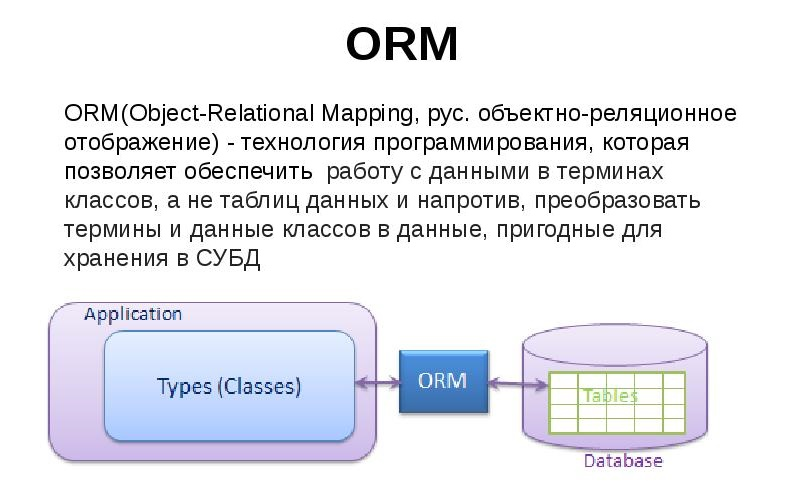

### ORM и JPA

**ORM - Object-Relational Mapping** или в переводе на русский: **объектно-реляционное отображение (описание реляционной
(или другими словами относительной) взаимосвязи объектов)**. Это технология программирования, которая связывает базы
данных с концепциями объектно-ориентированных языков программирования.

Если упростить, то ORM это связь Java объектов и записей в БД см. 



JPA - это по сути идея о том, что Java объект можно представить как данные в БД (и наоборот). Она нашла воплощение
в виде спецификации **JPA — Java Persistence API**. Спецификация — это уже описание Java API, которое выражает эту
концепцию (идею). Спецификация рассказывает, какими средствами мы должны быть обеспечены (т.е. через какие
интерфейсы мы сможем работать), чтобы работать по концепции ORM. И как использовать эти средства.

Реализацию средств спецификация не описывает. Это даёт возможность использовать для одной спецификации разные
реализации. Можно упростить и сказать, что спецификация — это описание API.

Текст спецификации JPA можно найти на сайте Oracle: ["JSR 338: JavaTM Persistence API"](https://edelivery.oracle.com/otn-pub/jcp/persistence-2_2-mrel-spec/JavaPersistence.pdf)

Следовательно, чтобы использовать JPA нам требуется некоторая реализация, при помощи которой мы будем пользоваться
технологией.

Реализации JPA ещё называют JPA Provider. Одной из самых заметных реализаций JPA является Hibernate.

---
### Java Persistence API

**JPA (Java Persistence API)** - это спецификация Java EE и Java SE, описывающая систему управления сохранением java
объектов в таблицы реляционных баз данных в удобном виде. Сама Java не содержит реализации JPA, однако есть
существует много реализаций данной спецификации от разных компаний (открытых и нет). Это не единственный способ
сохранения java объектов в базы данных (ORM систем), но один из самых популярных в Java мире.

---
### Отличие JPA от Hibernate

**Hibernate** - одна из самых популярных открытых реализаций последней версии спецификации (JPA 2.1). Даже скорее самая
популярная, почти стандарт де-факто. То есть JPA только описывает правила и API, а Hibernate реализует эти описания,
в прочем у Hibernate (как и у многих других реализаций JPA) есть дополнительные возможности, не описанные в JPA
(и не переносимые на другие реализации JPA).

---
### Отличие JPA от JDO ***

**JPA (Java Persistence API) и Java Data Objects (JDO)** две спецификации сохранения java объектов в базах данных.
Если **JPA сконцентрирована только на реляционных базах**, то **JDO более общая спецификация которая описывает ORM
для любых возможных баз и хранилищ**.

В принципе, **можно рассматривать JPA как специализированную на релятивистских БД часть спецификации JDO**, даже
при том что API этих двух спецификаций не полностью совпадает. Также отличаются «разработчики» спецификаций —
если JPA разрабатывается [как JSR](https://www.jcp.org/en/home/index), то JDO сначала разрабатывался как JSR,
теперь же разрабатывается [как проект Apache JDO](https://db.apache.org/jdo/).

---
### Типы загрузки данных в JPA

В JPA описаны два типа fetch стратегии:
1) **LAZY** — данные поля будут загружены только во время первого доступа к этому полю;
2) **EAGER** — данные поля будут загружены немедленно;

См. док. (ENG): [FetchType](https://docs.oracle.com/javaee/7/api/javax/persistence/FetchType.html)
См. пример (RUS): [Hibernate_part_7](https://github.com/JcoderPaul/Hibernate_Lessons/tree/master/Hibernate_part_7)

---
### Аннотации JPA

**@Basic** - указывает на простейший тип маппинга данных на колонку таблицы базы данных. Также в параметрах аннотации
         можно указать fetch стратегию доступа к полю и является ли это поле обязательным или нет.

Пример:

```Java
         @Basic
         protected String name;
         
         @Basic(fetch=LAZY)
         protected String getName() { return name; }
```

---
**@Access** - определяет тип доступа (access type) для класса Entity, супер-класса, embeddable или отдельных атрибутов,
          то есть, как JPA будет обращаться к атрибутам Entity, как к полям класса (FIELD) или как к свойствам
          класса (PROPERTY), имеющие геттеры (getter) и сеттеры (setter).

---
Если требуется перекрыть связи (override entity relationship) или атрибуты, унаследованные от супер-класса,
или заданные в embeddable классе при использовании этого embeddable класса в одном из Entity классов и не
перекрывать в остальных, то существует четыре аннотации:

- **@AttributeOverride** - чтобы перекрыть поля, свойства и первичные ключи;
- **@AttributeOverrides** - аналогично можно перекрыть поля, свойства и первичные ключи со множественными значениями;
- **@AssociationOverride** - чтобы перекрывать связи (override entity relationship);
- **@AssociationOverrides** - чтобы перекрывать множественные связи (multiple relationship);

Пример c (AssociationOverride):

```Java
         @MappedSuperclass
         public class Employee {
         
          @Id
          protected Integer id;
         
          @Version
          protected Integer version;
         
          @ManyToOne
          protected Address address;
         
          public Integer getId() { ... }
          public void setId(Integer id) { ... }
          public Address getAddress() { ... }
          public void setAddress(Address address) { ... }
         }
         
         @Entity
         @AssociationOverride(name="address",
                              joinColumns=@JoinColumn(name="ADDR_ID"))
         public class PartTimeEmployee extends Employee {
         // address field mapping overridden to ADDR_ID foreign key
          @Column(name="WAGE")
          protected Float hourlyWage;
          public Float getHourlyWage() { ... }
          public void setHourlyWage(Float wage) { ... }
         }
```

Пример: Переопределение мапинга (Overriding of the mapping) связи phoneNumbers, определенной во встраиваемом классе ContactInfo.

```Java
         @Entity
         public class Employee {
         
          @Id
          int id;
         
          @AssociationOverride(name="phoneNumbers",
                               joinTable=@JoinTable(name="EMPPHONES",
                                                    joinColumns=@JoinColumn(name="EMP"),
                               inverseJoinColumns=@JoinColumn(name="PHONE")))
          @Embedded
          ContactInfo contactInfo;
          ...
         }
         
         @Embeddable
         public class ContactInfo {
         
          @ManyToOne
          Address address; // Unidirectional
         
          @ManyToMany(targetEntity=PhoneNumber.class)
          List phoneNumbers;
         }
         
         @Entity
         public class PhoneNumber {
         
          @Id
          int number;
         
          @ManyToMany(mappedBy="contactInfo.phoneNumbers")
          Collection<Employee> employees;
         }
```

---
**@Cacheable** — позволяет включить или выключить использование кеша второго уровня (second-level cache) для данного
             Entity (если провайдер JPA поддерживает работу с кешированием и настройки кеша (second-level cache)
             стоят как ENABLE_SELECTIVE или DISABLE_SELECTIVE, см. пример и описание: [Hibernate_part_11](https://github.com/JcoderPaul/Hibernate_Lessons/tree/master/Hibernate_part_11).

Обратите внимание свойство наследуется и если не будет перекрыто у наследников, то кеширование измениться и для них тоже см. [SecondLevelCache](https://github.com/JcoderPaul/Hibernate_Lessons/blob/master/Hibernate_part_11/DOC/SecondLevelCache.txt).

---
**@Convert и @Converts** — позволяют указать класс для конвертации Basic аттрибута Entity в другой тип
                       (Converts — позволяют указать несколько классов конвертации). Классы для конвертации
                       должны реализовать интерфейс AttributeConverter и могут быть отмечены (но это не
                       обязательно) аннотацией Converter.

Пример: Преобразование basic атрибута.

```Java
     @Converter
     public class BooleanToIntegerConverter
        implements AttributeConverter<Boolean, Integer> {  ... }

     @Entity
     public class Employee {
         @Id
         long id;

         @Convert(BooleanToIntegerConverter.class)
         boolean fullTime;
          ...
     }
```

Пример: Auto-apply преобразование basic атрибута.

```Java
     @Converter(autoApply=true)
     public class EmployeeDateConverter
        implements AttributeConverter<com.acme.EmployeeDate, java.sql.Date> {  ... }

     @Entity
     public class Employee {
         @Id
         long id;
         ...
         // EmployeeDateConverter is applied automatically
         EmployeeDate startDate;
     }
```

Пример:  Отключить конвертацию при наличии конвертера авто-применения.

```Java
     @Convert(disableConversion=true)
     EmployeeDate lastReview;
```

Пример: Примените преобразователь к коллекции элементов (basic) базового типа.

```Java
     @ElementCollection
     // applies to each element in the collection
     @Convert(NameConverter.class)
     List<String> names;
```

Пример: Примените преобразователь к коллекции элементов, которая представляет собой Map-у или базовые значения
        (basic value). Конвертер применяется к (value) значению Map-ы.

```Java
     @ElementCollection
     @Convert(EmployeeNameConverter.class)
     Map<String, String> responsibilities;
```

Пример: Применить конвертер к ключу Map-ы базового (basic) типа.

```Java
     @OneToMany
     @Convert(converter=ResponsibilityCodeConverter.class,
              attributeName="key")
     Map<String, Employee> responsibilities;
```

Пример: Применить конвертер к (встраиваемому) embeddable атрибуту.

```Java
     @Embedded
     @Convert(converter=CountryConverter.class,
              attributeName="country")
     Address address;
```

Пример: Применить конвертер к (вложенному встраиваемому) nested embeddable атрибуту.

```Java
     @Embedded
     @Convert(converter=CityConverter.class,
              attributeName="region.city")
     Address address;
```

Пример: Применение преобразования к вложенному атрибуту встраиваемого объекта, который является ключом
        Map - коллекции элементов.

```Java
     @Entity public class PropertyRecord {
          ...
         @Convert(name="key.region.city",
                  converter=CityConverter.class)
         @ElementCollection
         Map<Address, PropertyInfo> parcels;
     }
```

Пример: Применение конвертора к встраиваемому объекту, который является ключом Map-ы для связи.

```Java
     @OneToMany
     @Convert(attributeName="key.jobType",
              converter=ResponsibilityTypeConverter.class)
     Map<Responsibility, Employee> responsibilities;
```

Пример: Переопределение мапинга преобразования для атрибутов, унаследованных от уже сопоставленного супер-класса.

```Java
     @Entity
         @Converts({
            @Convert(attributeName="startDate",
                     converter=DateConverter.class),
            @Convert(attributeName="endDate",
                     converter=DateConverter.class)})
     public class FullTimeEmployee extends GenericEmployee { ... }
```

---
**@EntityListeners** - аннотация, которая позволяет задать класс Listener, который будет содержать методы обработки
                   событий (callback methods) определенных Entity или Mapped Superclass.

---
- См. док. (ENG): [EntityListeners](https://docs.oracle.com/javaee/7/api/javax/persistence/EntityListeners.html)
- См. примеры (RUS): [Hibernate_part_9](https://github.com/JcoderPaul/Hibernate_Lessons/tree/master/Hibernate_part_9)

---
**Callback методы** служат для вызова при определенных событиях Entity (то есть добавить обработку, например, удаления
Entity методами JPA), могут быть добавлены к Entity классу, к mapped superclass, или к callback listener классу,
заданному аннотацией @EntityListeners. 

Существует семь callback методов (и аннотаций с теми же именами):

- **PrePersist**;
- **PostPersist**;
- **PreRemove**;
- **PostRemove**;
- **PreUpdate**;
- **PostUpdate**;
- **PostLoad**;

---
**@OrderBy и @OrderColumn** - аннотации служат для установки порядка выдачи элементов коллекций Entity.

Пример:

```Java
         @Entity public class Course {
          ...
          @ManyToMany
          @OrderBy("lastname ASC")
          public List<Student> getStudents() {...};
          ...
         }
```

Пример:

```Java
         @Entity public class Student {
          ...
          @ManyToMany(mappedBy="students")
          @OrderBy // PK is assumed
          public List<Course> getCourses() {...};
          ...
         }
```

Пример:

```Java
         @Entity public class Person {
          ...
          @ElementCollection
          @OrderBy("zipcode.zip, zipcode.plusFour")
          public Set<Address> getResidences() {...};
          ...
         }
```

---
**@Transient** - аннотация, которая позволяет исключить поле и свойства Entity из маппинга (property or field is not persistent).

Подробнее, см. [Transient](https://docs.oracle.com/javaee/7/api/javax/persistence/Transient.html)

Пример:

```Java
         @Entity
         public class Employee {
         
             @Id
             int id;
         
             @Transient
             User currentUser;
             ...
         }
```

---
### Типы блокировок - LockMode в JPA

- См. подробнее (ENG): [LockModeType](https://docs.oracle.com/javaee/7/api/javax/persistence/LockModeType.html)
- См. подробнее (RUS): [Hibernate_part_8](https://github.com/JcoderPaul/Hibernate_Lessons/tree/master/Hibernate_part_8)

У JPA есть шесть видов блокировок, перечислим их в порядке увеличения надежности (от самого ненадежного и
быстрого, до самого надежного и медленного):

1) **NONE** — без блокировки;
2) **OPTIMISTIC** (или синоним READ, оставшийся от JPA 1) — оптимистическая блокировка;
3) **OPTIMISTIC_FORCE_INCREMENT** (или синоним WRITE, оставшийся от JPA 1) — оптимистическая блокировка с
   принудительным увеличением поля версионности;
4) **PESSIMISTIC_READ** — пессимистичная блокировка на чтение;
5) **PESSIMISTIC_WRITE** — пессимистичная блокировка на запись (и чтение);
6) **PESSIMISTIC_FORCE_INCREMENT** — пессимистичная блокировка на запись (и чтение) с принудительным увеличением
   поля версионности;

---
**JPA имеет два вида кэшей (cache)**:

1) **first-level cache (кэш первого уровня)** — кэширует данные одной транзакции;
2) **second-level cache (кэш второго уровня)** — кэширует данные дольше чем одна транзакция;

Провайдер JPA может, но не обязан реализовывать работу с кэшем второго уровня. Такой вид кэша позволяет
сэкономить время доступа и улучшить производительность, однако оборотной стороной является возможность
получить устаревшие данные.

JPA имеет пять значений shared-cache-mode из persistence.xml, который определяет как будет использоваться
second-level cache:

1) **ALL** — все Entity могут кэшироваться в кеше второго уровня;
2) **NONE** — кеширование отключено для всех Entity;
3) **ENABLE_SELECTIVE** — кэширование работает только для тех Entity, у которых установлена аннотация
                      Cacheable(true) или её *.xml эквивалент, для всех остальных кэширование отключено;
4) **DISABLE_SELECTIVE** — кэширование работает для всех Entity, за исключением тех у которых установлена
                       аннотация Cacheable(false) или её *.xml эквивалент;
5) **UNSPECIFIED** — кеширование не определенно, каждый провайдер JPA использует свое значение по умолчанию
                 для кэширования;

---
См. подробнее (RUS): [Hibernate_part_11](https://github.com/JcoderPaul/Hibernate_Lessons/tree/master/Hibernate_part_11)

---
Для работы с кэшем второго уровня (second level cache) (удалять все или определенные Entity из кеша, узнать
закэширован ли данный Entity и т.п.) в JPA описан Cache интерфейс, содержащий большое количество методов по
управлению кэшем второго уровня (second level cache), если он поддерживается провайдером JPA, конечно.
Объект данного интерфейса можно получить с помощью метода getCache у EntityManagerFactory.

JPA предоставляет средства для получения метаданные (сведения о Entity типах, Embeddable и Managed классах и
т.п.) - для этого используется интерфейс Metamodel. Объект этого интерфейса можно получить методом getMetamodel
у EntityManagerFactory или EntityManager.
