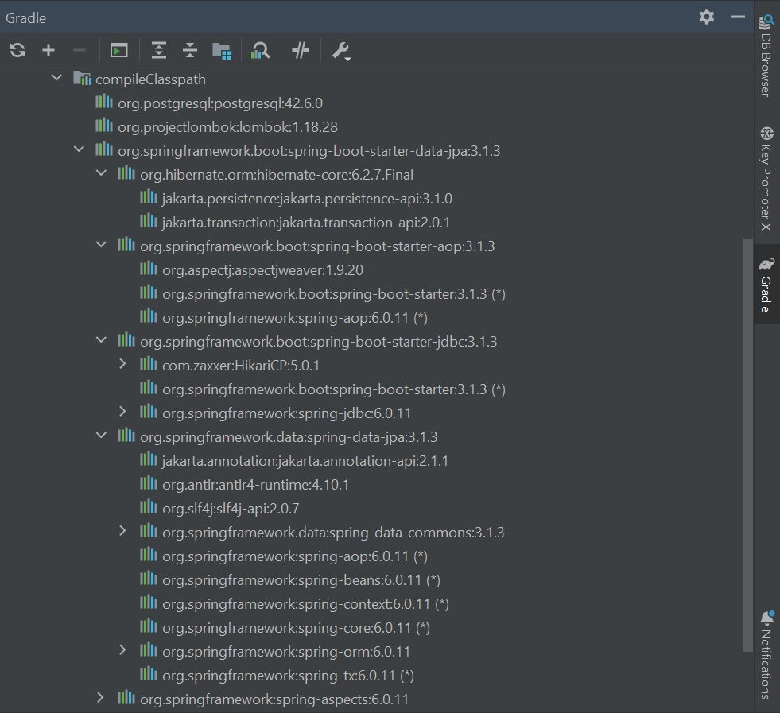
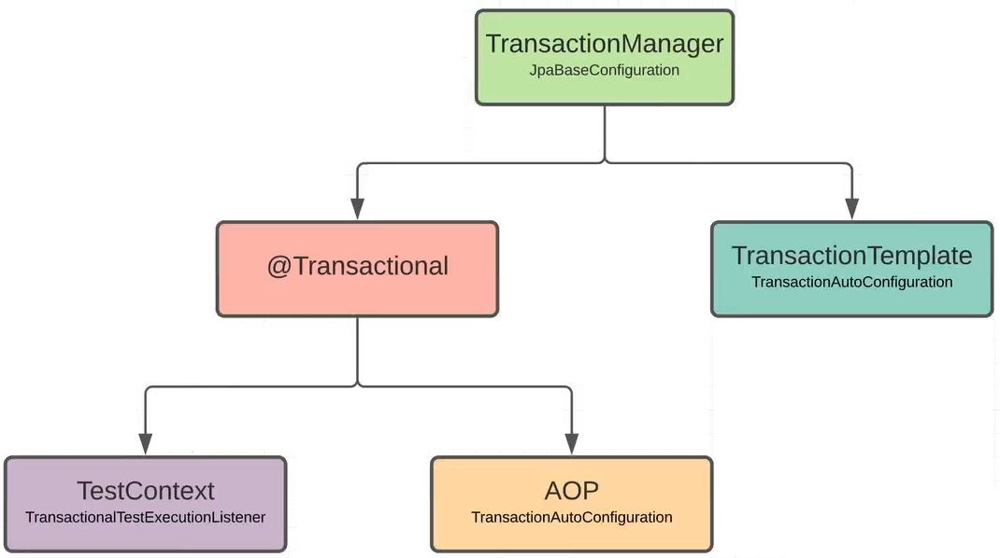
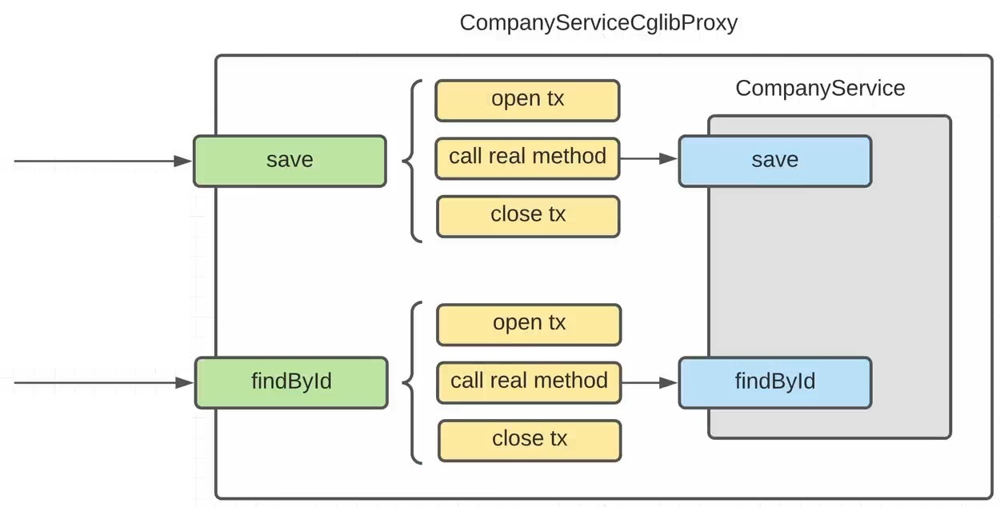
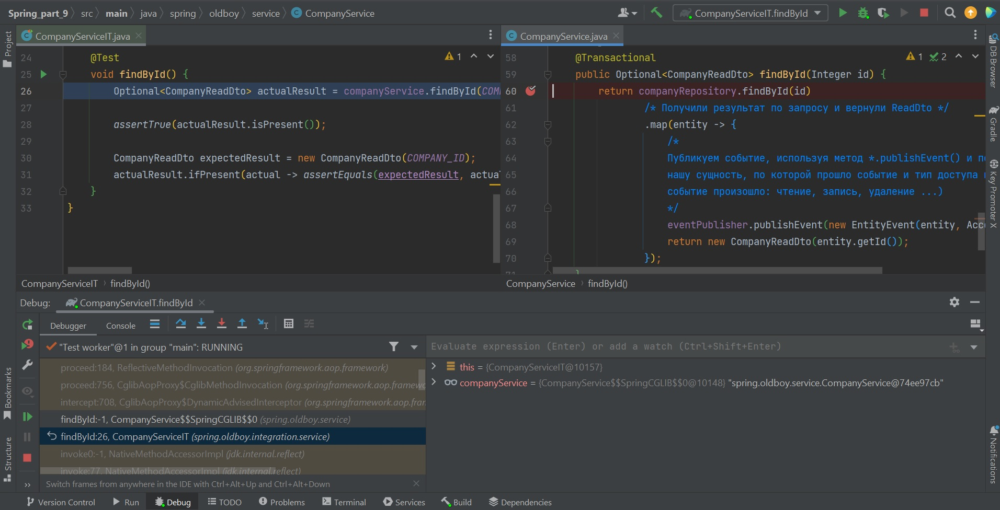
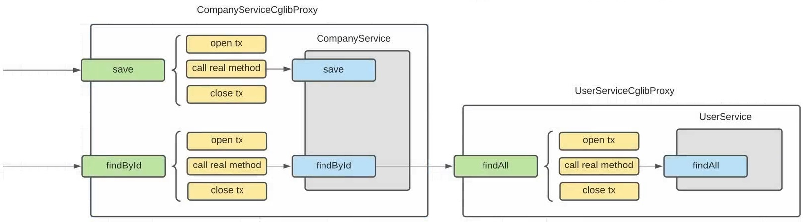

### Spring Boot lessons part 9 - Data JPA Starter и Data JPA Transactions.

В [папке DOC sql-скрипты](https://github.com/JcoderPaul/Spring_Framework_Lessons/tree/master/Spring_part_9/DOC) и др. полезные файлы.

Док. (ссылки) для изучения:
- [PostgreSQL Documentation](https://www.postgresql.org/docs/) ;
- [Docker Documentation](https://docs.docker.com/) ;
- [Hibernate](https://hibernate.org/) ;
- [Spring Data JPA](https://spring.io/projects/spring-data-jpa) ;

---
- [Spring Boot Reference Documentation](https://docs.spring.io/spring-boot/docs/current/reference/htmlsingle/) ;
- [Spring Framework 6.1.5 Documentation](https://spring.io/projects/spring-framework) ;
- [Spring Framework 3.2.x Reference Documentation](https://docs.spring.io/spring-framework/docs/3.2.x/spring-framework-reference/html/index.html) ;
- [Getting Started Guides](https://spring.io/guides) ;
- [Developing with Spring Boot](https://docs.spring.io/spring-boot/docs/current/reference/html/using.html) ;

---
Для начала проведем предварительную подготовку (первые 3-и шага из предыдущих частей):

Шаг 1. - в файле build.gradle добавим необходимые plugin-ы: 

```Gradle
    /* 
       Плагин Spring Boot добавляет необходимые задачи в Gradle 
       и имеет обширную взаимосвязь с другими plugin-ами.
    */
    id 'org.springframework.boot' version '3.1.3'
    /* 
       Менеджер зависимостей позволяет решать проблемы несовместимости 
       различных версий и модулей Spring-а
    */
    id "io.spring.dependency-management" version '1.0.11.RELEASE'
    /* Подключим Lombok */
    id "io.freefair.lombok" version "8.3"
```

Шаг 2. - подключаем Spring Boot starter:

```Gradle
    /* 
       Подключим Spring Boot Starter он включает поддержку 
       авто-конфигурации, логирование и YAML
    */
    implementation 'org.springframework.boot:spring-boot-starter'
```

Шаг 3. - подключаем блок тестирования (Spring Boot Starter Test) 
(он будет активен на этапе тестирования):

```Gradle
    testImplementation 'org.springframework.boot:spring-boot-starter-test'
```

Шаг 4. - автоматически Gradle создал тестовую зависимость на Junit5
(мы можем использовать как Junit4, так и TestNG):

```Gradle
    test {
        useJUnitPlatform()
    }
```

Шаг 5. - подключим блок для работы с БД (Spring Boot Starter Data Jpa)

```Gradle
    implementation 'org.springframework.boot:spring-boot-starter-data-jpa'
```

---
#### Lesson 41 - Подключение Spring-Data-JPA-Starter (теория, настройка и подключение БД).

Ставим БД [PostgreSQL или локальную на машину](https://www.postgresql.org/), или разворачиваем [Docker образ](https://hub.docker.com/_/postgres) с сайта [Docker](https://www.docker.com/).

Подключаем JPA-Starter, фактически само подключение описано выше на шаге 5., что легко можно наблюдать в [build.gradle](https://github.com/JcoderPaul/Spring_Framework_Lessons/blob/master/Spring_part_9/build.gradle).

Из меню Gradle мы можем увидеть все зависимости загруженные вместе со spring-boot-starter-data-jpa см.



Настроим подключение к БД (пока на локальную машину, а не Docker контейнер) в [application.yml](https://github.com/JcoderPaul/Spring_Framework_Lessons/blob/master/Spring_part_9/src/main/resources/application.yml):

```YAML
    spring:
     datasource:
      url: jdbc:postgresql://localhost:5432/SpringLessons
      username: postgres
      password: testadmin
      driver-class-name: org.postgresql.Driver
```

Мы так же можем настроить и JPA см. [DataSourceSetting](./DOC/SpringBootAndDataBases/DataSourceSetting.md) и [application.yml](https://github.com/JcoderPaul/Spring_Framework_Lessons/blob/master/Spring_part_9/src/main/resources/application.yml).
Чтобы посмотреть результат настроек можно запустить [SpringAppRunner.java](https://github.com/JcoderPaul/Spring_Framework_Lessons/blob/master/Spring_part_9/src/main/java/spring/oldboy/SpringAppRunner.java) и изучить содержимое консоли.

Упрощенно это выглядит так:

    /* Приложение запускается и прогружает все нужные модули, видно как загружается HikariPool */

    Bootstrapping Spring Data JPA repositories in DEFAULT mode.
    Finished Spring Data repository scanning in 13 ms. Found 0 JPA repository interfaces.
    Processing PersistenceUnitInfo [name: default]
    HHH000412: Hibernate ORM core version 6.2.7.Final
    HHH000406: Using bytecode reflection optimizer
    HHH000021: Bytecode provider name : bytebuddy
    No LoadTimeWeaver setup: ignoring JPA class transformer
    HikariPool-1 - Starting...
    HikariPool-1 - Added connection org.postgresql.jdbc.PgConnection@2fb25f4c
    HikariPool-1 - Start completed.
    HHH000021: Bytecode provider name : bytebuddy
    HHH000490: Using JtaPlatform implementation: [org.hibernate.engine.transaction.jta.platform.internal.NoJtaPlatform]
    Initialized JPA EntityManagerFactory for persistence unit 'default'
    Jpa configuration is enabled
    
    /* Тут создаются наши bean-ы */
    
    Closing JPA EntityManagerFactory for persistence unit 'default'
    HikariPool-1 - Shutdown initiated...
    HikariPool-1 - Shutdown completed.

    /* Приложение закончило работу пулы Hikari освобождаются */

---
#### Lesson 42 - Создание Hibernate Entities.

Создаем сущности для общения с Hibernate. Чтобы более подробно разобраться (повторить) данный вопрос 
см. [уроки по Hibernate](https://github.com/JcoderPaul/Hibernate_Lessons).

- База данных подключена, заполним ее тестовыми данными из: [SqlScripts](https://github.com/JcoderPaul/Spring_Framework_Lessons/tree/master/Spring_part_9/DOC/SqlScripts);
- Создадим сущности для работы с БД ([см. пример из уроков по Hibernate](https://github.com/JcoderPaul/Hibernate_Lessons/tree/master/Hibernate_part_1/src/main/java/oldboy/entity));

Немного изменим структуру проекта и приведем в соответствие таблицы БД и Entity классы: [database/entity](https://github.com/JcoderPaul/Spring_Framework_Lessons/tree/master/Spring_part_9/src/main/java/spring/oldboy/database/entity)

На данном этапе, мы:
- используя [application.yml](https://github.com/JcoderPaul/Spring_Framework_Lessons/blob/master/Spring_part_9/src/main/resources/application.yml) настроили связь с БД и настроили свойства [Hibernate](https://hibernate.org/orm/);
- создали [Entity](https://github.com/JcoderPaul/Spring_Framework_Lessons/tree/master/Spring_part_9/src/main/java/spring/oldboy/database/entity) классы, см. комментарии внутри классов;
- настроили взаимосвязь (mapping) между сущностями и БД;

Запустив [SpringAppRunner.java](https://github.com/JcoderPaul/Spring_Framework_Lessons/blob/master/Spring_part_9/src/main/java/spring/oldboy/SpringAppRunner.java) мы видим, что приложение отработало, как в предыдущем уроке - [Hibernate](https://hibernate.org/orm/) настроен 
и работает.

См. док.:
- [Hibernate ORM Documentation - 6.3](https://hibernate.org/orm/documentation/6.3/) ;
- [GitHub Hibernate Repository](https://github.com/hibernate) ;

---
#### Lesson 43 - [@Transactional](https://docs.spring.io/spring-framework/docs/current/javadoc-api/org/springframework/transaction/annotation/Transactional.html).

Spring Data Jpa позволяет быстро настроить работу с DAO и транзакциями см. 



Как уже стало понятно, многие настройки в SpringBoot проходят условно автоматически, в данном случае общением с БД занимается
[JpaBaseConfiguration](https://docs.spring.io/spring-boot/docs/current/api/org/springframework/boot/autoconfigure/orm/jpa/JpaBaseConfiguration.html). Через 
менеджера транзакций этой конфигурации (или так, менеджер транзакций конфигурируется в JpaBaseConfiguration) мы можем управлять
транзакциями используя аннотации (декларативно) или вручную (TransactionTemplate)

- [AnnotationTransactional](https://github.com/JcoderPaul/Spring_Framework_Lessons/tree/master/Spring_part_9/DOC/AnnotationTransactional) - подробное описание аннотационного интерфейса и применения [@Transactional](https://docs.spring.io/spring-framework/reference/data-access/transaction/declarative/annotations.html);
- [TransactionInSpring](https://github.com/JcoderPaul/Spring_Framework_Lessons/tree/master/Spring_part_9/DOC/TransactionInSpring) - подробное описание такого понятия как транзакция (особенность при работе в Spring);
- [SpringTransactionManagement](./DOC/SpringTransactionManagement.md) - статья об управлении транзакциями в Spring;
- [JPA](./DOC/JPA) - еще раз о JPA;
- [SpringBootAndDataBases](./DOC/SpringBootAndDataBases) - особенности настройки и работы Spring Data JPA;

Пример работы с аннотациями [@Transactional](https://docs.spring.io/spring-framework/docs/current/javadoc-api/org/springframework/transaction/annotation/Transactional.html), [@Rollback](https://docs.spring.io/spring-framework/docs/current/javadoc-api/org/springframework/test/annotation/Rollback.html) и [@Commit](https://docs.spring.io/spring-framework/docs/current/javadoc-api/org/springframework/test/annotation/Commit.html) приведен в [CompanyRepositoryTest.java](https://github.com/JcoderPaul/Spring_Framework_Lessons/blob/master/Spring_part_9/src/test/java/spring/oldboy/integration/database/repository/CompanyRepositoryTest.java) - особенности
применения их читать в комментариях к коду тестового класса. 

В случае работы с тестами аннотацию @Transactional обрабатывает [TransactionalTestExecutionListener](https://docs.spring.io/spring-framework/docs/current/javadoc-api/org/springframework/test/context/transaction/TransactionalTestExecutionListener.html) из TestContext см. [TestContextFramework из Spring_part_8](https://github.com/JcoderPaul/Spring_Framework_Lessons/tree/master/Spring_part_8/DOC/TestContextFramework).

В нашем примере:

- данный слушатель фиксирует наличие аннотации @Transactional над классом или методом;
- автоматически открывает транзакцию;
- далее выполняется тестовый метод;
- затем происходит откат изменений внесенных нашими тестами;

Такое поведение работает по-умолчанию.

См. док. (пакеты):
- [Пакет org.springframework.test.annotation](https://docs.spring.io/spring-framework/docs/current/javadoc-api/org/springframework/test/annotation/package-summary.html) ;
- [Пакет org.springframework.transaction.annotation](https://docs.spring.io/spring-framework/docs/current/javadoc-api/org/springframework/transaction/annotation/package-summary.html) ;
- [Пакет org.springframework.boot.autoconfigure.orm.jpa](https://docs.spring.io/spring-boot/docs/current/api/org/springframework/boot/autoconfigure/orm/jpa/JpaBaseConfiguration.html) ;
- [Spring Data Access](https://docs.spring.io/spring-framework/reference/data-access.html) ;

---
#### Lesson 44 - Авто-конфигурирование транзакций.

С приходом Spring Boot необходимость в аннотации @EnableTransactionManager в Spring приложении отпала. Теперь это перешло в
ответственность авто-конфигурации Spring Boot-а. Происходит следующее - когда мы добавляем в проект зависимость
spring-boot-starter-..., то подтягивается транзитивная зависимость - [spring-boot-autoconfigure](https://github.com/spring-projects/spring-boot/tree/main/spring-boot-project/spring-boot-autoconfigure), которая
содержит в файле [spring.factories](https://github.com/spring-projects/spring-boot/blob/main/spring-boot-project/spring-boot-autoconfigure/src/main/resources/META-INF/spring.factories) список авто-конфигураций.

Это файл: [org.springframework.boot.autoconfigure.transaction.TransactionAutoConfiguration](https://github.com/spring-projects/spring-boot/blob/main/spring-boot-project/spring-boot-autoconfigure/src/main/java/org/springframework/boot/autoconfigure/transaction/TransactionAutoConfiguration.java), содержит конфигурацию,
которая будет загружена при подъеме контекста см. [TransactionalAnnotation](./DOC/AnnotationTransactional/TransactionalAnnotation.md)

Когда мы ставим [@Transactional](https://docs.spring.io/spring-framework/docs/current/javadoc-api/org/springframework/transaction/annotation/Transactional.html) над методом, Spring создает прокси-класс, который содержит CompanyService, и внедряет вместо нашего объекта этот прокси объект. Этот прокси-класс содержит такие же методы (прокси класс оборачивает вызов метода в транзакцию), что и наш класс, поэтому он подходит для внедрения в bean-ы, которые ожидают CompanyService, см. 

 

и 



- [CompanyService.java](https://github.com/JcoderPaul/Spring_Framework_Lessons/blob/master/Spring_part_9/src/main/java/spring/oldboy/service/CompanyService.java) - класс в котором аннотирован @Transactional только один метод *.findById();
- [CompanyServiceIT.java](https://github.com/JcoderPaul/Spring_Framework_Lessons/blob/master/Spring_part_9/src/test/java/spring/oldboy/integration/service/CompanyServiceIT.java) - интеграционный тест в котором мы проверяем работу метода *.findById();

Запуск тестового метода CompanyServiceIT происходит в режиме отладки DEBUG, дойдя до точки останова мы можем наблюдать следующую картину см. 


Где явно видно, что вместо оригинального CompanyService создана его CGLIB прокси копия, см. схему реализации 

.

Подробная документация по [@Transactional](https://docs.spring.io/spring-framework/docs/current/javadoc-api/org/springframework/transaction/annotation/Transactional.html) см. [AnnotationTransactional](./DOC/AnnotationTransactional), а так же другие материалы в [разделе DOC](./DOC).

И так, повторимся, в обычном случае необходимо сделать две вещи:

- убедиться, что наша Configuration Spring сопровождена аннотацией @EnableTransactionManagement (!!! в Spring Boot это будет сделано автоматически !!!);
- убедиться, что мы указали менеджер транзакций в нашей Configuration Spring (это необходимо сделать в любом случае, однако см. отличие Spring Boot ниже).

**!!! Единственное отличие Spring Boot заключается в том, что он автоматически устанавливает аннотацию 
    @EnableTransactionManagement и создает ее PlatformTransactionManager для нас — с помощью 
    авто-конфигурации JDBC !!!**

---
#### Lesson 45 - Настройки @Transactional.



Cхема описывает взаимодействие прокси-объектов созданных при работе (классов) методов помеченных аннотацией [@Transactional](https://docs.spring.io/spring-framework/docs/current/javadoc-api/org/springframework/transaction/annotation/Transactional.html). Так же, эта схема хорошо описывает т.н. 'подводный камень' при работе с прокси объектами, см. [ProxyHowToWorksIs](./DOC/AnnotationTransactional/ProxyHowToWorksIs.md) (говорят, что это вопрос часто встречается на собеседованиях), т.е. ситуацию в которой при уже открытой транзакции, другая не открывается 
(все будет зависеть от настроек @Transactional см. ниже). 

Работа аннотации описана:
- (RUS) [AnnotationTransactional](./DOC/AnnotationTransactional);
- (RUS) [SpringTransactionManagement](./DOC/SpringTransactionManagement.md);
- (ENG) [Annotation Interface Transactional](https://docs.spring.io/spring-framework/docs/current/javadoc-api/org/springframework/transaction/annotation/Transactional.html);

Сами настройки можно посмотреть в структуре интерфейса, некоторые из них описаны ниже:

Propagation - способ "распространения, деления" транзакций, выделяются следующие способы:

- **MANDATORY** - если есть текущая активная транзакция - выполняется в ней, иначе выбрасывается исключение;
- **NESTED** - выполняется внутри вложенной транзакции, если есть активная, если нет активной - то аналогично REQUIRED;
- **NEVER** - выполняется вне транзакции, если есть активная - выбрасывается исключение;
- **NOT_SUPPORTED** - выполняется вне транзакции - если есть активная, она приостанавливается;
- **REQUIRED** - (значение по умолчанию) - если есть активная, то выполняется в ней, если нет, то создается новая транзакция;
- **REQUIRES_NEW** - всегда создается новая транзакция, если есть активная - то она приостанавливается;
- **SUPPORTS** - если есть активная - то выполняется в ней, если нет - то выполняется не транзакционно;

Уровни или режимы деления, можно настроить в @Transactional следующим образом:

```Java
    @Transactional(propagation = Propagation.REQUIRED);
    ... some class ...
    
    @Transactional(propagation = Propagation.REQUIRES_NEW);
    ... some method...
```

Правила управления откатом:

- **noRollbackFor и noRollbackForClassName** - определяет исключения, при которых транзакция НЕ будет откачена;
- **rollbackFor и rollbackForClassName** - определяет исключения, при которых транзакция БУДЕТ откачена;

Уровни изоляции базы данных, является сложной темой, следует потратить некоторое время, чтобы полностью разобраться 
в ней:
- См. (RUS): [Hibernate_part_8](https://github.com/JcoderPaul/Hibernate_Lessons/tree/master/Hibernate_part_8) ;
- См. (ENG): [Transaction Isolation](https://www.postgresql.org/docs/9.5/transaction-iso.html) ;

Пример применения:

```Java
    @Transactional(propagation=TransactionDefinition.NESTED,
                   isolation=TransactionDefinition.ISOLATION_READ_UNCOMMITTED
    )
    ... some class or method ...
```

---
**!!! Внимание !!! Когда речь идет о переключении уровней изоляции во время транзакции, мы должны точно знать, какой 
                 драйвере JDBC/БД используем, чтобы понять, какие сценарии тем поддерживаются, а какие нет.**

Вложенные транзакции в Spring - это точки сохранения JDBC / базы данных (savepoints), для понимания особенностей
этого момента см. руководство (ENG): [The Java™ Tutorials - Using Transactions](https://docs.oracle.com/javase/tutorial/jdbc/basics/transactions.html)

**!!! Внимание !!! Поддержка точек сохранения зависит от выбранного драйвера JDBC/базы данных.**

---
#### Lesson 46 - Программное (ручное) управление транзакциями - TransactionTemplate.

- [CompanyRepositoryTemplateTest.java](https://github.com/JcoderPaul/Spring_Framework_Lessons/blob/master/Spring_part_9/src/test/java/spring/oldboy/integration/database/repository/lesson_46/CompanyRepositoryTemplateTest.java) - тестовый класс, где применяется TransactionTemplate (см. комментарии в тесте);
- [TransactionTemplate](./DOC/AnnotationTransactional/TransactionTemplate.md) - краткое описание TransactionTemplate;

---
См. официальные [Guides](https://spring.io/guides):

- [Getting Started Guides](https://spring.io/guides) - Эти руководства, рассчитанные на 15–30 минут, содержат быстрые
  практические инструкции по созданию «Hello World» для любой задачи разработки с помощью Spring. В большинстве случаев
  единственными необходимыми требованиями являются JDK и текстовый редактор.
- [Topical Guides](https://spring.io/guides#topicals) - Тематические руководства предназначенные для прочтения и
  понимания за час или меньше, содержит более широкий или субъективный контент, чем руководство по началу работы.
- [Tutorials](https://spring.io/guides#tutorials) - Эти учебники, рассчитанные на 2–3 часа, обеспечивают более глубокое
  контекстное изучение тем разработки корпоративных приложений, что позволяет вам подготовиться к внедрению реальных
  решений.
  
---
- [Spring Projects на GitHub](https://github.com/spring-projects) ;
